# Xenon — Features

The complete guide to everything Xenon can do. For installation see **[README.md](README.md)**; for the API and architecture see **[DEVELOPER.md](DEVELOPER.md)**.

> **Optimized for the CORSAIR Xeneon Edge, great anywhere.** Every feature below works the same in a browser on a normal monitor as it does on the Xeneon Edge touchscreen. Touch gestures have mouse/keyboard equivalents, and the layout reflows for landscape, portrait, large windows, and the Edge's short screen.

## Contents

- [The dashboard](#the-dashboard)
- [Multi-page & layout editor](#multi-page--layout-editor)
- [Widget SDK (build your own)](#widget-sdk-build-your-own)
- [System monitor](#system-monitor)
- [Sensor history & PC Screen Time](#sensor-history--pc-screen-time)
- [Network & in-game FPS](#network--in-game-fps)
- [Media](#media)
- [Audio](#audio)
- [Microphone](#microphone)
- [Xenon AI](#xenon-ai)
- [RGB lighting](#rgb-lighting)
- [Deck](#deck)
- [Calendar](#calendar)
- [Tasks](#tasks)
- [Timers](#timers)
- [Notes](#notes)
- [Notifications](#notifications)
- [Weather](#weather)
- [Stocks (Borsa)](#stocks-borsa)
- [Football (Calcio)](#football-calcio)
- [Claude Code usage](#claude-code-usage)
- [News](#news)
- [Vitals](#vitals)
- [Focus lock screen](#focus-lock-screen)
- [App switcher](#app-switcher)
- [Browser](#browser)
- [Second screen](#second-screen)
- [Smart Home (Home Assistant)](#smart-home-home-assistant)
- [Streaming (Twitch, YouTube, OBS, Discord & Spotify)](#streaming-twitch-youtube-obs-discord--spotify)
- [Remote PC control](#remote-pc-control)
- [Share & import (themes, pages, Deck profiles)](#share--import-themes-pages-deck-profiles)
- [Settings](#settings)
- [Performance Mode](#performance-mode)
- [Smart context profiles](#smart-context-profiles)
- [Proactive moments](#proactive-moments)
- [Daily greeting](#daily-greeting)
- [Top bar](#top-bar)

---

## How you run it — one Xenon, four surfaces

A single local engine — a **Windows background service** since v4.0 that starts at boot and restarts itself if it crashes — serves the dashboard, and every surface shows that same live UI:

- **Native app** *(recommended on the Edge — this is the main way to run Xenon)* — a full-screen, borderless kiosk that opens itself on the Xeneon Edge with no browser or iCUE. It finds the Edge among your monitors and stays pinned to it through display changes, unplug/replug and standby, and puts a small Xenon icon in the system tray (show, hide, restart, exit). It never ships its own copy of the UI — it loads the same dashboard, so every feature and update appears here automatically. Touching the Edge doesn't steal your mouse or your game: the cursor snaps back to the screen it was on the moment your finger lifts, and while a game is detected taps never take the game's focus (typing in the AI chat or notes still works normally) — both tray-toggleable, on by default. No other surface can do this — on the stock iCUE dashboard, in a browser tab or in the iCUE iFrame a touch still teleports the cursor and takes the game's focus; only a real native window can tell Windows how to treat it. And when you need Windows itself, **swipe up, iPhone-style**: a quick flick up from the bottom of the screen tucks Xenon into a small floating button at the top of the screen and reveals the desktop on the Edge — the taskbar stays reachable the whole time — then a tap on the button brings the dashboard straight back (on by default, toggleable in Settings → General → Native app).
- **Browser tab** — open `http://127.0.0.1:3030/` in any Chromium browser, on any monitor.
- **iCUE iFrame** — alternative to the native app: embed the same URL as an iFrame widget on your Xeneon Edge dashboard, if you prefer keeping the Edge inside iCUE.
- **Native iCUE widget** — *in development.*

Because it's one engine behind all four, they're always in sync — open whichever you like.

---

## The dashboard

The home screen is a fully modular **Bento** grid you can shape around the panels you actually use. By default it shows three tidy **hub tiles**, each grouping related content as tabs:

- **Media** — Playback · Chat (Xenon AI)
- **Agenda** — Calendar · Timer · Tasks · Notes
- **System** — System (CPU/GPU/RAM/Disk + Network & Gaming) · Volume · Microphone

When a hub is left with a single item inside, its tab bar hides automatically for a cleaner look.

All layout choices are saved automatically (locally and to the server), so the dashboard stays the way you left it after a refresh or restart. On upgrade the layout migrates automatically while preserving your other settings (theme, weather, API key…).

**First run:** the very first time you open Xenon, a short **guided tour** spotlights the main controls one by one — Xenon AI, the Media tile, the layout editor, the pager and Settings. It's skippable, shows only once, and can be replayed any time from **Settings → Appearance → Tutorial**.

---

## Multi-page & layout editor

The dashboard is a horizontal **pager** — page 1 is your dashboard, and you can add more pages and place any module on any of them. Move between pages by:

- **Swiping** sideways on the touchscreen
- **Scrolling** horizontally (or holding **Shift** while scrolling the wheel)
- **Dragging** an empty area left/right with the mouse
- **Arrow keys** ← / →
- Tapping the **page dots** in the top bar

Navigation is compositor-driven (CSS scroll-snap), so it stays smooth and inexpensive even while a game or heavy workload is running.

### Layout mode

Tap **Layout** in the top bar to edit. In Layout mode you can:

- **Drag** a tile from anywhere on its surface to reposition it — the grid is fine-grained (24 columns, half-height rows), so tiles go almost exactly where you drop them, with an accent placeholder previewing the landing slot.
- **Resize** from the corner chip at the bottom-right (snapped to the same fine grid).
- **Hide** (👁) any tile, or **move it to another page** (⇄).
- Use the **"+"** drop-zone on any page to open a palette and add any available widget. The palette is organised into categories (Media, Productivity, System, Streaming) with an icon per widget.
- **Reset** the layout of the page you're looking at: the stock page returns to its default arrangement, while custom pages are tidied up — never deleted.

### Tab-grouping & duplication

- **Group widgets into tabs:** drag one tile onto the centre of another to merge them into a single tabbed tile (e.g. Calendar + Music); drag a tab's ⤤ out to split it back.
- **Duplicate any widget:** the "+" can add another copy of a module so it lives on several pages at once. Every copy is a **live mirror** of the same source — edit one (tick a task, type a note, change a track) and every copy updates. Each copy has its own **×** to remove just that copy.

### Layout presets

Save arrangements you like and reuse them in one tap. In Layout mode every tile has a **bookmark** button that saves it as a reusable **preset** — for a single widget *or* a whole tab-group (e.g. your Calendar + System tab). A **Save page** action stores an entire page (all its tiles and their arrangement) as a template. Saved presets appear under **My presets** in the layout toolbar: tap one to drop it onto the current page (a saved page creates a brand-new page), or remove it with its **×**. Reinserting never disturbs what's already on screen — existing components are duplicated as live copies — so you can rebuild a deleted tab in one tap or reuse a favourite arrangement on another page. Presets are saved on the server, so they survive reloads and restarts.

### Pages

The Layout **Pages** manager lets you **add, rename, remove, and reorder** dashboard pages (1–8). Removing a page asks for confirmation and moves its modules to the hidden list (restorable).

Customization goes deeper too: the individual **System cards** (CPU, GPU, RAM, Disk) and **audio sub-controls** (Volume, Speaker, Microphone) can each be reordered, resized, hidden, and restored.

---

## Widget SDK (build your own)

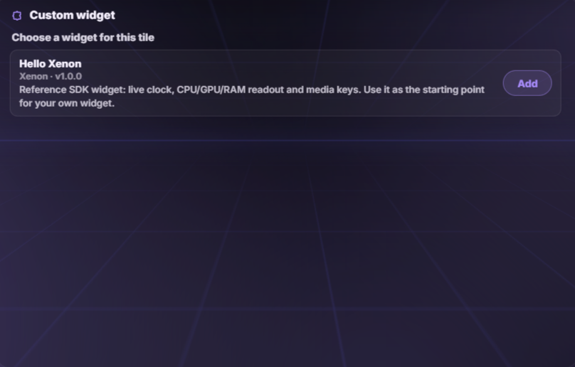

The dashboard is now a **platform**: third parties (and you) can build widgets for it. A widget is just a small folder — a `manifest.json` plus an HTML page — dropped into `server/data/widgets`.

- **Add one in seconds.** Enable the feature in **Settings → Widgets & sharing**, add the **Custom widget** tile from the "+" palette, and pick which installed widget it shows. You can add several Custom widget tiles, each hosting a different community widget. A built-in **"Install example"** button sets up a working reference widget (live clock, CPU/GPU/RAM readout, media keys) with one tap.
- **Sandboxed and permission-gated by design.** Community widgets run in an isolated sandbox with **no network access and no reach into the dashboard** — they can't call the internet, read your settings, or touch anything outside their own tile. Everything goes through a small, versioned **message bridge**: a widget only *sees* the data streams you approve (system sensors, now playing, volume, status) and can only *do* the low-risk actions you allow (media keys, volume, mic mute, lighting, open a link), each re-checked by the server like a Deck key. Before a widget first renders, a clear **permission dialog** shows exactly what it requested — with a reminder to only install widgets from people you trust. Everything is off by default.
- **Documented and versioned from day one.** The full developer guide — package format, sandbox rules, the complete bridge protocol and the security model — lives in **[docs/WIDGET_SDK.md](WIDGET_SDK.md)**, and the message contract carries an API version so future Xenon releases stay compatible with existing widgets. It's the first step of the Xenon widget ecosystem (a shared gallery comes next). *Beta*, fully localised (EN/IT/KO/JA/ZH).

---

## System monitor

Real-time hardware readouts from Windows performance counters and LibreHardwareMonitor:

| Metric | Details |
|--------|---------|
| **CPU** | Usage %, package temperature, hostname, uptime |
| **GPU** | Usage %, temperature (NVIDIA `nvidia-smi` or WMI fallback) |
| **RAM** | Used / total (GB), load % |
| **Disks** | Temperature per drive (LibreHardwareMonitor) |

- Live **download / upload** throughput (MB/s) from the active adapter
- **Ping** and **jitter** to a configurable target
- **Real in-game FPS** — the actual frame rate of the running game, including **exclusive-fullscreen** titles, via **PresentMon** (installed by `INSTALL.bat`). Falls back to a DWM reading (windowed/borderless only) if PresentMon isn't present.

The System tile compresses cards to share the available height so everything stays visible on the Edge's short screen, and fills tall desktop windows. Card order, size, visibility, tab order, and the remembered active tab all persist.

---

## Sensor history & PC Screen Time

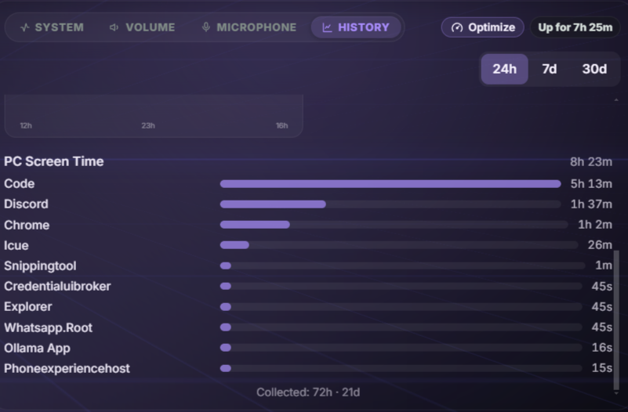
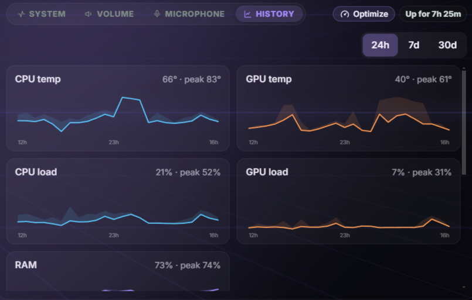
Turn on **Sensor history** (Settings → Performance) and the System tile gains a **History** tab — the "how has my PC been doing lately" view, with no AI required.

- **Trend charts.** Clean sparklines of **CPU and GPU temperature and load, and RAM usage** over the last **24 hours, 7 days or 30 days** — each chart marks its latest value and its peak, so you can see at a glance that (say) your GPU has run hotter this week than last.
- **PC Screen Time.** A screen-time breakdown for the same period: your **most-used apps** as a ranked bar list with the time spent in each, a **total active time**, and how much of it was **gaming** (games are marked 🎮 and counted separately) — the "Screen Time for your PC". Measured from the app already in focus; time while the screen is locked doesn't count.
- **Private and cheap.** It's **off by default**, costs almost nothing (one lightweight sample every few minutes of data the dashboard already reads), and **everything stays on your PC**. If you already use the AI **Guardian** feature, the same history simply appears in this tab. Fully localised (EN/IT/KO/JA/ZH).

---

## Media

The Media tile has two tabs — **Playback** and **Chat** (Xenon AI). It reads the currently playing track from **any SMTC-aware app** (Spotify, YouTube Music, Windows Media Player, Chrome, Edge…).

- Album artwork fetched automatically (the last known cover is kept if the track briefly drops it, so it never flickers to "No media")
- Title and artist
- **Play / Pause / Previous / Next** transport
- A **source badge** shows the official icon of where you're listening (Spotify/YouTube brand mark, or the app's real executable icon)
- A **per-source volume slider** (with mute) controls the volume of the app currently playing, independently of master volume
- **Spotify extras when the source is Spotify** — if you're listening on Spotify *and* have linked your account (Settings → Spotify), the Playback tab adds a tidy strip under the transport: a **seek bar**, **♥ save to Liked**, **shuffle**, **repeat**, and **Playlists** / **Devices** buttons that open a small in-place list (tap to play a playlist or move playback to another device). It appears only for a linked Spotify source, so the tile stays clean for everything else.
- When nothing is playing, the tile opens on the **Chat** tab so it is never empty. While music plays, the Chat tab keeps a compact mini player visible with the album art softly blurred behind the conversation

---

## Audio

- **Output device picker** — switch between speakers, headphones, and headsets in one tap
- **Master volume slider** (0–100%) and **mute toggle**
- **Per-app Audio Mixer** — when any app produces audio (Spotify, Discord, Chrome/YouTube, iCUE…), a compact mixer appears below the master slider. Each row shows the **real icon extracted from the executable**, a friendly name, an independent volume slider, a percentage, and a per-app mute toggle. The list matches the Windows 11 Volume Mixer one-to-one (only active sessions, no idle background apps), and hides automatically when nothing is producing audio.

All changes take effect immediately via the bundled [SoundVolumeView](https://www.nirsoft.net/utils/sound_volume_view.html) (NirSoft, freeware).

---

## Microphone

- **One-click mute / unmute** with a clear visual indicator
- Live input **level meter**
- **Change the default mic device** from a drop-down — no need to open Windows Settings
- **Per-app Mic Mixer** — when an app actively captures audio (Discord in a voice channel, Teams, OBS…), a section appears below the master controls with a per-app sensitivity slider and mute toggle. It hides automatically when no app is using the mic.

---

## Xenon AI

A full **voice + vision + chat** assistant. Text chat lives in the **Media tile's Chat tab**; voice mode is started from the **Xenon** pill in the top bar, where the assistant is visualised as an animated **circular audio equaliser** that reacts to its three states (listening / thinking / speaking).

### Two providers — your choice

- **Gemini (cloud)** *(default)* — text & vision via Gemini, with natural neural voice replies. Needs a free [Gemini API key](https://aistudio.google.com).
- **Local (Ollama)** *(free, on-device)* — runs entirely on your PC with no API key: **Ollama** (chat & function-calling, e.g. Qwen 2.5, Gemma 4 12B), **Whisper.cpp** (speech-to-text), and **Microsoft Edge neural voices** (text-to-speech). It even has key-free web search via DuckDuckGo.

Switch providers in **Settings → Xenon AI**. Choosing local opens a hardware-compatibility panel that scans RAM, VRAM, and CPU cores and **blocks the option on machines that aren't powerful enough** (restoring Gemini). You can pick a model tier (Auto / Light / Balanced / Powerful / Custom), check the live status of Ollama, Whisper, and the Edge voice, and download a model from Settings with a progress bar.

The local components are **not bundled or pre-downloaded** (so installation stays fast). When you switch to Local: **Whisper** downloads in-app with a progress bar ("Download Whisper"), **Ollama** is installed from its official page ("Install Ollama"), and the chat model is downloaded from the same panel.

### What it can do

| Category | Commands |
|----------|----------|
| **Mic** | Toggle mute / unmute |
| **Media** | Play/pause, next, previous |
| **Volume** | Set to any level (0–100) |
| **Timers** | Start named countdowns, list, delete |
| **Notes** | Read or rewrite the scratchpad |
| **Tasks** | List tasks, create with priority |
| **Calendar** | List upcoming events, create an event |
| **Memory** | Remember a fact about you, recall it later, or forget it on request |
| **PC history** *(with Guardian)* | Compare a sensor over time — today vs yesterday, last 24 h, weekly/monthly averages, the month's peak day |
| **Screen vision** | Capture and analyse any monitor in real time |
| **Apps & web** | Open any app, website, or file; web search |
| **Lighting** | Set colours/effects, toggle the RGB bridge |
| **Deck** | Switch Deck profile by name |
| **Performance** | "Optimize performance" / "restore performance" |
| **Dashboard** | Open weather, settings, app switcher, lock screen; switch theme; navigate pages |
| **System** | Lock the PC; get CPU/GPU/RAM stats; check weather |
| **Spotify** *(when linked)* | Play/pause, next/previous, **play or queue any song/artist/album/playlist by name**, shuffle, repeat, like, volume, seek, switch device, read what's playing (Premium for playback) |
| **Smart home** *(when connected)* | List devices, turn on/off/toggle, run scenes, and set details — **brightness, colour, temperature, fan speed, blind position** — on the right device by name/room |
| **Discord** *(when connected)* | Mute/unmute, deafen, push-to-talk, **join a voice channel by name**, leave, mic & output volume |

Spotify, Smart Home and Discord commands become available to the assistant the moment you connect the matching integration (Settings → Spotify / Smart Home / Streaming). Every control runs through the same allowlisted dispatcher the Deck uses, and works with both the cloud (Gemini) and local (Ollama) providers.

### How a voice session works

1. Press the **Xenon** pill in the top bar. Activation is instant — Xenon starts listening right away, and a Siri-style animated border glows around the display.
2. Ask your command (e.g. *"set a timer for 10 minutes"*). Master volume **ducks to 20%** while it listens or speaks, then restores.
3. Xenon answers aloud, then **keeps listening for a few seconds** so you can follow up without pressing the button again. Stay silent and the session closes on its own with a soft chime.

Spoken replies **start almost immediately**: Xenon speaks the first sentence the moment it's ready and prepares the next one while that plays, instead of waiting for the whole answer to be turned into audio — so longer answers flow naturally rather than pausing up front. The music-ducking and on-screen text still appear cleanly as one, and tapping to interrupt still stops it instantly.

The mic re-opens only **after** Xenon finishes speaking, and near-silent or noise-only clips are discarded, so the assistant's own voice is never misheard as a command.

**Tap to interrupt:** during the thinking/speaking phase a "· tap to stop" hint appears — tapping anywhere instantly stops playback and exits voice mode. You can also say "stop"/"basta", or just wait in silence.

**Hands-free with "Hey Xenon" (opt-in):** turn on the wake word in **Settings → Xenon AI** and saying *"Hey Xenon"* opens the voice session without touching the screen. Detection is 100% local (the same on-device Whisper the voice chat can use — one-tap download if missing): no cloud, no account, no audio ever leaves your PC or gets stored. It listens only while a dashboard is open, ignores long speech and music so it never drains the CPU, and muting your microphone silences it too. Off by default.

### Voce Live — real-time, talk-over-it voice (beta)

Turn on **Voce Live** in **Settings → Xenon AI** and the voice button opens a genuine **full-duplex** conversation instead of the turn-by-turn one. Xenon streams its reply as it speaks, and you can **cut in and talk over it at any moment** — it stops and listens instantly, with no button press and no waiting for it to finish. It's powered by Google's **Gemini Live** realtime model and still runs every dashboard command by voice (volume, timers, lighting, media, notes…), remembering you and keeping the conversation's context like the normal chat.

- **Off by default, clearly beta.** It needs a **Live-capable Gemini API key** and uses more of your Gemini quota, so it's opt-in. **Headphones give the best experience** — on open speakers the microphone can pick up the assistant's own voice.
- **Never a dead end.** If the Live model isn't available on your key, or there's no microphone, Xenon **falls back automatically** to the normal turn-based voice (which stays the default). The mic is captured on the server side, so Voce Live works the same on the Xeneon Edge as in a desktop browser.
- Fully localised (EN/IT/KO/JA/ZH).

### Chat

The Chat tab renders **headings, bold/italic, lists, inline code, and links** as formatted HTML. A **New chat** button resets the conversation, and you can attach **images, PDFs, and text/code files** (TXT, Markdown, CSV, JSON, common code files). Without an API key (Gemini mode) it shows a clear "AI unavailable — add your API key" message, with an option to hide the Chat tab entirely.

**Follow-up questions about a file you shared keep working.** Attach a document or image, and a follow-up like *"and what does the second page say?"* or *"translate that"* still refers to it for the next couple of turns — you don't have to re-attach it to keep talking about the same file.

**One-tap undo for the AI's changes.** When Xenon changes something you might regret — overwriting your notes, clearing all your tasks or events, adding a task — a small **Undo** appears under its reply. Tap it and the previous state comes straight back. It's there for the moments that matter and quietly absent for harmless actions.

**Multi-step requests finish in one turn.** Asking Xenon to do several things at once ("build me a streaming page and set up the deck for it") now has room to carry the whole request through to the end, with a firm time limit so it can never hang.

### Memory — it remembers you

Xenon can keep a small, private set of **facts about you** so it doesn't ask twice. Tell it *"remember that my main GPU is a 5080"* or *"da adesso ricorda che gioco su Steam"* and it stores the fact locally; ask *"what do you know about me?"* to recall the list, or *"forget that"* to drop one. Remembered facts travel with every conversation (chat and voice) so replies stay personal across sessions.

- **On by default, fully local.** Facts live only on your PC (`server/data/ai-memory.json`) — never uploaded. They ARE included in your configuration backup (Settings → Backup), so Xenon still remembers you after a restore on a new machine. Turn the whole feature off, or review and delete individual facts, in **Settings → Xenon AI**.
- **Works with both providers** (Gemini and local Ollama).

### Long conversations stay coherent

Xenon used to simply forget the oldest turns once a chat grew long, losing the thread. Now, as a conversation grows, the earlier part is quietly **condensed into a running summary** that travels with the chat — so it keeps the context of a long back-and-forth instead of dropping it. It happens in the background and never slows your reply.

### Advanced reasoning (opt-in)

A switch in **Settings → Xenon AI → Advanced AI features** lets your **typed** questions use a stronger model when you want more careful answers to complex things. It's off by default and only affects text chat — **voice stays on the fast model** so spoken replies never lag — and if the stronger model isn't available on your key, Xenon quietly falls back to the fast one instead of failing.

### Advanced AI features (opt-in)

A dedicated **Settings → Xenon AI → Advanced AI features** group unlocks four extra capabilities. They are **all off by default** behind a master switch, because they use the AI actively (Gemini API quota, or compute on the local provider):

- **Genesis — AI-built pages.** Ask Xenon to *"build me a streaming page"* and it composes a new dashboard page with the most relevant widgets, arranged in a clean balanced grid, and switches to it. If you just say *"create a new dashboard"*, Genesis first asks what the page is for (gaming, work, music…) so it can pick the right modules. AI-created pages are normal pages: renameable, editable in Layout mode, removable.
- **Game Companion.** An in-game overlay with FPS, session time, and on-demand AI screen insights while you play.
- **Guardian — PC health.** Keeps a local history of temperatures and loads, and gives you an AI analysis on demand ("how is my PC doing?"). You can also **see the history yourself** — a button on the System tile opens trend charts over the last 24h / 7 days / 30 days (no AI needed).
- **Ambient presence.** Proactive greetings and contextual alerts, spoken aloud when TTS is on — including an **anomaly heads-up** that speaks up only when a sensor drifts unusually far from its own recent baseline (e.g. your GPU running hotter than it normally does at idle), learned per-metric and rate-limited so it never nags.

You can share and reuse your dashboard pages, Deck profiles and themes today — see [Share & import](#share--import-themes-pages-deck-profiles) and trade presets with others on the [Xenon Discord](https://discord.gg/MBVrw9kZyg).

### Privacy

The Gemini API key is stored **only on this PC** (`server/settings.json`) and is never sent to any other service. The local provider runs fully on-device.

---

## RGB lighting

The dashboard can **drive your Corsair RGB devices from real data** — all from **Settings → Illuminazione (Lighting)**.

**Reactive effects:**

- **CPU temperature → colour** — a cool blue → warm red gradient that follows your CPU temp
- **Timer expiring → pulse** — a red pulse when a countdown finishes
- **Album art → colour** — the current track's cover colour drives the LEDs (independent of the main bridge toggle; opt-in)

**Ambient animations** add motion on top — eight styles: **Solid**, **Breathing**, **Rainbow**, **Wave** (a rainbow that scrolls across your per-LED devices), **Aurora** (a slow northern-lights drift through greens, blues and purples), **Candle** (a warm, organic flame flicker), and **Palette** (your own 2–5 colours blending in a loop, with an in-page palette editor). Every moving style has a speed slider, and Breathing/Candle have their own colour. They play in sync across all your lights (iCUE *and* external), and the render loop only runs while a moving animation is actually painting — zero idle overhead.

You can also set a **fixed manual colour** (name or hex) that overrides the effects until you reset it.

**Event flashes:** the timer, notifications, and reminders can each flash the lights with a chosen colour (default red), style — **blink**, **pulse** (breathing), or **solid** — and **duration** (0.5–10 s per event type).

It is designed to **share control with iCUE**, not fight it: turn the bridge off (globally or per device) and it hands the LEDs straight back to your normal iCUE profile. It also **idles automatically while you game** (toggleable). Everything is opt-in and granular — a master switch, per-effect toggles, per-game pause, a brightness slider, and a per-device on/off list — and the bridge is **off by default**.

**Xenon AI** can control all of this by voice or chat: *"turn the lights red"*, *"enable the temperature effect"*, *"set the timer effect to a blue pulse"*, *"metti l'aurora sulle luci"*, *"cycle my lights through red, white and green"*, *"turn the lighting off"*.

> **Requirements:** iCUE must be running with the **SDK enabled** (iCUE → Settings → enable the SDK). Without it, Lighting shows a friendly "iCUE not detected" notice and the rest of the dashboard is unaffected. The native binding (koffi + iCUE SDK) loads **only when you enable the bridge**, so users who never turn it on pay zero cost.

**Smart lights beyond iCUE.** The hub also drives popular network lights — **Govee** (strips, lamps, monitor backlights), **LIFX** bulbs, **Yeelight** (Xiaomi Wi-Fi bulbs and strips), **WLED** controllers, **Philips Hue** (via the local bridge, on both the current and the legacy bridge API), **Nanoleaf** panels, and — through your existing **Home Assistant** integration — every colour light HA manages (IKEA, Zigbee, Tuya, …) — all from **Settings → Lighting → External systems**. Tap **Search the network** to discover them, or add one by IP; Hue and Nanoleaf pair with a button press; Home Assistant lights appear automatically once the Smart Home integration is configured. They follow the same colours, effects and animations as your iCUE devices, each with its own on/off and per-device mode. Everything is **local, key-free and conflict-free** — no cloud account, no extra software, and nothing that fights iCUE for your Corsair gear. Discovery only runs when you ask, so there's no background scanning.

> **Govee / Yeelight:** enable *LAN Control* in the Govee Home / Yeelight app (per device) so the light listens on your network.

**Advanced: OpenRGB.** Power users can also bridge **OpenRGB** (ASUS Aura, MSI, Gigabyte, Razer, RAM, motherboards…) from the collapsed *Advanced* group: run OpenRGB with its SDK Server enabled and add it by IP (it is never auto-scanned). Corsair devices are always skipped there, so OpenRGB and iCUE never fight over the same gear.

---

## Deck

A programmable, **Stream Deck-style key grid** you can add to any dashboard page (and duplicate like any other widget) — styled to look and feel like a real physical device.

- **Tactile, lit keys:** glossy LCD caps in a matte chassis with a soft RGB underglow. Keys press in on tap, lift and brighten on hover, flash while an action runs, and light up and breathe when active.
- **Key size that fits the tile:** an edit-mode toolbar (✎) offers **Small / Medium / Large** keys. With **Auto** on (default) the Deck shows exactly as many true-square keys as fit the tile (up to 8 columns, Stream Deck XL width); turn Auto off to set columns and rows by hand. Your keys are never dropped when the grid changes.
- **Built-in music screen:** turn on **Musica** to dock a now-playing LCD-style screen under the keys — album art, title/artist, and transport, tinted by the cover's colours. When idle it shows a **Standby** face (output device + live volume meter).
- **Build your own keys:** add a title, an emoji / vector icon / uploaded image (with fill/fit/icon sizing) and an accent colour; turn a key into a **folder**; add/remove **pages**; and pick a **tap feedback** effect (glow, press, hold, blink, off). A roomy editor with categorized, icon-labelled pickers makes it fast.
- **Total key styling:** a key face can be a solid colour, a **two-colour gradient** (diagonal / vertical / radial, with one-tap preset pairs) or a **photo with an icon on top** — the picture sits behind the icon under an adjustable tinted scrim and optional blur, so it reads as a backlit cap. Colour the **icon** and the **label** independently, resize both, move the label (bottom / top / hidden), make it bold, and add an ambient **breathe** or **sheen** animation. Animated **GIFs** work as icons and backdrops, and **"Colors from image"** builds a matching gradient from your picture's dominant colours in one tap. A **live preview** beside the editor shows the finished cap as you go. Style once, reuse everywhere: **copy / paste a key's style** or repaint the **whole page** with it.
- **Whole-device looks:** in edit mode, restyle the entire deck — cap theme (**LCD** gloss, **Flat** minimal, **Neon** rim-glow, **Glass** frost), key shape (**rounded / square / circle**) and faceplate finish (**graphite / carbon fiber / brushed steel / midnight / invisible**, which floats bare keys on the dashboard).
- **Key Logic & Multi-Action:** one key can run a **tap / double-tap / hold** trigger, and each trigger can run a **sequence** of actions with delays (e.g. mute mic → wait → open an app).
- **Live state:** keys can reflect a live state (mic muted, speaker muted, OBS recording/streaming, remote connected) with an accent ring; OBS keys glow green while recording / red while live, and a scene key shows a small live thumbnail of what's on air.
- **Profiles:** keep separate key sets (streaming / work / gaming) as profiles. Switch instantly from the faceplate header; create, rename, and delete profiles in edit mode. Switch by voice too ("switch to my streaming profile"). Only decks actually on your dashboard appear in the "From another Deck" and share pickers; if a duplicated Deck tile left profiles behind after you removed it, a one-tap **"Remove decks no longer present"** button in the profile menu (edit mode) clears the leftovers.

**Available actions:** open an app / file / URL · open a Microsoft Store (UWP) app · keyboard shortcut (hotkey, sent to the app behind the dashboard) · **window management (move to next/previous monitor · snap left/right · maximize / minimize / center)** · media controls · mic/speaker mute · per-app volume / mute · app mixer overlay · play sound (soundboard) · OBS (scene / record / stream / mute) · Twitch (clip / marker / ad) · YouTube broadcast · **Discord voice (mute / deafen / push-to-talk / join or leave a voice channel / mic & output volume / audio processing)** · **Home Assistant (toggle a device / activate a scene / call a service)** · Streamer.bot · Remote Control (disconnect / block / cycle monitor) · webhook (GET/POST any URL) · Xenon AI (send prompt / voice session / open chat) · RGB LED reactions. Every action runs through a single **allowlisted dispatcher** on the local server — no arbitrary commands — and a key **flashes red** if an action fails, so it's never a silent no-op.

---

## Calendar

- Add, edit, and delete **events** directly on the widget
- Tap any day to open the **Day Modal** with full event details
- **Reminder toasts** pop up at the configured time — no external app needed
- Stored locally in `server/events.json`

### External calendar sync (Outlook & Google)

Show events from your real Outlook and Google calendars alongside your local ones. In **Settings → Calendari esterni**, paste each calendar's **iCal (`.ics`) link** (the panel gives step-by-step instructions for Google and Outlook). Each feed gets its own colour, an on/off switch, and an optional reminder toggle; feeds refresh automatically every 15 minutes.

> External events are **read-only** (you can't edit them from the widget). Google's secret link can take hours to reflect changes (Google's side). The link is stored only on your PC. Works with any calendar that publishes an `.ics` link (iCloud, etc.), with no account or sign-in.

---

## Tasks

Part of the **Agenda** hub (or pull it out into its own tile from the Layout editor).

- Add tasks with a name, a **priority** (high / medium / low), and optional **recurrence** (daily, weekly, or every N days)
- **Colour-coded priority dots** (red / amber / green) and action buttons (complete / undo / delete)
- Completed tasks move to a separate section with strikethrough styling
- Recurring tasks **reset themselves automatically** when their interval elapses
- Stored locally in `server/tasks.json`

---

## Timers

Part of the **Agenda** hub (or its own tile). Create a timer by typing a label and a duration (`5:00`, `1:30:00`, or a plain number of minutes) and tapping **+**.

- **SVG ring arc** shows real-time progress around each card
- Countdown updates ~4×/second for a smooth readout
- **Pause / Resume / Restart / Delete** on each card
- **Toast** slides up when a timer finishes (and can flash your RGB lights)
- **AI integration:** "set a 10-minute timer called Pasta" creates one instantly
- Persists across server restarts (`server/timers.json`); up to 20 simultaneous timers

---

## Notes

- **Keep several notes** and switch between them from a row of tabs — a **＋** starts a new one, each tab titled automatically from its first line
- **Pin** an important note to keep it first; **delete** the current one when you're done
- Live **word count** and a **saving / saved** indicator along the bottom
- **Auto-saves** the instant you stop typing; survives server restarts, and Xenon AI and backups keep working with your notes
- Plain text, no formatting needed

---

## Notifications

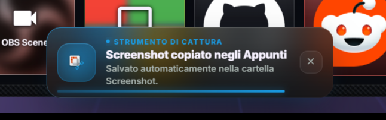
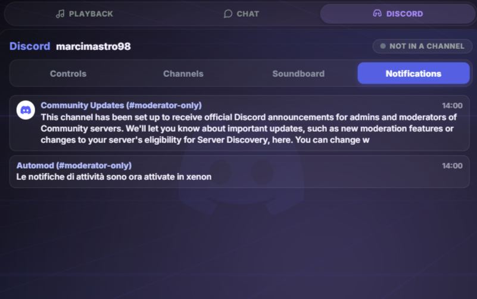

Xenon mirrors your whole PC's pings onto the Xeneon Edge so you never have to turn your head or Alt-Tab to see what just happened. Add the **Notifications** tile from the **"+" → Productivity** palette.

- **Every Windows toast, on the dashboard.** WhatsApp, mail, Teams, Discord, game launchers — whatever Windows shows you appears as a live feed with the app's real icon, who wrote, the message and the time. Read **locally** (the same WinRT listener the OS uses) — nothing is installed and nothing ever leaves your PC, and the reader only runs while a dashboard is actually open.
- **Pop-up toasts, redesigned.** Each new notification also slides in as a premium **liquid-glass** toast, haloed by an accent colour pulled from the app's own icon, adapting to light/dark theme; you can **swipe it away** (or press-and-hold to keep reading). Reduced-motion is respected.
- **Private by design.** One tap turns it on. An **eye button** hides content until you tap (shows only the app name — handy when others can see the panel), and every row has a **per-app mute** with a manager to unmute later. At most the last 30 notifications are kept.
- **Discord DMs & mentions too.** The **Discord** widget has a **Notifications tab** that mirrors your Discord DMs, mentions and watched-channel messages, read from your own Discord desktop app over the same local connection the voice controls use — no bot, nothing installed.
- **Works with or without the native helper.** The Xenon Helper reads notifications natively; without it a PowerShell fallback does the same. If Windows blocks notification access, the tile says so and points at the exact setting. One master switch in **Settings → Notifiche** turns pop-ups (or everything) off and stops the background readers. Fully localised (EN/IT/KO/JA/ZH).

> Notifications can also drive your **RGB lighting** — set a colour for the *Notifiche* event under Settings → Illuminazione → Effetti evento and your lights blink/pulse when a notification arrives (Windows or Discord), staying out of the way during full-screen gaming.

---

## Weather

- **Current conditions** — temperature, feels-like, humidity, wind speed/direction, pressure, visibility, UV index, cloud cover, precipitation
- **3-day forecast** — daily high/low and condition summary
- **8-hour hourly timeline** (scrollable)
- Location **auto-detected via IP** or set manually to your city (your choice persists)
- **°C / °F** toggle applies everywhere instantly
- Tap the weather chip in the top bar to open the full detail modal
- Add a dedicated **Weather tile** to the dashboard from the **"+" → Productivity** palette — the same live card as the full panel (animated sky, location, temperature, condition, feels-like/wind/precipitation), **resizable** to any shape. It can also show the **same detail cards, hourly timeline and 3-day forecast** below the card, and you **choose which sections to show** per-widget in Settings → Weather (all off = clean current-conditions card; on = a full scrolling weather board). Tap the card to open the full modal. Shares the top-bar chip's live data, city and °C/°F setting, and persists like any widget
- **Choosable data source** (Settings → Weather): **Automatic** (recommended — tries the most reliable first and falls back automatically), **[Open-Meteo](https://open-meteo.com/)**, **[MET Norway / yr.no](https://www.yr.no/)**, or **[wttr.in](https://wttr.in/)** — all free, no account. Automatic keeps the widget alive even if one provider is down, and Open-Meteo/MET Norway are typically more accurate
- Refreshed every 10 minutes; condition descriptions follow the widget language; **air quality via Open-Meteo** — air-quality index, PM2.5, PM10, NO₂, and **pollen** (where available, e.g. across Europe), each colour-coded by severity and individually toggleable

---

## Stocks (Borsa)

<!--TODO-->
<!-- SCREENSHOT: Borsa widget — watchlist with sparklines. Save as docs/images/stocks-widget.png -->
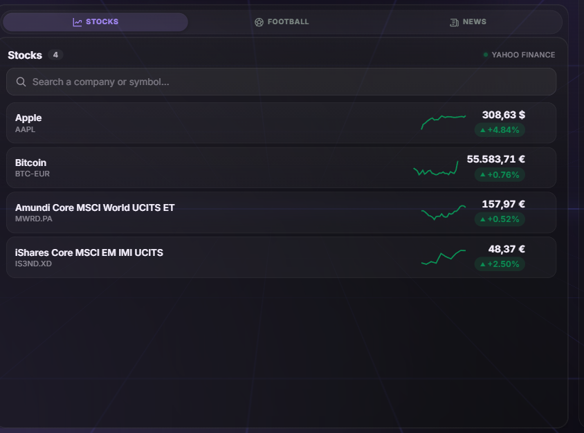
<!-- SCREENSHOT: Borsa detail — price chart with range switch. Save as docs/images/stocks-chart.png -->
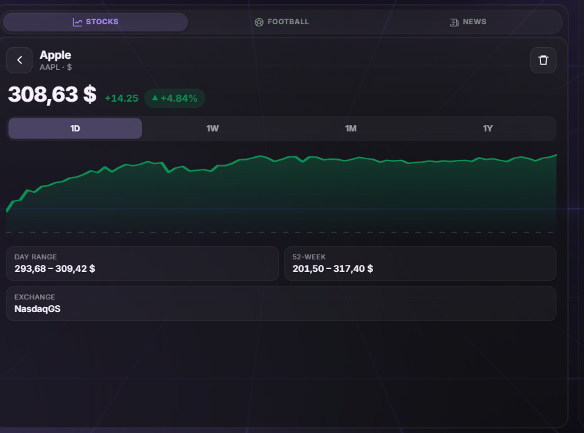
<!-- SCREENSHOT: Scrolling ticker bar at the bottom edge. Save as docs/images/stocks-ticker.png -->
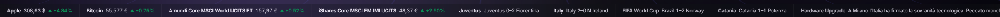

Track stocks, indices, crypto and currencies right on the dashboard. Add the **Borsa** tile from the **"+" → Productivity** palette.

- **Live watchlist** — each row shows the name, price, day change (green up / red down) and a small **sparkline** of today's move. Tap a row for the detail view.
- **Detail view with charts** — a clean SVG price chart with **1D / 1W / 1M / 1Y** ranges, a dashed baseline at the previous close, a hover crosshair, plus the **day range**, **52-week range** and exchange.
- **Favorites & alerts** — add any symbol from the widget (e.g. `AAPL`, `ENI.MI`, `BTC-EUR`, `^GSPC`). When a favorite moves sharply during the day (past a threshold you set in **Settings → Borsa & Ticker**, 2% by default) Xenon pops a toast and can **flash your RGB lighting** — gated by the master **Notifiche** switch, and never repeating the same move twice a day.
- **Scrolling ticker** — an opt-in bar (Settings → Borsa & Ticker) streams your stocks across the **bottom** edge (configurable to the top, or hidden, with adjustable speed). It **freezes automatically in Performance / Game mode** (and while a modal is open or the dashboard is idle), so it never competes with a game for the GPU.
- **Data source** — works **keyless** with **Yahoo Finance** by default, covering **Borsa Italiana** (`.MI`), world indices, US stocks, crypto and FX. Optional free **Twelve Data** or **Finnhub** keys (Settings → Borsa & Ticker) unlock richer/official data; without a key everything still works.
- **Ask Xenon** — the assistant answers "how's Apple / the FTSE MIB doing", reads your watchlist and adds favorites, by voice or text.
- Deliberately light: no new dependencies, SVG charts, quotes fetched only while a dashboard is open and streamed over the live channel. Fully localised (EN/IT/KO/JA/ZH). *(A News feed for the same widget and ticker is coming next.)*

---

## Football (Calcio)
<!--TODO-->
<!-- SCREENSHOT: Calcio widget — favorite teams with crests, result and next fixture. Save as docs/images/football-widget.png -->
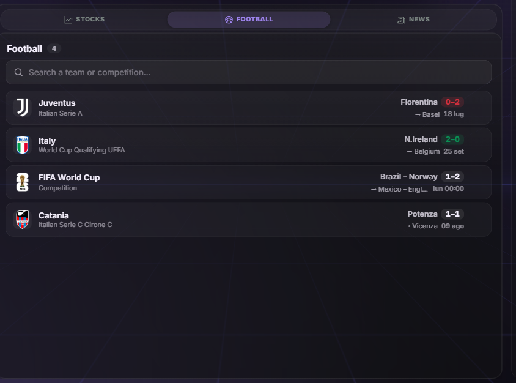
<!-- SCREENSHOT: Calcio detail — match hero, recent results, upcoming, league table. Save as docs/images/football-detail.png -->
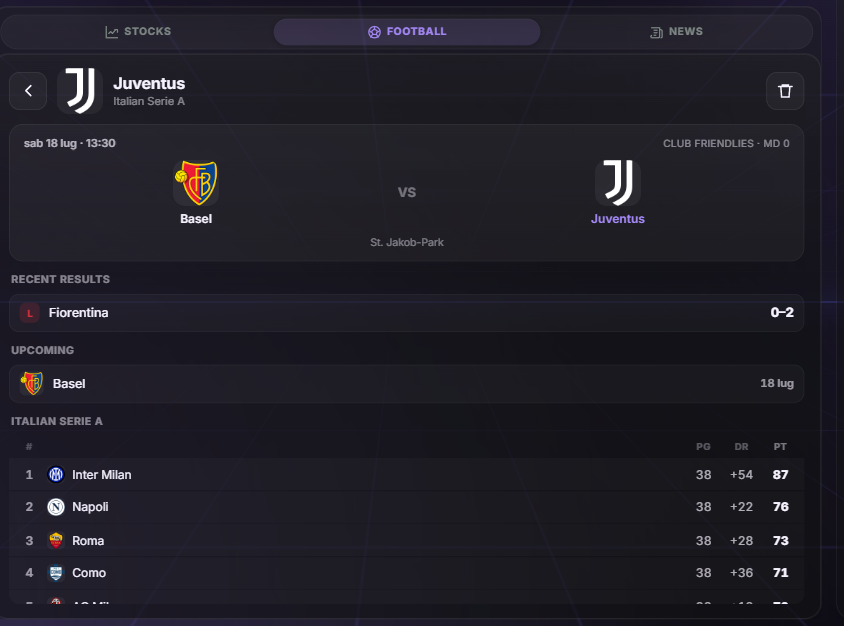

Follow your football clubs right on the dashboard. Add the **Calcio** tile from the **"+" → Productivity** palette.

- **Favorite teams at a glance** — each row shows the club **crest**, its latest result (win/draw/loss colour-coded) and its next fixture. Tap a team for the detail view.
- **Follow competitions too** — search **Champions League, Serie A, World Cup, Europa League, Premier League** (and the other top leagues and cups) and follow the *competition* itself: its row shows the next match and latest result across the whole tournament, and its detail gives recent results, upcoming fixtures and the full standings.
- **Detail view** — a match **hero** (the live or upcoming game with both crests and the score), the last handful of **results**, the **upcoming fixtures**, and the **live league table** with your team highlighted.
- **Add by searching** — type a club or competition name ("Napoli", "Arsenal", "Champions League") and pick it from a live dropdown that shows whether it's a club or a competition.
- **Goal & full-time alerts** — when a followed team scores or a match ends, Xenon pops a toast and can **flash your RGB lighting** — gated by the master **Notifiche** switch, never repeating and never spamming on startup.
- **Scrolling ticker** — turn on the football source (Settings → Borsa & Ticker) and your teams' scores and next fixtures scroll across the ticker, with live matches highlighted.
- **Data source** — works **keyless** with **TheSportsDB** by default (fixtures, results, crests, standings for Serie A and every major league). An optional **TheSportsDB Premium** key (Settings → Calcio) unlocks **live scores** during matches; without it everything else still works.
- **Ask Xenon** — "how did Napoli do", "when does Inter play next", "read me the Serie A table", by voice or text.
- Deliberately light: no new dependencies, crests loaded lazily with an initials fallback, data fetched only while a dashboard is open and streamed over the live channel. Fully localised (EN/IT/KO/JA/ZH).

## Claude Code usage

If you use **Claude Code** on your PC, this tile turns your token consumption into a living reactor. Add the **Claude Code** tile from the **"+" → System** palette.

- **A model-tinted plasma reactor** — a glowing core that takes the colour of the model you're running right now (Opus, Sonnet, Haiku or a frontier model), with particles streaming into it and a live pulse while Claude is actually working.
- **The numbers that matter** — tokens used **today** and **this week**, your **cache-hit rate** (how much of your input was served cheaply from cache), and the **equivalent API value** of everything you've run.
- **Every running session, live** — if several Claude Code sessions are open at once, each shows as its own row with the project · git branch, the model, and **what it's working on** (its last prompt). Particles in the reactor take each session's model colour, so several instances feeding the core show as several colours.
- **A weekly budget you set** — there is no official way to query a plan's remaining quota, so the reactor's "remaining" ring is one you choose: tap the reactor and pick a plan estimate (**Pro / Max 5× / Max 20×**) or type your own weekly token ceiling; leave it on **Auto** to instead charge the core with the week's activity against its own recent peak. It's an estimate you can tune any time.
- **Grows with the tile** — small, it's the reactor and four headline numbers; taller, it fills in a **30-day history** (cache-served tokens stacked under fresh ones), a **per-project split** and a **per-model split**.
- **100% local & private** — read straight from Claude Code's own session files (`~/.claude`): no account, no API key, nothing ever leaves your PC, and it works on every plan even offline. The reading is throttled and only re-scans the active session, and the reactor pauses its animation off-screen and respects "reduce motion". No new dependencies. Fully localised (EN/IT/KO/JA/ZH).

---

## News
<!--TODO-->
<!-- SCREENSHOT: News widget — merged headline stream. Save as docs/images/news-widget.png -->
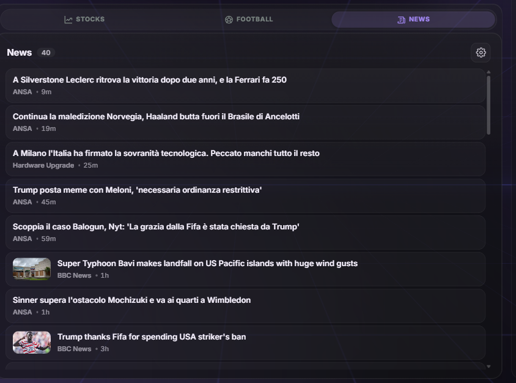

A single, time-sorted stream of headlines from the outlets and topics you follow. Add the **News** tile from the **"+" → Productivity** palette.

- **Merged headline stream** — every followed feed in one list, newest first, each row with the **outlet**, relative time and (when available) a **thumbnail**. Tap to open the article.
- **Follow outlets and topics** — open the manage panel (gear) and search a curated list of major outlets (ANSA, Repubblica, Corriere, Il Post, Sky TG24, Gazzetta, BBC, The Guardian, The Verge, TechCrunch…), or type any subject to follow it as a topic. Followed feeds show as removable chips.
- **Data source** — works **keyless**: outlet **RSS** feeds and **Google News** (in your language) for topics. An optional **NewsData.io** key (Settings → News) enriches topics with more articles and images; without it everything still works.
- **Scrolling ticker** — turn on the news source (Settings → Borsa & Ticker) and your latest headlines scroll across the ticker.
- **Ask Xenon** — "what's in the news", "any news about AI", "latest headlines", by voice or text.
- Deliberately light: no new dependencies (a small hand-rolled RSS reader), lazy thumbnails, article links opened only after an https check, data fetched only while a dashboard is open. Fully localised (EN/IT/KO/JA/ZH).

---

## Vitals
<!--TODO-->
<!-- SCREENSHOT: Vitals widget — pixel-art self-care HUD. Save as docs/images/vitals-widget.png -->

A retro game HUD for looking after yourself: pixel-art meters that drain the longer you sit at the PC, and refill when you tap them. Add the **Vitals** tile from the **"+" → Productivity** palette.

- **Five vitals, game-style** — **Hydration 💧, Energy 🍗, Stamina 🚶, Focus 👀** (on by default) and an optional **Posture 🧘** meter, each a chunky 10-segment pixel bar with its own sprite. Levels are computed from real timestamps, so a reload or PC restart never resets your bars — and every new day starts fresh: at midnight all bars quietly refill.
- **Tap for coaching, confirm to refill** — tapping a bar (or a top-bar chip, or a reminder toast) opens a small card explaining what the meter tracks and what actually helps (drink a glass of water now; the 20-20-20 eye rule; stand up and walk a couple of minutes…). Hit **"Done! +100"** once you've done it and the bar springs back to full with a pixel burst and a floating "+100".
- **Fits any tile size** — the HUD compacts itself as you shrink the tile (smaller rows, then just the bars), down to a tiny at-a-glance strip.
- **Fun reminders** — below 25% (and again at zero) a game-style toast nudges you ("Stamina drained — stand up and take a walk 🚶"). Reminders respect the master Notifiche switch and have their own toggle; each threshold fires once per drain.
- **XP & level** — every refill earns +25 XP toward the widget's **LV badge** (with a LEVEL UP! toast), and the header shows a beating pixel heart plus your time at the PC this session.
- **Top-bar mini chips** — an opt-in toggle puts tiny pixel icons with micro bars next to the clock and weather (they follow the minimal-topbar island too). Tap a chip to refill on the spot.
- **Tunable** — per-vital on/off and drain interval (water every 45 min, food every 3 h, 20-20-20-style eye breaks…) in **Settings → Notifiche → Vitals**.
- Deliberately light: no new dependencies, inline pixel-art SVG sprites, decay math riding the existing 1-second clock tick, cheap transform/opacity animations that respect "reduce motion". Fully localised (EN/IT/KO/JA/ZH).

### Bit — the pixel guardian
<!--TODO-->
<!-- SCREENSHOT: Bit's GAME OVER screen over the dashboard. Save as docs/images/vitals-pet.png -->

An opt-in 8-bit tamagotchi (**Settings → Notifiche → Vitals → Bit**) that lives in a corner of the dashboard, mirrors your Vitals and *roasts* you — always in pixel style, whatever theme you run.

- **Moods** — bouncy and green when you're fine, worried at low meters, furious (shaking, steam puffs) at zero, a floating ghost when every vital is dead. Tap him for a quick menu: worst meters, **Truce 30 min**, **Quiet for today**.
- **250+ hand-written roasts** (IT/EN) served through a no-repeat shuffle, in three tones — **Gentle / Sarcastic / Savage** ("Hydration: 0%. You are officially freeze-dried.").
- **An escalation ladder, every rung opt-in**: speech-bubble + toast nags → dashboard desaturation with glitch pulses (~5 min at zero) → full **CRT GAME OVER screen** (~8 min) → **pixel popups on your real monitors** (10 min; all screens when 3+ vitals are dead) → **minimize all windows** (15 min, 30 s warning, nothing is closed) → **lock the PC** (20 min, 60 s countdown; the normal Windows lock).
- **Presence-aware and fail-safe** — the PC-invading rungs need *fresh keyboard/mouse input* (a system-idle probe in the persistent PowerShell worker; the touchscreen alone is not proof you're at the desk), every opt-in is re-checked server-side, and hard cooldowns cap the mayhem.
- **Gamer truce** (default on) — silent and hands-off during games, with a post-match roast if a vital died mid-session. Refills flip him instantly to praise, with a tiny WebAudio chiptune fanfare.
- Zero new dependencies; with Bit off, not a single timer runs.

---

## Focus lock screen

An internal, client-side overlay that dims everything into a distraction-free view — separate from the Windows PC lock.

- Activated via the **Focus** button (lock icon) in the top bar; dismissed with a tap or Esc
- **Animated clock** — digits bounce on change, the colon pulses, the clock breathes
- Configurable **widgets** (each independently toggleable in Settings): **Clock**, **Now Playing** (art, title, artist, controls), **Upcoming Events** (next 1–3), and a **Weather summary**
- When only Now Playing is active, it expands to fill the screen

---

## App switcher

- Lists all currently **open top-level windows** with a live preview and icon
- **Tap to bring any window to the foreground** — great for switching context from the touchscreen
- **Search** to filter the list by app name or window title, and **close a window** straight from its card (system-critical apps are safely refused)
- **Keyboard navigation** — arrow keys move between windows, Enter opens the highlighted one (a real Alt+Tab feel on top of touch)
- **Favorites quick-launch dock** — star your most-used apps and they sit in the top bar as a dock. Tap a running app to focus it, tap a closed one to **launch** it (a green dot marks what's open), and **drag to reorder**
- **Favorites are saved on your PC** (with your dashboard settings), so a starred app stays starred across reboots and shows the same on every dashboard — existing stars migrate over automatically

---

## Browser
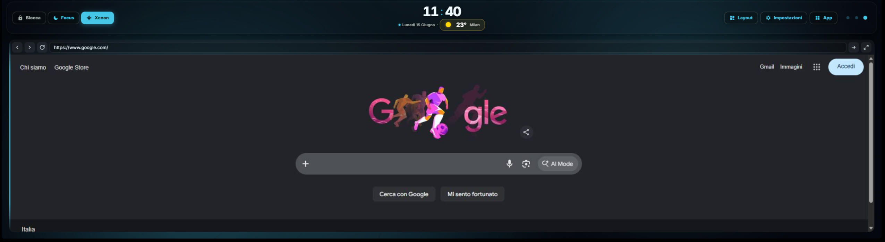
A live, **interactive web page inside a dashboard tile** — type an address and browse, tap links, scroll and type, right on the Xeneon Edge. Add it from a page's **+** menu (under *System*); you can add several, each remembering its own address.

- **A real browser, not an embed.** It's driven by a dedicated headless **Microsoft Edge** under the hood — the page is relayed to the tile as a live video stream over a local loopback connection, and your taps/scrolls/keystrokes are sent back to it. Unlike a plain `<iframe>` this works with sites that normally refuse to be framed (YouTube, Google, most web apps).
- **Toolbar:** address field, **Back / Forward / Reload**, an **expand-to-fullscreen** toggle, and a **hide-toolbar** button that collapses the tab strip, address bar and favorites so a maximized video fills the whole tile (a small button in the corner brings it back). The choice is remembered per Browser widget.
- **Optional one-click ad-blocker.** A **Browser** section in Settings adds a single **Block ads** switch: flip it on and the dashboard downloads **uBlock Origin Lite** once (~10 MB) and loads it into the tile's browser — no manual install. It's **off by default** and applies to every Browser tile (they share one browser). It blocks the large majority of ads (banners, pop-ups, much of YouTube); it **can't** stop YouTube video ads or Twitch ads (Twitch stitches ads into the stream server-side). Toggling reloads open tiles instantly.
- **Light by design:** a tile streams **only while it's actually on screen** — switch to another page and it stops immediately, and the background Edge **shuts itself down** once no Browser tile is open, so an added-but-unused tile costs nothing. It also **pauses while you game or optimize** (see [Performance Mode](#performance-mode)). Everything is local — the page stream never leaves your PC.

> First version: needs **Microsoft Edge** (present on every Windows 11; the tile shows a clear message if it's missing) and the tile is **video only, no sound**.

---

## Second screen
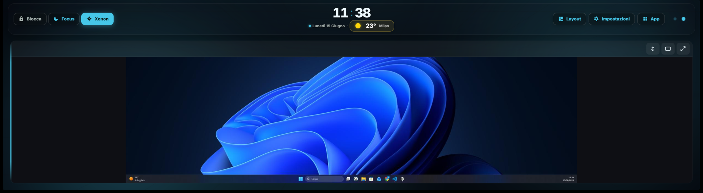
A genuine **extra Windows desktop, live inside a dashboard tile** — drag any app onto it, then tap, scroll and type to drive it from the Xeneon Edge. Add it from a page's **+** menu (under *System*).

- **One-click setup.** The tile installs a signed **virtual-display driver** and creates the extra monitor for you (just accept the Windows prompts). If a step can't be automated — winget missing, or a reboot needed to finish — it tells you exactly what to do rather than failing silently.
- **Pick the resolution** in **Settings → Second screen** (along with smoothness/FPS and image quality). It applies **instantly** — no reinstall, no reboot — including ultra-wide modes like **2560×720** so the view fills the Xeneon Edge bar with no side bars. The screen **persists across restarts** and is automatically restored to your chosen resolution the first time you view it (Windows otherwise resets a virtual monitor to a tiny default after a reboot).
- **Fit toggle** on the tile — *fill the tile edge-to-edge* (cropping the overflow) or *show the whole screen* (letterboxed); your choice is remembered.
- **Visible pointer** — the mouse cursor is drawn into the view, so you can always see where you're pointing.
- **Natural touch** — by default a **swipe scrolls the dashboard** while a **tap clicks** in the virtual screen (so a large tile doesn't swallow your page swipes, yet you can still click things). A toolbar **toggle** switches to *full control* for dragging inside the screen (moving windows, sliders, selecting text); a mouse drives the screen directly in that mode.
- **Light by design:** it streams **only while on screen**, **pauses while you game or optimize** (see [Performance Mode](#performance-mode)), and the capture process **frees itself after sitting idle**. A static desktop barely sends any frames. Everything stays local.
- **Remove cleanly** — **Settings → Second screen → Remove** takes the virtual monitor away (with a confirmation first).

> First version: needs the **Xenon Helper** companion (installed by `INSTALL.bat`; the tile shows a clear message if it's missing), the live view is **video only, no sound**, and some hardware-accelerated/DRM-protected windows (certain video players) may show black — ordinary apps capture fine.

---

## Smart Home (Home Assistant)

Turn the dashboard into a **smart-home control panel** by connecting it to **[Home Assistant](https://www.home-assistant.io/)** — the free, open-source, local home-automation hub. Add the **Smart Home** tile from the **"+" → System** palette and it shows the devices you choose, grouped by room:

- **One-tap toggles** for lights, switches, fans, plugs, locks and covers — tap and the device responds instantly.
- **Run buttons** for scenes and scripts (movie night, good morning…).
- **Media players** (soundbars, speakers, TVs) with a play/pause and what's playing.
- **Live value cards** for temperature, humidity, power, air quality and any other sensor — updating the moment they change.

**Live and lightweight.** The dashboard holds a single connection to Home Assistant open **only while the tile is on screen**, and reacts to changes **as they happen** (a light flips, a door opens, the dryer finishes) instead of polling — so it's instant yet essentially free at rest, and disconnects entirely when the tile is hidden or Home Assistant isn't configured.

**Setup (Settings → Smart Home).** Paste your Home Assistant **address** (e.g. `http://homeassistant.local:8123`) and a **long-lived access token** (create one in Home Assistant → your profile → *Long-lived access tokens*), tap **Connect**, then pick the devices to show from a **searchable, room-grouped list**. Everything runs **locally** between your PC and Home Assistant — nothing goes to the cloud, and your **token never leaves the server** (stored server-side, shown as "saved", never sent to the browser or included in a backup).

**On the Deck, too.** The Deck editor has a **Home Assistant** category: **toggle a device**, **activate a scene**, or **call any service** (advanced), with a picker that lists your real entities. The category stays locked with a hint until you connect.

---

## Streaming (Twitch, YouTube, OBS, Discord & Spotify)

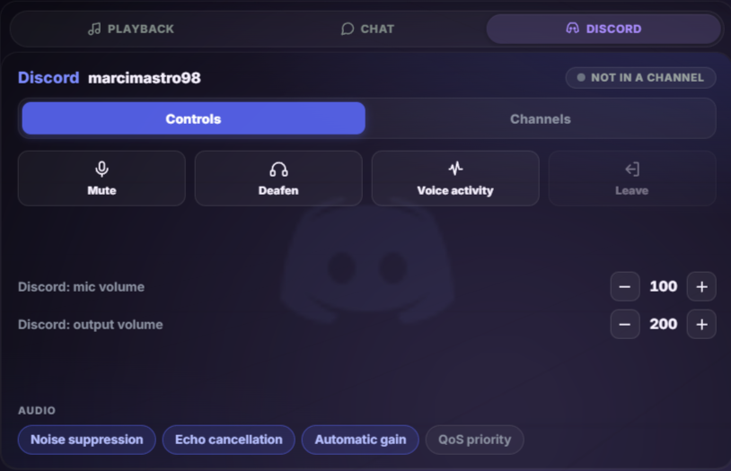

Connect your **Twitch** and **YouTube** accounts to control your stream from the dashboard and Deck, use dedicated **OBS**, **Discord** and **Spotify** widgets, and drive **Discord** voice and **Spotify** playback from the Deck.

- **Twitch widget** — live status (channel, viewers, game, title, or Offline), actions (Go live / End stream via OBS, mic mute, Clip / Marker / Ad), and a built-in **live chat** (read anonymously). Styled in Twitch purple.
- **YouTube widget** — live status, viewer count, total views/likes, an **editable stream title**, **stream health** (Good/OK/Poor), and a one-tap **Go live / End stream**.
- **OBS widget** — a live **program preview**, **Go live / End stream** and **Record / Stop** buttons (with LIVE/REC indicators), and a **scene switcher** that highlights the current scene.
- **Discord widget** — the voice channel you're in with its **members and a live highlight on whoever's speaking**, your **mute / deafen / push-to-talk** state, one-tap **mute, deafen, PTT, leave, mic & output volume** and **audio-processing** toggles, plus a **channel list grouped by server** to jump into any voice channel. Extra tabs add a **Soundboard** (tap a sound to play it into your current channel) and **Notifications** (your DMs and mentions — see [Notifications](#notifications)). Updates **in real time** (event-driven, not polled). Styled in Discord blurple.
- **Spotify widget** — a full player: a **now-playing hero** (large art, a **draggable seek bar**, play/pause · prev · next · shuffle · repeat, a **♥ like**, and a **device volume slider**) over three tabs — **Up Next** (live queue with cover art), **Playlists** (tap to play) and **Spotify Connect devices** (tap to move playback). Styled in Spotify green.

### Spotify

Connect your **Spotify** account to see and steer your listening from the dashboard and Deck. It complements the Media tile rather than duplicating it — the Media tile shows Windows' now-playing for *any* app; the Spotify widget adds the Spotify-only things Windows can't expose.

- **Now-playing hero** — large album art, track/artist, and a **live seek bar** you can drag to scrub. Full transport: **play/pause, previous, next, shuffle, repeat** (off / all / one), a **♥ like** that fills when the track is in your Liked Songs, and a **volume slider** for the active device. A header **device chip** shows where playback is happening; the progress ticks smoothly between refreshes.
- **Up Next** — the **live queue** with cover art.
- **Playlists** — your playlists with covers; **tap one to start playing** it.
- **Devices** — your **Spotify Connect** targets (this PC, phone, speakers…); **tap one to move playback** there, with the active device marked.
- **Deck actions** — **play/pause, next, previous, shuffle, repeat, like, set/step volume, seek/restart, save to Liked, play a playlist** (link / URI / ID), and **switch device** (by name).

It's **lightweight**: the widget only talks to Spotify while its tile is on screen (playback state refreshes on a gentle interval, with a local ticker keeping the seek bar smooth in between; playlists and devices load when you open their tab), and does nothing when hidden.

Connect it from its own **Settings → Spotify** section, which explains what you get and walks you through setup. Spotify uses the modern **PKCE** flow, so you paste **only a Client ID** (no secret): create your own free Spotify app, add the redirect URI `http://127.0.0.1:3030/stream/spotify/callback` (shown with a one-tap **Copy** button in that section), paste the Client ID, tap **Connect**, and approve access in the Spotify tab that opens. Your token stays on your PC and is never sent to the browser.

> Reading the queue, playlists and devices works on any account; **playback control** (play a playlist, shuffle, switch device) needs **Spotify Premium** — a Spotify API limitation.

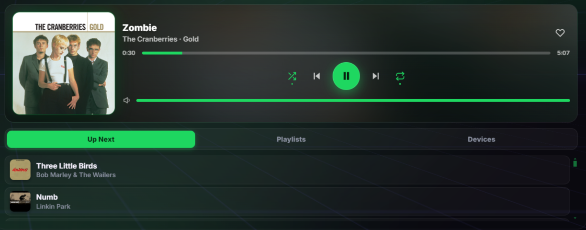

### Discord voice control

Control **Discord** voice from your Deck keys **or the Discord dashboard widget** — the same actions a Stream Deck plugin gives you, driven through Discord's own desktop app (no third-party plugin, and nothing leaves your PC):

- **Mute / unmute** your mic, **deafen / undeafen**, and switch **push-to-talk** on or off.
- **Join a voice channel** — pick any channel from your servers (in the Deck editor, or from the widget's channel list) and jump straight in — or **leave voice** to hang up.
- Nudge your **microphone** and **output** volume up or down, and toggle **audio processing** (noise suppression, echo cancellation, automatic gain, QoS).
- **Play a soundboard sound** — a **Discord: soundboard** Deck action (and the widget's **Soundboard** tab) fires one of your soundboard sounds into the voice channel you're in, the same as clicking it in Discord. Both the Deck picker and the tiles have a **▶ preview** that auditions a sound just for you (no channel needed). Because Discord doesn't officially document this, it's best-effort — a future Discord change would simply make it a no-op, never a crash.

The **Discord widget** (added from the "+" palette, Streaming group) shows the channel you're in — with its members and who's talking — and your live mute/deafen/PTT state, and puts all of the above one tap away, across **Controls**, **Channels**, **Soundboard** and **Notifications** tabs. It updates in real time, reacting to voice changes as they happen instead of polling, so it costs essentially nothing while idle.

Connect it from **Settings → Streaming** (Discord card). Because Discord has no cloud API for voice control, you register your own free Discord app and paste its **Client ID + Secret**, then tap **Connect** and click **Authorize** in the pop-up Discord shows you — your Discord desktop app just needs to be running. The Deck's Discord actions and the widget's controls stay inactive until you connect.

> Playing a Discord **soundboard** sound is supported (Deck action + widget tab, best-effort over Discord's local channel). Thanks to the community on issue #61 for showing it was possible.

**Connect from the dashboard:** **Settings → Streaming** has a card per service. Paste your app credentials right there (Twitch **Client ID**; YouTube and Discord **Client ID + Secret**), tap **Save**, then **Connect** and authorise on your phone or PC with a short code (no password typed on the touchscreen). Your tokens stay on your PC (`server/stream-tokens.json`) and are never sent to the browser.

> Each user registers their own free Twitch app and Google Cloud project — nothing is shared or hard-coded. See **[docs/streaming-setup.md](docs/streaming-setup.md)** for the one-time setup (including the easy-to-miss Google "test user" step).

---

## Remote PC control

Turn your phone into a full remote control of your PC — see the screen and use mouse and keyboard — **even when you're away from home**. Configured entirely from **Settings → Controllo Remoto**, and **off until you opt in**.

- **Command centre, not a reinvention:** the dashboard orchestrates two mature, free tools — **Sunshine** (open-source streaming host) and **Tailscale** (secure access with no open ports). On the phone you use the free **Moonlight** app.
- **Guided, one-place setup:** install Sunshine and Tailscale (via Windows **winget**, official sources), sign in to Tailscale, configure Sunshine, and pair your phone with a **PIN** — all from the touchscreen.
- **Private by design:** the dashboard's local server is **never exposed to the internet**. Your phone talks **directly to Sunshine over your encrypted Tailscale network** — no open ports, and the traffic never passes through the dashboard or any cloud.
- **Always in control:** a one-tap **kill-switch** disconnects any device instantly; a live panel lets you choose which monitor is streamed, disconnect a session, and block/reactivate access without re-running setup.
- **Addable widget & Deck actions:** add the Remote Control panel as a dashboard tile, and use Deck keys for disconnect / block / cycle-monitor (plus a connected-state indicator). All appear only once remote access is configured.

> Requires a free [Tailscale](https://tailscale.com/) account, the free [Moonlight](https://moonlight-stream.org/) app, and one Windows UAC confirmation during setup. Sunshine and Tailscale are installed for you.

---

## Share & import (themes, pages, Deck profiles)

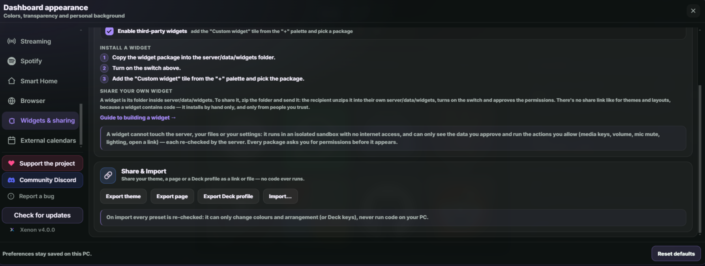

Send your look to a friend with a link — no accounts, no cloud. A **Share & Import** panel in **Settings → Widgets & sharing** lets you export and import three kinds of thing as a compact, self-contained **link** or a downloadable **.json** file:

- **Theme** — your colours, appearance and surface look. An imported theme recolours the dashboard instantly.
- **Page** — a dashboard page with its widgets and arrangement. **Export page** opens a picker of every page (with widget counts, the current one marked, empty pages disabled) so you export the one you mean; an imported page is added as a new page.
- **Deck profile** — a fully programmed Deck profile (keys, folders, styling, photo faces and all its actions), from a **Share** button next to each profile or the Share & Import panel. Because a profile *contains actions*, the recipient gets a **review step first** — the profile's name, key count, and exactly **which action types it contains** ("Open app ×2, Webhook ×1…") — with a reminder to only import from people they trust.

**Safe by construction.** Everything is re-checked on the way in: an imported theme or page can only ever change colours and widget arrangement, and every imported Deck profile is rebuilt from scratch through Xenon's own validators — unknown or malformed actions are dropped, nothing auto-runs on import, and each action is re-checked by the server the moment its key is tapped. Opening a preset link on the machine running your dashboard jumps straight into the import dialog. Profiles with photo key-faces share as a file (too big for a link), with a one-tap **"Share without images"** alternative. Trade presets with other users on the **[Xenon Discord](https://discord.gg/MBVrw9kZyg)**. Fully localised (EN/IT/KO/JA/ZH).

---

## Settings

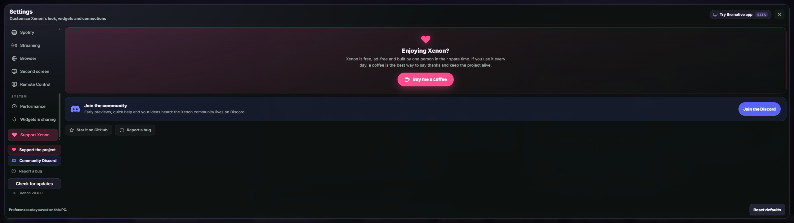

- **Theme** — **Light / Dark / Auto**. Auto follows your Windows app theme (read reliably from the registry server-side) and updates within ~30s. Your accent colour applies to both schemes (Dark is the default).
- **Dashboard style** — two complete visual languages: the default **Liquid Glass**, or **Pixel Retro** — a full '80s/'90s CRT console skin (terminal pixel typography, hard square corners, chunky offset shadows, pixelated album art, a static pixel starfield and an optional **CRT scanline** overlay). One tap to switch, one tap back; the retro skin adds zero animation of its own.
- **Background effects** — two optional, GPU-light ambient layers: an elegant **depth scene** (a faint accent bloom, soft vignette and slow ambient light pools in your accent colour — only when no custom background is set) and **Grid** (a neon perspective grid). Each toggles independently and both stop when the system "reduce motion" setting is on.
- **Color presets** — Xenon (green), Ocean (cyan), Ember (orange), Violet, Mono — plus accent / text / background hex personalization with live preview.
- **Accent from album art** — while music plays, the accent follows the cover (a prominent, hue-faithful colour, smoothly cross-faded); near-greyscale covers and stopped playback fall back to your accent. On by default.
- **Surface controls** — panel opacity down to 18%, background dim and blur, with readability protection for bright custom backgrounds.
- **Language** — English / Italian / Korean / Japanese / Chinese, switchable on the fly.
- **Clock format** — 12h / 24h, show or hide seconds.
- **Weather** — automatic detection or a manual city; **°C / °F** unit.
- **Background media** — upload a custom image (JPG/PNG/WebP/GIF) or video (MP4/WebM, up to 200 MB); MP4 is converted to WebM when FFmpeg is available.
- **Lock Screen widgets** — enable/disable each tile individually.
- **Xenon AI** — provider selector (Gemini / Local), API key, capabilities guide, TTS toggle.
- **Widgets & sharing** — one place to both *extend* and *share*: enable the [Widget SDK](#widget-sdk-build-your-own) and manage community widgets, and export/import your theme, pages and Deck profiles ([Share & import](#share--import-themes-pages-deck-profiles)).
- **Notifiche** — master switch for notifications and on-screen pop-ups (Windows + Discord).
- **Browser** — the optional one-click ad-blocker for Browser tiles.
- **Startup** — if you use Xenon in a normal browser, it can **open the dashboard automatically when Windows starts** (on by default under **Appearance → Startup**). It only ever sets this up from a real browser, so a Xeneon-Edge-only setup never gets a surprise tab — and the option is hidden there.
- **Performance**, **Illuminazione (Lighting)**, **Calendari esterni**, **Streaming**, **OBS**, **Controllo Remoto** — see their sections above.

All preferences are stored under `xeneonedge.settings.v1` in `localStorage` and synced to the server.

### Performance Mode

An opt-in, transparent, reversible profile under **Settings → Performance** that optimizes your setup on demand.

- **Game mode** *(on by default)* — when a real game runs full-screen, the animated background and the Xenon AI glow automatically pause and fade out, so the widget stops competing for the GPU; they resume when you exit. Detection keys on the **foreground full-screen window** (far more reliable than frame-rate guessing) — maximized desktop apps, the dashboard's own browser host, and iCUE/Corsair are all excluded. Needs no extra tools or admin rights.
- **On-demand optimization** — it notices what you're doing (gaming / coding / writing) and can offer to optimize via a banner (games only by default; you choose which activities and apps trigger it). Trigger it any time with **Optimize now** or the **Optimize performance** button on the System tile.
- **You confirm everything** — a confirmation sheet lets you tick exactly what to apply: pause animations (zero-risk), a high-performance power plan, a gentle **AboveNormal priority boost** for the active app, and which background apps to close (graceful — never force-killed; critical Windows processes always refused).
- **Fully reversible** — it remembers your previous power plan, the boosted process, and closed apps, and restores everything on **Restore** or session end, even after a restart.
- **Pauses heavy live tiles** *(on by default)* — the **Browser** and **Second screen** tiles stop streaming while a game is running **or** an optimization session is active, and resume on their own afterwards. Because the live stream is the costly part, this keeps an open tile from competing with your game. It's the *"Pause heavy tiles"* option — turn it off to keep those tiles live.
- **Works with or without AI** — a toggle lets Xenon AI pre-select which background apps to close (with a one-line explanation) when configured, or keep decisions fully deterministic. You can also ask by voice/chat: "optimize performance" / "restore performance".
- **Idle background rest** — the animated background (Aurora + neon grid) drifts continuously, which keeps the GPU drawing frames even when the picture barely changes. After about a minute without any touch/mouse/key input — or whenever the tab is hidden — the animation now **freezes in place** and resumes the instant you interact. It looks identical while you're using it; it just stops working the GPU when no one's watching. (On laptops where the dashboard is drawn by the discrete GPU but the Xeneon Edge is driven by the integrated GPU, this also stops the constant frame-copying between the two cards.)
- **Rendering GPU panel** — a panel in **Settings → Performance** shows which graphics card your browser is actually drawing the dashboard on. If that's your discrete GPU (a common cause of the dashboard running hot on laptops), it explains the one-time Windows setting — Settings → System → Display → Graphics → set your browser to *Power saving* — that pins the browser to the integrated GPU. Purely informational; it never changes anything on its own.

---

## Smart context profiles

The dashboard can **switch itself to match your activity**. Set up a profile per activity — **gaming, coding, writing, streaming, content creation, meetings** — under **Settings → Performance → Context profiles**, with one dropdown each for **Page / Lighting / Deck / Style**:

- When that activity starts, Xenon applies the profile automatically — it can **jump to a chosen page**, set a **lighting effect**, switch the active **Deck profile**, and even flip the whole **dashboard style**: pick **Pixel Retro** for gaming and the 8-bit CRT skin takes over the moment a game starts, returning to **Liquid Glass** when you quit. Start a game and your gaming page + RGB + retro look come up on their own; close it and everything goes back.
- **It reverts when you're done and never fights you.** When the activity ends it restores what was showing before (after a short grace, so a quick Alt-Tab out of a game doesn't flip things back and forth). It only acts on transitions, so you can always swipe to another page or change lighting by hand — if you've moved something yourself, it leaves your choice alone.
- It **reuses Performance Mode's activity detection** (including your custom "which apps count as gaming/coding/…" lists), so there's one consistent notion of what you're doing — no extra background monitoring. Each dimension is optional (leave Lighting on "—" to not touch your RGB), there's a one-tap **Clear profiles**, and the whole feature is **off by default** and fully localised (EN/IT/KO/JA/ZH).

---

## Proactive moments

Xenon speaks up only when it's worth it — everything here is computed **locally** from data the dashboard already reads (**no AI required**, nothing leaves your PC), and each has its own switch under a **Proactive moments** group in **Settings → Performance**.

- **Game session recap** — close a game after a real session (10 minutes or more) and the dashboard greets you back with a one-glance summary: **how long you played, average and peak FPS** (when the FPS reader is installed), and the **highest CPU/GPU temperatures** the session reached. One toast per session, nothing while you're playing.
- **Sustained heat alerts** — beyond the existing temperature-*spike* warning, Xenon now notices a GPU or CPU that has sat **above its safe threshold continuously for 15+ minutes** (a blocked fan, an airflow problem, a runaway app) and tells you plainly: *"GPU has been at 91°C for 16 minutes"*. Deliberately hard to nag: at most one alert per hour per sensor, only for heat actually observed.
- **A smarter morning greeting** — the morning greeting splash includes **today's first calendar events** in a small glass card, and (with spoken Ambient presence on) Xenon reads your day ahead aloud: weather plus *"You have 3 events today. First up: …"*.

Fully localised (EN/IT/KO/JA/ZH); zero cost while no dashboard is open.

---

## Daily greeting

Once per part of the day, Xenon welcomes you with a **fullscreen cinematic greeting** — its own scenography for each moment: a warm rising sun at dawn, bright daylight in the afternoon, a glowing sunset in the evening, and a moonlit sky with twinkling stars at night.

- The greeting **types itself in** letter by letter, followed by a friendly line, today's date, and — when available — a glass pill with the **current weather** (condition, temperature, city).
- It **dismisses itself** after a few seconds (a thin progress line shows how long) or instantly with a tap anywhere.
- Fully respects the system **reduce-motion** preference, and never repeats the same part-of-day greeting after a reload.

> With **Ambient presence** (an opt-in Xenon AI feature) the greeting can also be **spoken aloud**, alongside heads-up reminders before events and spoken Guardian alerts. See [Xenon AI → Advanced AI features](#advanced-ai-features-opt-in).

---

## Top bar

Designed for clarity on a touchscreen — every action is a clear **labelled button** (icon + text), collapsing to icons only on very narrow widths.

- **Big centred live clock** (configurable format) with a pulsing accent colon; AM/PM reads as a clean, box-less superscript
- A prominent **weather chip** with a **live animated condition icon**, a large temperature, and a soft tint matching the current weather — tap to open the weather modal
- **Lock** (Windows lock) · **Focus** (distraction-free lock screen) on the left
- **Page dots** · **Xenon** (AI voice) in the centre
- **Layout** · **Settings** · **Apps** (open-window switcher + favourites) on the right

### Minimal style

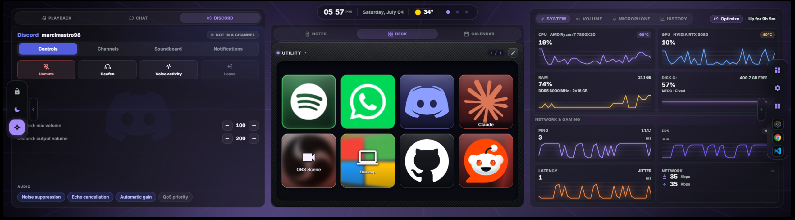

Prefer more room for widgets? **Settings → Appearance → Top bar** switches the chrome from **Full** to **Minimal**, clearing almost the entire top of the screen.

- **Actions dock to the screen edges.** Lock, Focus and Xenon slide into a slim glass rail on the **left**; Layout, Settings, App and your favourites into a matching rail on the **right** — vertically centred, icon-only, touch-sized. A small chevron pull collapses each rail to just its tab; whether it's open is remembered per device.
- **Widgets reclaim the full height.** The chrome floats instead of taking a bar, so the dashboard runs edge-to-edge — the left- and right-most tiles stretch the entire height of the display. Only the tile directly under the clock is trimmed slightly at the top, so the capsule sits in clear space above it and never covers a header.
- **One tidy island.** Clock, date, weather chip and page dots merge into a single floating capsule at the top centre, each segment set off by a hairline.
- Same controls, a fraction of the space — the layout editor previews the minimal bar too (its tools tuck below the clock island), and you can switch back to **Full** at any time.
