# Xenon — Features

The complete guide to everything Xenon can do. For installation see **[README.md](README.md)**; for the API and architecture see **[DEVELOPER.md](DEVELOPER.md)**.

> **Optimized for the CORSAIR Xeneon Edge, great anywhere.** Every feature below works the same in a browser on a normal monitor as it does on the Xeneon Edge touchscreen. Touch gestures have mouse/keyboard equivalents, and the layout reflows for landscape, portrait, large windows, and the Edge's short screen.

## Contents

- [The dashboard](#the-dashboard)
- [Multi-page & layout editor](#multi-page--layout-editor)
- [System monitor](#system-monitor)
- [Network & in-game FPS](#network--in-game-fps)
- [Media](#media)
- [Audio](#audio)
- [Microphone](#microphone)
- [Xenon AI](#xenon-ai)
- [RGB lighting](#rgb-lighting)
- [Deck](#deck)
- [Calendar](#calendar)
- [Tasks](#tasks)
- [Timers](#timers)
- [Notes](#notes)
- [Weather](#weather)
- [Focus lock screen](#focus-lock-screen)
- [App switcher](#app-switcher)
- [Streaming (Twitch, YouTube, OBS)](#streaming-twitch-youtube--obs)
- [Remote PC control](#remote-pc-control)
- [Settings](#settings)
- [Performance Mode](#performance-mode)
- [Daily greeting](#daily-greeting)
- [Top bar](#top-bar)

---

## The dashboard

The home screen is a fully modular **Bento** grid you can shape around the panels you actually use. By default it shows three tidy **hub tiles**, each grouping related content as tabs:

- **Media** — Playback · Chat (Xenon AI)
- **Agenda** — Calendar · Timer · Tasks · Notes
- **System** — System (CPU/GPU/RAM/Disk + Network & Gaming) · Volume · Microphone

When a hub is left with a single item inside, its tab bar hides automatically for a cleaner look.

All layout choices are saved automatically (locally and to the server), so the dashboard stays the way you left it after a refresh or restart. On upgrade the layout migrates automatically while preserving your other settings (theme, weather, API key…).

---

## Multi-page & layout editor

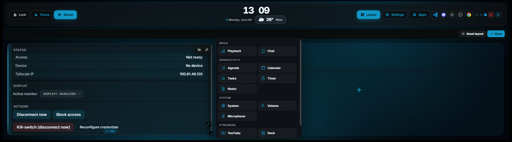

The dashboard is a horizontal **pager** — page 1 is your dashboard, and you can add more pages and place any module on any of them. Move between pages by:

- **Swiping** sideways on the touchscreen
- **Scrolling** horizontally (or holding **Shift** while scrolling the wheel)
- **Dragging** an empty area left/right with the mouse
- **Arrow keys** ← / →
- Tapping the **page dots** in the top bar

Navigation is compositor-driven (CSS scroll-snap), so it stays smooth and inexpensive even while a game or heavy workload is running.

### Layout mode

Tap **Layout** in the top bar to edit. In Layout mode you can:

- **Drag** a tile by its left-edge grip to reposition it.
- **Resize** from the corner chip at the bottom-right (snapped to a clean grid).
- **Hide** (👁) any tile, or **move it to another page** (⇄).
- Use the **"+"** drop-zone on any page to open a palette and add any available widget. The palette is organised into categories (Media, Productivity, System, Streaming) with an icon per widget.
- **Reset** the layout of the page you're looking at: the stock page returns to its default arrangement, while custom pages are tidied up — never deleted.

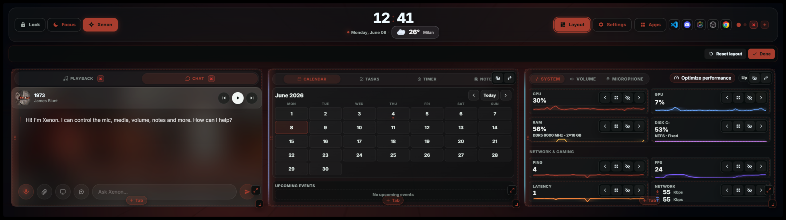

### Tab-grouping & duplication

- **Group widgets into tabs:** drag one tile onto the centre of another to merge them into a single tabbed tile (e.g. Calendar + Music); drag a tab's ⤤ out to split it back.
- **Duplicate any widget:** the "+" can add another copy of a module so it lives on several pages at once. Every copy is a **live mirror** of the same source — edit one (tick a task, type a note, change a track) and every copy updates. Each copy has its own **×** to remove just that copy.

### Layout presets

Save arrangements you like and reuse them in one tap. In Layout mode every tile has a **bookmark** button that saves it as a reusable **preset** — for a single widget *or* a whole tab-group (e.g. your Calendar + System tab). A **Save page** action stores an entire page (all its tiles and their arrangement) as a template. Saved presets appear under **My presets** in the layout toolbar: tap one to drop it onto the current page (a saved page creates a brand-new page), or remove it with its **×**. Reinserting never disturbs what's already on screen — existing components are duplicated as live copies — so you can rebuild a deleted tab in one tap or reuse a favourite arrangement on another page. Presets are saved on the server, so they survive reloads and restarts.

### Pages

The Layout **Pages** manager lets you **add, rename, remove, and reorder** dashboard pages (1–8). Removing a page asks for confirmation and moves its modules to the hidden list (restorable).

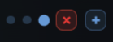

Customization goes deeper too: the individual **System cards** (CPU, GPU, RAM, Disk) and **audio sub-controls** (Volume, Speaker, Microphone) can each be reordered, resized, hidden, and restored.

---

## System monitor

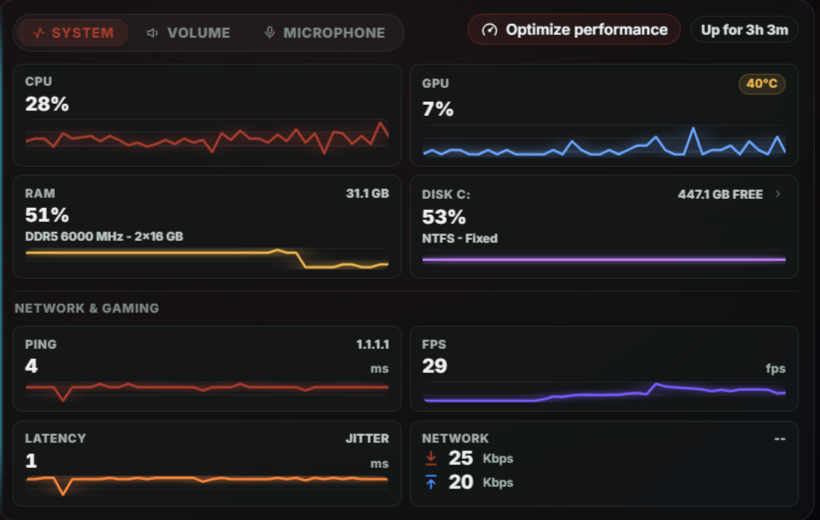

Real-time hardware readouts from Windows performance counters and LibreHardwareMonitor:

| Metric | Details |
|--------|---------|
| **CPU** | Usage %, package temperature, hostname, uptime |
| **GPU** | Usage %, temperature (NVIDIA `nvidia-smi` or WMI fallback) |
| **RAM** | Used / total (GB), load % |
| **Disks** | Temperature per drive (LibreHardwareMonitor) |

- Live **download / upload** throughput (MB/s) from the active adapter
- **Ping** and **jitter** to a configurable target
- **Real in-game FPS** — the actual frame rate of the running game, including **exclusive-fullscreen** titles, via **PresentMon** (installed by `INSTALL.bat`). Falls back to a DWM reading (windowed/borderless only) if PresentMon isn't present.

The System tile compresses cards to share the available height so everything stays visible on the Edge's short screen, and fills tall desktop windows. Card order, size, visibility, tab order, and the remembered active tab all persist.

---

## Media

The Media tile has two tabs — **Playback** and **Chat** (Xenon AI). It reads the currently playing track from **any SMTC-aware app** (Spotify, YouTube Music, Windows Media Player, Chrome, Edge…).

- Album artwork fetched automatically (the last known cover is kept if the track briefly drops it, so it never flickers to "No media")
- Title and artist
- **Play / Pause / Previous / Next** transport
- A **source badge** shows the official icon of where you're listening (Spotify/YouTube brand mark, or the app's real executable icon)
- A **per-source volume slider** (with mute) controls the volume of the app currently playing, independently of master volume
- When nothing is playing, the tile opens on the **Chat** tab so it is never empty. While music plays, the Chat tab keeps a compact mini player visible with the album art softly blurred behind the conversation

---

## Audio

- **Output device picker** — switch between speakers, headphones, and headsets in one tap
- **Master volume slider** (0–100%) and **mute toggle**
- **Per-app Audio Mixer** — when any app produces audio (Spotify, Discord, Chrome/YouTube, iCUE…), a compact mixer appears below the master slider. Each row shows the **real icon extracted from the executable**, a friendly name, an independent volume slider, a percentage, and a per-app mute toggle. The list matches the Windows 11 Volume Mixer one-to-one (only active sessions, no idle background apps), and hides automatically when nothing is producing audio.

All changes take effect immediately via the bundled [SoundVolumeView](https://www.nirsoft.net/utils/sound_volume_view.html) (NirSoft, freeware).

---

## Microphone

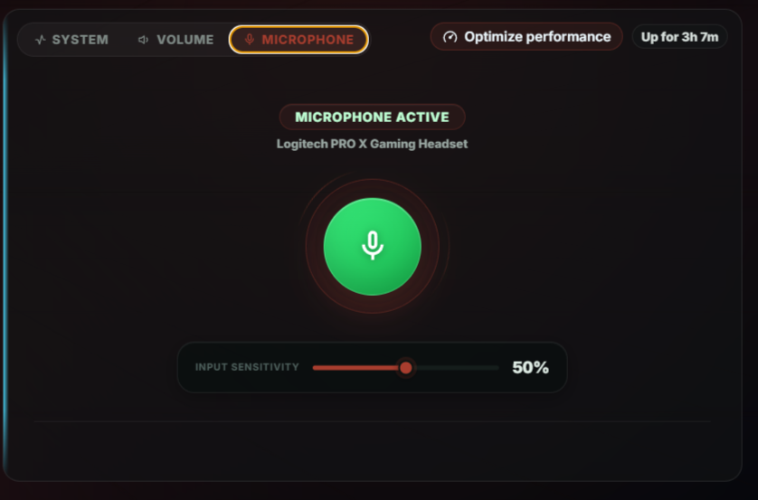

- **One-click mute / unmute** with a clear visual indicator
- Live input **level meter**
- **Change the default mic device** from a drop-down — no need to open Windows Settings
- **Per-app Mic Mixer** — when an app actively captures audio (Discord in a voice channel, Teams, OBS…), a section appears below the master controls with a per-app sensitivity slider and mute toggle. It hides automatically when no app is using the mic.

---

## Xenon AI

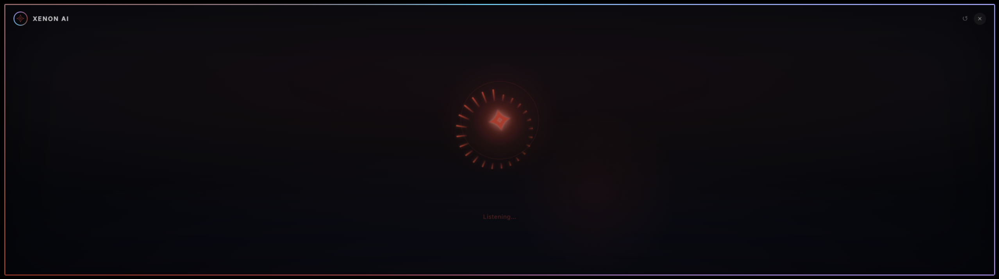
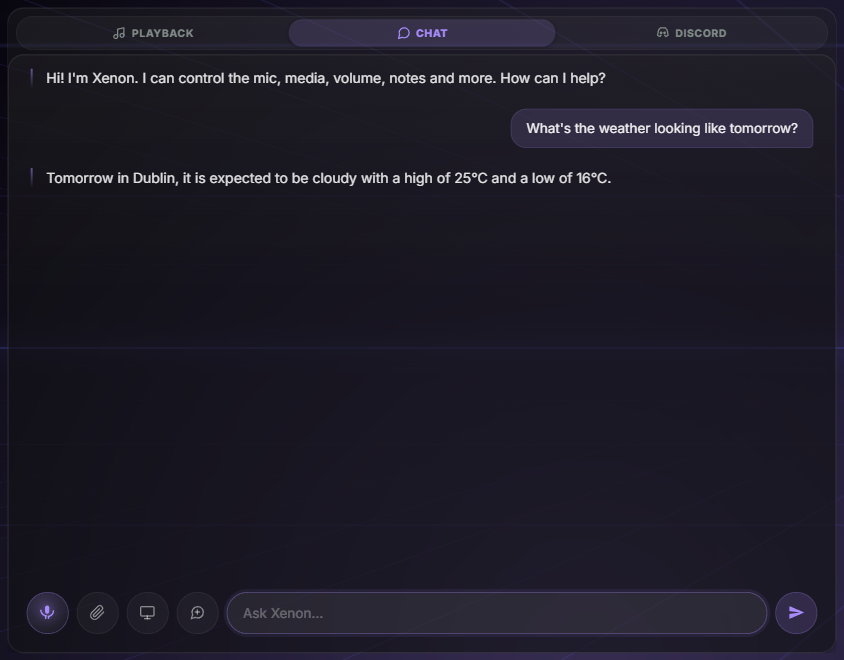

A full **voice + vision + chat** assistant. Text chat lives in the **Media tile's Chat tab**; voice mode is started from the **Xenon** pill in the top bar, where the assistant is visualised as an animated **circular audio equaliser** that reacts to its three states (listening / thinking / speaking).

### Two providers — your choice

- **Gemini (cloud)** *(default)* — text & vision via Gemini, with natural neural voice replies. Needs a free [Gemini API key](https://aistudio.google.com).
- **Local (Ollama)** *(free, on-device)* — runs entirely on your PC with no API key: **Ollama** (chat & function-calling, e.g. Qwen 2.5, Gemma 4 12B), **Whisper.cpp** (speech-to-text), and **Microsoft Edge neural voices** (text-to-speech). It even has key-free web search via DuckDuckGo.

Switch providers in **Settings → Xenon AI**. Choosing local opens a hardware-compatibility panel that scans RAM, VRAM, and CPU cores and **blocks the option on machines that aren't powerful enough** (restoring Gemini). You can pick a model tier (Auto / Light / Balanced / Powerful / Custom), check the live status of Ollama, Whisper, and the Edge voice, and download a model from Settings with a progress bar.

The local components are **not bundled or pre-downloaded** (so installation stays fast). When you switch to Local: **Whisper** downloads in-app with a progress bar ("Download Whisper"), **Ollama** is installed from its official page ("Install Ollama"), and the chat model is downloaded from the same panel.

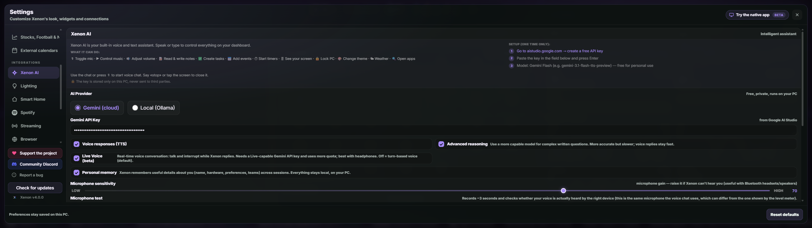

### What it can do

| Category | Commands |
|----------|----------|
| **Mic** | Toggle mute / unmute |
| **Media** | Play/pause, next, previous |
| **Volume** | Set to any level (0–100) |
| **Timers** | Start named countdowns, list, delete |
| **Notes** | Read or rewrite the scratchpad |
| **Tasks** | List tasks, create with priority |
| **Calendar** | List upcoming events, create an event |
| **Screen vision** | Capture and analyse any monitor in real time |
| **Apps & web** | Open any app, website, or file; web search |
| **Lighting** | Set colours/effects, toggle the RGB bridge |
| **Deck** | Switch Deck profile by name |
| **Performance** | "Optimize performance" / "restore performance" |
| **Dashboard** | Open weather, settings, app switcher, lock screen; switch theme; navigate pages |
| **System** | Lock the PC; get CPU/GPU/RAM stats; check weather |

### How a voice session works

1. Press the **Xenon** pill in the top bar. Activation is instant — Xenon starts listening right away, and a Siri-style animated border glows around the display.
2. Ask your command (e.g. *"set a timer for 10 minutes"*). Master volume **ducks to 20%** while it listens or speaks, then restores.
3. Xenon answers aloud, then **keeps listening for a few seconds** so you can follow up without pressing the button again. Stay silent and the session closes on its own with a soft chime.

The mic re-opens only **after** Xenon finishes speaking, and near-silent or noise-only clips are discarded, so the assistant's own voice is never misheard as a command.

**Tap to interrupt:** during the thinking/speaking phase a "· tap to stop" hint appears — tapping anywhere instantly stops playback and exits voice mode. You can also say "stop"/"basta", or just wait in silence.

### Chat

The Chat tab renders **headings, bold/italic, lists, inline code, and links** as formatted HTML. A **New chat** button resets the conversation, and you can attach **images, PDFs, and text/code files** (TXT, Markdown, CSV, JSON, common code files). Without an API key (Gemini mode) it shows a clear "AI unavailable — add your API key" message, with an option to hide the Chat tab entirely.

### Advanced AI features (opt-in)

A dedicated **Settings → Xenon AI → Advanced AI features** group unlocks four extra capabilities. They are **all off by default** behind a master switch, because they use the AI actively (Gemini API quota, or compute on the local provider):

- **Genesis — AI-built pages.** Ask Xenon to *"build me a streaming page"* and it composes a new dashboard page with the most relevant widgets, arranged in a clean balanced grid, and switches to it. If you just say *"create a new dashboard"*, Genesis first asks what the page is for (gaming, work, music…) so it can pick the right modules. AI-created pages are normal pages: renameable, editable in Layout mode, removable.
- **Game Companion.** An in-game overlay with FPS, session time, and on-demand AI screen insights while you play.
- **Guardian — PC health.** Keeps a local history of temperatures and loads, and gives you an AI analysis on demand ("how is my PC doing?").
- **Ambient presence.** Proactive greetings and contextual alerts, spoken aloud when TTS is on.

The same settings page also previews the **Community Hub** *(coming soon)* — a place to share and download dashboard pages, Deck profiles, and themes made by the community.

### Privacy

The Gemini API key is stored **only on this PC** (`server/settings.json`) and is never sent to any other service. The local provider runs fully on-device.

---

## RGB lighting

The dashboard can **drive your Corsair RGB devices from real data** — all from **Settings → Illuminazione (Lighting)**.

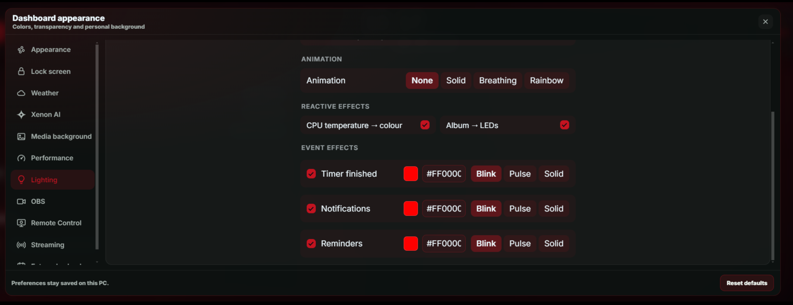

**Reactive effects:**

- **CPU temperature → colour** — a cool blue → warm red gradient that follows your CPU temp
- **Timer expiring → pulse** — a red pulse when a countdown finishes
- **Volume → flash** — a brief accent-coloured flash when you change the volume
- **Album art → colour** — the current track's cover colour drives the LEDs (independent of the main bridge toggle; opt-in)

**Ambient animations** add motion on top: **Solid**, **Breathing**, or **Rainbow**, each with a speed control. They play in sync across all your lights (iCUE *and* external), and the render loop only runs while a moving animation is actually painting — zero idle overhead.

You can also set a **fixed manual colour** (name or hex) that overrides the effects until you reset it.

**Event flashes:** the timer, notifications, and reminders can each flash the lights with a chosen colour (default red) and style — **blink**, **pulse** (breathing), or **solid**.

It is designed to **share control with iCUE**, not fight it: turn the bridge off (globally or per device) and it hands the LEDs straight back to your normal iCUE profile. It also **idles automatically while you game** (toggleable). Everything is opt-in and granular — a master switch, per-effect toggles, per-game pause, a brightness slider, and a per-device on/off list — and the bridge is **off by default**.

**Xenon AI** can control all of this by voice or chat: *"turn the lights red"*, *"enable the temperature effect"*, *"set the timer effect to a blue pulse"*, *"turn the lighting off"*.

> **Requirements:** iCUE must be running with the **SDK enabled** (iCUE → Settings → enable the SDK). Without it, Lighting shows a friendly "iCUE not detected" notice and the rest of the dashboard is unaffected. The native binding (koffi + iCUE SDK) loads **only when you enable the bridge**, so users who never turn it on pay zero cost.

> External providers — **WLED, OpenRGB, Philips Hue, Nanoleaf** — are also supported, with on-demand LAN discovery.

---

## Deck

A programmable, **Stream Deck-style key grid** you can add to any dashboard page (and duplicate like any other widget) — styled to look and feel like a real physical device.

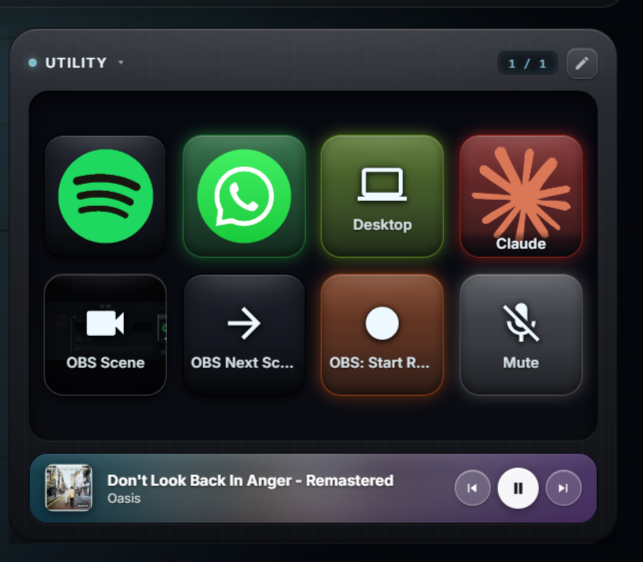

- **Tactile, lit keys:** glossy LCD caps in a matte chassis with a soft RGB underglow. Keys press in on tap, lift and brighten on hover, flash while an action runs, and light up and breathe when active.
- **Key size that fits the tile:** an edit-mode toolbar (✎) offers **Small / Medium / Large** keys. With **Auto** on (default) the Deck shows exactly as many true-square keys as fit the tile (up to 8 columns, Stream Deck XL width); turn Auto off to set columns and rows by hand. Your keys are never dropped when the grid changes.
- **Built-in music screen:** turn on **Musica** to dock a now-playing LCD-style screen under the keys — album art, title/artist, and transport, tinted by the cover's colours. When idle it shows a **Standby** face (output device + live volume meter).
- **Build your own keys:** add a title, an emoji / vector icon / uploaded image (with fill/fit/icon sizing) and an accent colour; turn a key into a **folder**; add/remove **pages**; and pick a **tap feedback** effect (glow, press, hold, blink, off). A roomy editor with categorized, icon-labelled pickers makes it fast.
- **Key Logic & Multi-Action:** one key can run a **tap / double-tap / hold** trigger, and each trigger can run a **sequence** of actions with delays (e.g. mute mic → wait → open an app).
- **Live state:** keys can reflect a live state (mic muted, speaker muted, OBS recording/streaming, remote connected) with an accent ring; OBS keys glow green while recording / red while live, and a scene key shows a small live thumbnail of what's on air.
- **Profiles:** keep separate key sets (streaming / work / gaming) as profiles. Switch instantly from the faceplate header; create, rename, and delete profiles in edit mode. Switch by voice too ("switch to my streaming profile").

**Available actions:** open an app / file / URL · open a Microsoft Store (UWP) app · keyboard shortcut (hotkey, sent to the app behind the dashboard) · media controls · mic/speaker mute · per-app volume / mute · app mixer overlay · play sound (soundboard) · OBS (scene / record / stream / mute) · Twitch (clip / marker / ad) · YouTube broadcast · Remote Control (disconnect / block / cycle monitor) · webhook (GET/POST any URL) · Xenon AI (send prompt / voice session / open chat) · RGB LED reactions. Every action runs through a single **allowlisted dispatcher** on the local server — no arbitrary commands — and a key **flashes red** if an action fails, so it's never a silent no-op.

---

## Calendar

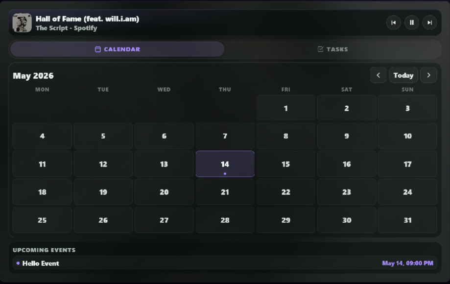
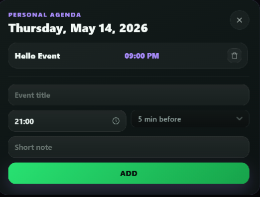

- Add, edit, and delete **events** directly on the widget
- Tap any day to open the **Day Modal** with full event details
- **Reminder toasts** pop up at the configured time — no external app needed
- Stored locally in `server/events.json`

### External calendar sync (Outlook & Google)

Show events from your real Outlook and Google calendars alongside your local ones. In **Settings → Calendari esterni**, paste each calendar's **iCal (`.ics`) link** (the panel gives step-by-step instructions for Google and Outlook). Each feed gets its own colour, an on/off switch, and an optional reminder toggle; feeds refresh automatically every 15 minutes.

> External events are **read-only** (you can't edit them from the widget). Google's secret link can take hours to reflect changes (Google's side). The link is stored only on your PC. Works with any calendar that publishes an `.ics` link (iCloud, etc.), with no account or sign-in.

---

## Tasks

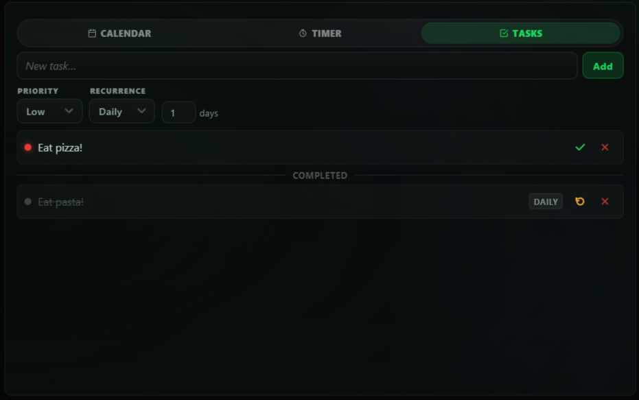

Part of the **Agenda** hub (or pull it out into its own tile from the Layout editor).

- Add tasks with a name, a **priority** (high / medium / low), and optional **recurrence** (daily, weekly, or every N days)
- **Colour-coded priority dots** (red / amber / green) and action buttons (complete / undo / delete)
- Completed tasks move to a separate section with strikethrough styling
- Recurring tasks **reset themselves automatically** when their interval elapses
- Stored locally in `server/tasks.json`

---

## Timers

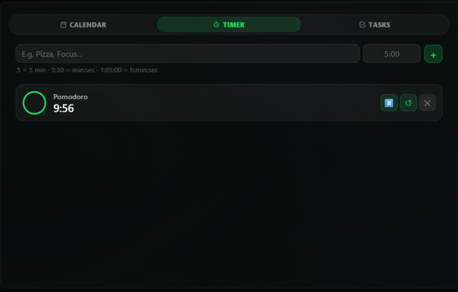

Part of the **Agenda** hub (or its own tile). Create a timer by typing a label and a duration (`5:00`, `1:30:00`, or a plain number of minutes) and tapping **+**.

- **SVG ring arc** shows real-time progress around each card
- Countdown updates ~4×/second for a smooth readout
- **Pause / Resume / Restart / Delete** on each card
- **Toast** slides up when a timer finishes (and can flash your RGB lights)
- **AI integration:** "set a 10-minute timer called Pasta" creates one instantly
- Persists across server restarts (`server/timers.json`); up to 20 simultaneous timers

---

## Notes

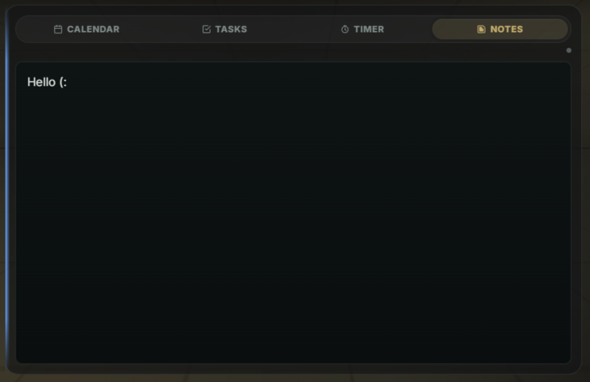

- Inline, always-visible **scratchpad** — just tap and type
- **Auto-saves** on every keystroke; survives server restarts
- Plain text, no formatting needed

---

## Weather

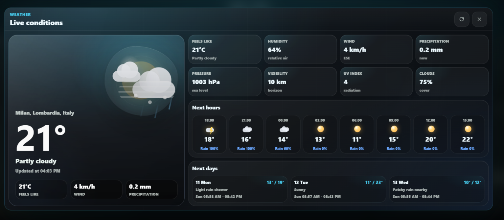

- **Current conditions** — temperature, feels-like, humidity, wind speed/direction, pressure, visibility, UV index, cloud cover, precipitation
- **3-day forecast** — daily high/low and condition summary
- **8-hour hourly timeline** (scrollable)
- Location **auto-detected via IP** or set manually to your city (your choice persists)
- **°C / °F** toggle applies everywhere instantly
- Tap the weather chip in the top bar to open the full detail modal
- Data from [wttr.in](https://wttr.in/) (free, no account), refreshed every 10 minutes; descriptions follow the widget language

---

## Focus lock screen

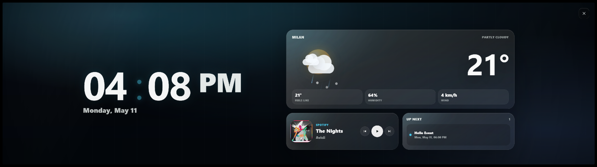

An internal, client-side overlay that dims everything into a distraction-free view — separate from the Windows PC lock.

- Activated via the **Focus** button (lock icon) in the top bar; dismissed with a tap or Esc
- **Animated clock** — digits bounce on change, the colon pulses, the clock breathes
- Configurable **widgets** (each independently toggleable in Settings): **Clock**, **Now Playing** (art, title, artist, controls), **Upcoming Events** (next 1–3), and a **Weather summary**
- When only Now Playing is active, it expands to fill the screen

---

## App switcher

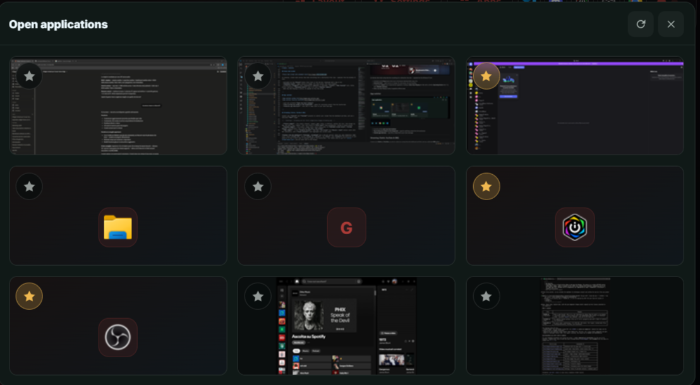

- Lists all currently **open top-level windows**
- **Tap to bring any window to the foreground** — great for switching context from the touchscreen
- **Favorite app shortcuts** — save URLs or deep links to your most-used apps

---

## Streaming (Twitch, YouTube & OBS)

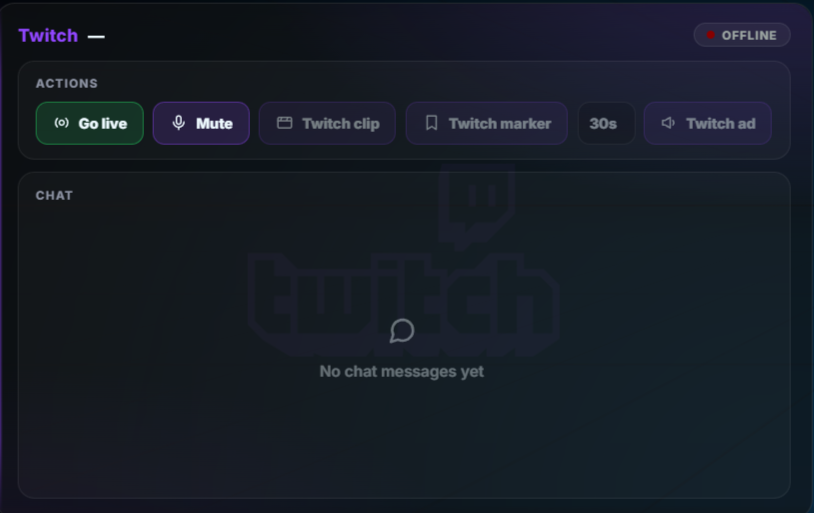
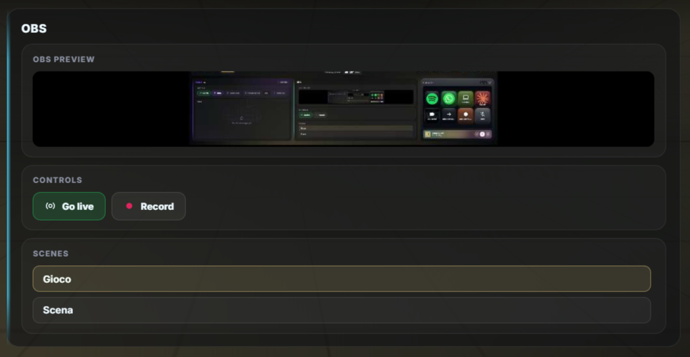

Connect your **Twitch** and **YouTube** accounts to control your stream from the dashboard and Deck, and use a dedicated **OBS** widget.

- **Twitch widget** — live status (channel, viewers, game, title, or Offline), actions (Go live / End stream via OBS, mic mute, Clip / Marker / Ad), and a built-in **live chat** (read anonymously). Styled in Twitch purple.
- **YouTube widget** — live status, viewer count, total views/likes, an **editable stream title**, **stream health** (Good/OK/Poor), and a one-tap **Go live / End stream**.
- **OBS widget** — a live **program preview**, **Go live / End stream** and **Record / Stop** buttons (with LIVE/REC indicators), and a **scene switcher** that highlights the current scene.

**Connect from the dashboard:** **Settings → Streaming** has a card per service. Paste your app credentials right there (Twitch **Client ID**; YouTube **Client ID + Secret**), tap **Save**, then **Connect** and authorise on your phone or PC with a short code (no password typed on the touchscreen). Your tokens stay on your PC (`server/stream-tokens.json`) and are never sent to the browser.

> Each user registers their own free Twitch app and Google Cloud project — nothing is shared or hard-coded. See **[docs/streaming-setup.md](docs/streaming-setup.md)** for the one-time setup (including the easy-to-miss Google "test user" step).

---

## Remote PC control

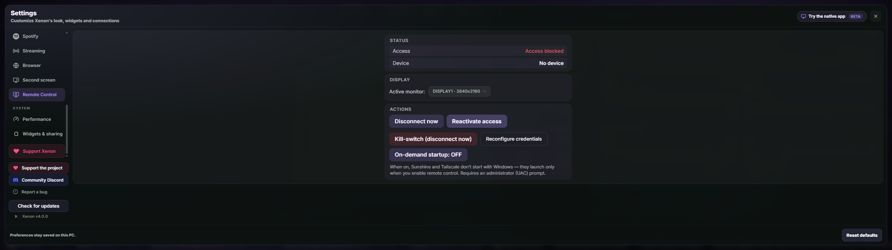

Turn your phone into a full remote control of your PC — see the screen and use mouse and keyboard — **even when you're away from home**. Configured entirely from **Settings → Controllo Remoto**, and **off until you opt in**.

- **Command centre, not a reinvention:** the dashboard orchestrates two mature, free tools — **Sunshine** (open-source streaming host) and **Tailscale** (secure access with no open ports). On the phone you use the free **Moonlight** app.
- **Guided, one-place setup:** install Sunshine and Tailscale (via Windows **winget**, official sources), sign in to Tailscale, configure Sunshine, and pair your phone with a **PIN** — all from the touchscreen.
- **Private by design:** the dashboard's local server is **never exposed to the internet**. Your phone talks **directly to Sunshine over your encrypted Tailscale network** — no open ports, and the traffic never passes through the dashboard or any cloud.
- **Always in control:** a one-tap **kill-switch** disconnects any device instantly; a live panel lets you choose which monitor is streamed, disconnect a session, and block/reactivate access without re-running setup.
- **Addable widget & Deck actions:** add the Remote Control panel as a dashboard tile, and use Deck keys for disconnect / block / cycle-monitor (plus a connected-state indicator). All appear only once remote access is configured.

> Requires a free [Tailscale](https://tailscale.com/) account, the free [Moonlight](https://moonlight-stream.org/) app, and one Windows UAC confirmation during setup. Sunshine and Tailscale are installed for you.

---

## Settings

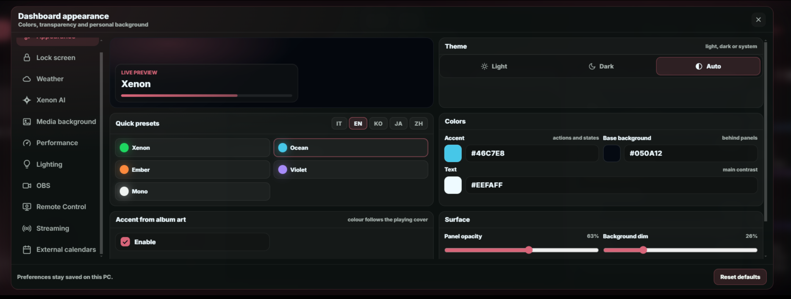

- **Theme** — **Light / Dark / Auto**. Auto follows your Windows app theme (read reliably from the registry server-side) and updates within ~30s. Your accent colour applies to both schemes (Dark is the default).
- **Background effects** — two optional, GPU-light ambient layers: **Aurora** (soft flowing accent gradients, only when no custom background is set) and **Grid** (a neon perspective grid). Each toggles independently and both stop when the system "reduce motion" setting is on.
- **Color presets** — Xenon (green), Ocean (cyan), Ember (orange), Violet, Mono — plus accent / text / background hex personalization with live preview.
- **Accent from album art** — while music plays, the accent follows the cover (a prominent, hue-faithful colour, smoothly cross-faded); near-greyscale covers and stopped playback fall back to your accent. On by default.
- **Surface controls** — panel opacity down to 18%, background dim and blur, with readability protection for bright custom backgrounds.
- **Language** — English / Italian / Korean / Japanese / Chinese, switchable on the fly.
- **Clock format** — 12h / 24h, show or hide seconds.
- **Weather** — automatic detection or a manual city; **°C / °F** unit.
- **Background media** — upload a custom image (JPG/PNG/WebP/GIF) or video (MP4/WebM, up to 200 MB); MP4 is converted to WebM when FFmpeg is available.
- **Lock Screen widgets** — enable/disable each tile individually.
- **Xenon AI** — provider selector (Gemini / Local), API key, capabilities guide, TTS toggle.
- **Startup** — if you use Xenon in a normal browser, it can **open the dashboard automatically when Windows starts** (on by default under **Appearance → Startup**). It only ever sets this up from a real browser, so a Xeneon-Edge-only setup never gets a surprise tab — and the option is hidden there.
- **Performance**, **Illuminazione (Lighting)**, **Calendari esterni**, **Streaming**, **OBS**, **Controllo Remoto** — see their sections above.

All preferences are stored under `xeneonedge.settings.v1` in `localStorage` and synced to the server.

### Performance Mode

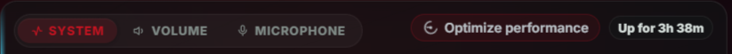
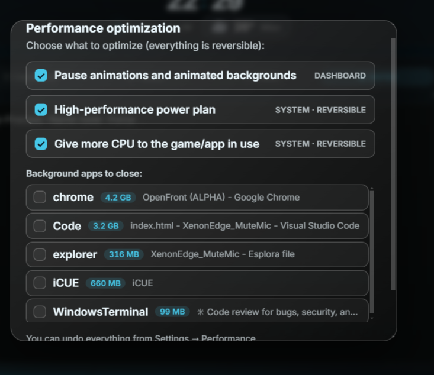

An opt-in, transparent, reversible profile under **Settings → Performance** that optimizes your setup on demand.

- **Game mode** *(on by default)* — when a real game runs full-screen, the animated background and the Xenon AI glow automatically pause and fade out, so the widget stops competing for the GPU; they resume when you exit. Detection keys on the **foreground full-screen window** (far more reliable than frame-rate guessing) — maximized desktop apps, the dashboard's own browser host, and iCUE/Corsair are all excluded. Needs no extra tools or admin rights.
- **On-demand optimization** — it notices what you're doing (gaming / coding / writing) and can offer to optimize via a banner (games only by default; you choose which activities and apps trigger it). Trigger it any time with **Optimize now** or the **Optimize performance** button on the System tile.
- **You confirm everything** — a confirmation sheet lets you tick exactly what to apply: pause animations (zero-risk), a high-performance power plan, a gentle **AboveNormal priority boost** for the active app, and which background apps to close (graceful — never force-killed; critical Windows processes always refused).
- **Fully reversible** — it remembers your previous power plan, the boosted process, and closed apps, and restores everything on **Restore** or session end, even after a restart.
- **Works with or without AI** — a toggle lets Xenon AI pre-select which background apps to close (with a one-line explanation) when configured, or keep decisions fully deterministic. You can also ask by voice/chat: "optimize performance" / "restore performance".

---

## Daily greeting

Once per part of the day, Xenon welcomes you with a **fullscreen cinematic greeting** — its own scenography for each moment: a warm rising sun at dawn, bright daylight in the afternoon, a glowing sunset in the evening, and a moonlit sky with twinkling stars at night.

- The greeting **types itself in** letter by letter, followed by a friendly line, today's date, and — when available — a glass pill with the **current weather** (condition, temperature, city).
- It **dismisses itself** after a few seconds (a thin progress line shows how long) or instantly with a tap anywhere.
- Fully respects the system **reduce-motion** preference, and never repeats the same part-of-day greeting after a reload.

> With **Ambient presence** (an opt-in Xenon AI feature) the greeting can also be **spoken aloud**, alongside heads-up reminders before events and spoken Guardian alerts. See [Xenon AI → Advanced AI features](#advanced-ai-features-opt-in).

---

## Top bar

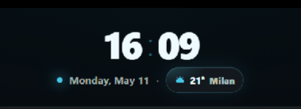

Designed for clarity on a touchscreen — every action is a clear **labelled button** (icon + text), collapsing to icons only on very narrow widths.

- **Big centred live clock** (configurable format) with a pulsing accent colon
- A prominent **weather chip** with a **live animated condition icon**, a large temperature, and a soft tint matching the current weather — tap to open the weather modal
- **Lock** (Windows lock) · **Focus** (distraction-free lock screen) on the left
- **Page dots** · **Xenon** (AI voice) in the centre
- **Layout** · **Settings** · **Apps** (open-window switcher + favourites) on the right
