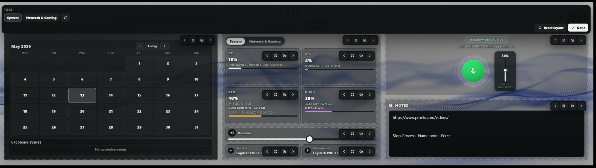
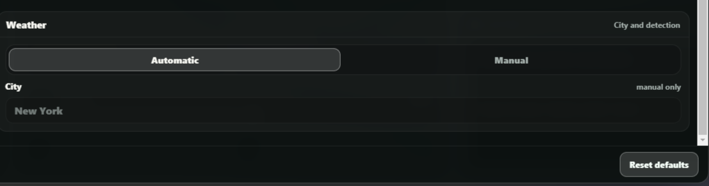
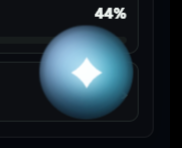
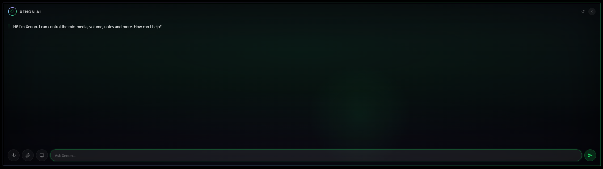

# XenonEdge Hub

A polished, all-in-one dashboard widget built for the **CORSAIR Xeneon Edge 14.5" LCD** — also works in any browser or iCUE iFrame on Windows.
Everything runs **100 % locally**: no cloud, no telemetry, no account required.


> **⚠️ Note:** This is **not a native iCUE widget** yet. It runs as a local Node.js server and is displayed inside iCUE via an **iFrame** — not as a `.icuewidget` package. A native iCUE widget version is in development.

---

## Overview


XenonEdge Hub turns your Xeneon Edge display into a real productivity panel.
At a glance you can monitor your PC health, control media playback, mute your mic, check your schedule, jot down a note, and even dim the screen into a focus lock — all without touching your keyboard.

---

## Sections at a glance

### Customizable Dashboard




The home dashboard is a fully modular **Bento** grid. You can shape it around the panels you actually use most.

By default it shows three tidy **hub tiles**, each grouping related content as tabs:

- **Media** — Playback · Chat (Xenon AI)
- **Agenda** — Calendar · Timer · Tasks · Notes
- **System** — System (CPU/GPU/RAM/Disk + Network & Gaming) · Volume · Microphone

Tap the **Layout** button in the top bar to enter edit mode. From there:

- **Add anything individually** — Calendar, Timer, Tasks, Notes, Volume and Microphone can each be pulled out of their hub into their own standalone tile, or put back. Hidden items appear as one-tap **"add" chips**
- **Move** any tile earlier/later in the grid
- **Resize** tiles through a set of sizes (compact → full) to give more space to what matters
- **Hide** any tile you do not need and restore it later — your other tiles are untouched
- **Reset** the layout at any time to return to the default arrangement
- When a hub (Agenda or System) is left with a single item inside, its tab bar hides automatically for a cleaner look

Customization goes deeper too: the individual **System cards** (CPU, GPU, RAM, Disk) and **Audio sub-controls** (Volume, Speaker, Microphone) can each be reordered, resized, hidden and restored.

All of these layout choices are saved automatically (locally and to the server), so the dashboard stays the way you left it after a refresh or restart. On upgrade the layout migrates automatically while preserving your other settings (theme, weather, API key…).

---

### Media


The Media tile has two tabs — **Playback** and **Chat** (Xenon AI). It shows the currently playing track from **any SMTC-aware app** (Spotify, YouTube Music, Windows Media Player, Chrome, Edge, …).

- Album artwork fetched automatically
- Song title and artist name
- **Play / Pause / Previous / Next** transport controls
- Falls back gracefully when nothing is playing — the tile opens on the **Chat** tab so it is never empty
- On the **Chat** tab a compact mini player (cover, title, prev/play/next) stays visible while music plays, with the album art softly blurred behind the conversation
- The Chat is the built-in **Xenon AI** assistant (see below): a **New chat** button resets the conversation, and you can attach **images, PDFs and text/code files**. Without an API key it shows a clear "AI unavailable — add your API key" message (all languages), with an option to hide the Chat tab entirely

---

### Microphone


- **One-click mute / unmute** toggle with a clear visual indicator
- Live microphone input level meter
- **Change default mic device** from a drop-down list — no need to open Windows Settings
- **Per-app mic mixer**: when an app actively captures audio (Discord in a voice channel, Teams, OBS, …) a dedicated section appears below the master controls with a per-app sensitivity slider and individual mute toggle. It hides automatically when no app is using the microphone

---

### Audio


- **Output device picker** — switch between speakers, headphones, headsets in one tap
- **Master volume slider** (0 – 100 %)
- **Speaker mute toggle**
- **Per-app Audio Mixer**: whenever any application produces audio (Spotify, Discord, Chrome/YouTube, iCUE, …) a compact App Mixer section appears directly below the master slider. Each app row shows the real icon extracted from the executable, a friendly name, an independent volume slider, a percentage, and a per-app mute toggle. Changing a row only affects that app's volume, leaving everything else untouched. The section disappears automatically when no apps are producing audio
- In **Customize Dashboard** mode, Volume, Speaker, and Microphone can each be reordered, resized, hidden, or restored independently
- All changes take effect immediately via [SoundVolumeView](https://www.nirsoft.net/utils/sound_volume_view.html) (bundled, freeware)

---

### System Monitor


Real-time hardware readouts pulled from Windows performance counters and LibreHardwareMonitor:

| Metric | Details |
|--------|---------|
| **CPU** | Usage %, temperature (package), hostname, uptime |
| **GPU** | Usage %, temperature (NVIDIA `nvidia-smi` or WMI fallback) |
| **RAM** | Used / total (GB), load % |
| **Disks** | Temperature per drive (LibreHardwareMonitor) |

In **Customize Dashboard** mode, the System / Network & Gaming panel now supports persistent card order, size, visibility, tab order, and remembered active tab.

---

### Network


- Live **download / upload** throughput (MB/s) sampled from the active adapter
- **Ping** and **jitter** to a configurable target
- **In-game FPS** — shows the *real* frame rate of the active game, including exclusive-fullscreen titles, via PresentMon (installed automatically by `INSTALL.bat`); falls back to a DWM reading (windowed/borderless only) if PresentMon isn't present
- Updates every few seconds without blocking the UI

---

### Weather




- **Current conditions** — temperature, feels-like, humidity, wind speed and direction, pressure, visibility, UV index, cloud cover, precipitation
- **3-day forecast** — daily high / low and condition summary
- **8-hour hourly forecast** with scrollable timeline
- Location can be **auto-detected via IP** or set manually to your preferred city
- Data provided by [wttr.in](https://wttr.in/) (free, no account), refreshed every 10 minutes
- Tap the weather chip in the top bar to open the full detail modal
- Fully bilingual — descriptions in Italian or English following the widget language setting

How location selection works:

- Open **Settings** and choose whether weather should use **automatic detection** or a **manual city**
- In automatic mode, the widget resolves your approximate location from your IP and refreshes weather for that area
- In manual mode, the widget keeps using the city you entered, even after reloads or restarts
- This is useful if the display is used in a fixed setup or if IP-based detection resolves the wrong city

---

### Calendar


- Add, edit, and delete **events** directly on the widget
- Tap any day to open the **Day Modal** with full event details
- **Reminder toasts** pop up on screen at the configured time — no external app needed
- Data stored locally in `server/events.json` (web version) or `localStorage` (iCUE widget)

---

### Task Tracker


Part of the **Agenda** hub (Calendar · Timer · Tasks · Notes) — switch with a single tap, or pull **Tasks** out into its own standalone tile from the Layout editor.

- Add tasks with a name, a **priority level** (high / medium / low) and optional **recurrence** (daily, weekly, or every N days)
- **Colour-coded priority dots**: red for high, amber for medium, green for low
- **Colour-coded action buttons**: complete (green), undo (orange), delete (red)
- Completed tasks move to a separate section with strikethrough styling
- Recurring tasks **reset themselves automatically** when their interval elapses — no manual intervention needed
- Data stored locally in `server/tasks.json` (auto-created, gitignored)

---

### Countdown Timers


Part of the **Agenda** hub (and pullable into its own standalone tile from the Layout editor). Create timers by typing a label and a duration (`5:00`, `1:30:00`, or a plain number of minutes) and tapping **+**.

- **SVG ring arc** shows real-time progress around each timer card
- **Countdown display** updates every ~250 ms for smooth M:SS readout
- **Pause / Resume / Restart / Delete** controls on each card
- **Toast notification** slides up from the bottom when a timer finishes
- **AI integration**: press the voice orb to start a session, then say "set a 10-minute timer called Pasta" and the assistant creates it instantly
- Timers persist across server restarts (stored in `server/timers.json`)
- Up to 20 simultaneous timers

---

### Xenon AI





An AI assistant powered by **Google Gemini** (text & vision via `gemini-3.5-flash`, spoken replies via `gemini-3.1-flash-tts-preview`). The text chat lives in the **Media tile's Chat tab**; voice mode is started from the prominent **Xenon** pill in the top bar. In voice mode the assistant is visualised as an animated **circular audio equaliser** (a ring of luminous bars around a breathing core) that reacts to its three states (listening / thinking / speaking).

#### What it can do

| Category | Commands |
|----------|----------|
| **Mic** | Toggle mute / unmute |
| **Media** | Play/pause, next, previous track |
| **Volume** | Set to any level (0 – 100) |
| **Timers** | Start named countdowns, list running timers, delete timers |
| **Notes** | Read or rewrite the scratchpad |
| **Tasks** | List tasks, create a task with priority |
| **Calendar** | List upcoming events, create a new event |
| **Screen vision** | Capture and analyse any monitor in real time |
| **Apps & web** | Open any app, website, or file by name or URL |
| **Dashboard** | Open weather, settings, app switcher, lock screen |
| **Theme** | Switch colour theme by name |
| **System** | Lock the PC, get CPU/GPU/RAM stats, check weather |

#### Voice mode — button activated

- Press the **Xenon** button in the top bar to start a session.
- Activation is **instant** — Xenon starts listening right away.
- A Siri 2026-style **conic-gradient animated border** glows around the display while listening, and the equaliser reacts to each state.
- **Master volume ducks to 20 %** while the AI listens or speaks, then restores automatically.

#### How a voice session works

1. Press the **Xenon** button in the top bar to start. Xenon listens and waits for your command, e.g. **"what's the weather tomorrow?"** or **"set a timer for 10 minutes"**.
2. Xenon thinks and then speaks the answer aloud. The spoken request is transcribed *and* answered in a single step, so the reply comes back quickly.
3. After the answer Xenon **keeps listening for a few seconds** so you can ask a follow-up straight away — no need to press the button again. Continue the conversation in the same context, or stay silent and the session closes on its own with a soft chime.

The microphone re-opens only *after* Xenon finishes speaking (never while it talks), and near-silent or noise-only clips are discarded, so the assistant's own voice is never misheard as a command.

#### Tap to interrupt (touchscreen)

During the **thinking** or **speaking** phase a **"· tap to stop"** hint appears on the voice screen. Tapping anywhere on that screen **instantly** stops playback, cancels any active recording, and exits voice mode — no need to wait for the TTS to finish.

#### Stopping a voice session

You can close a voice session in three ways:
- Tap the screen (touchscreen devices)
- Say **"stop"**, **"basta"**, **"fermati"**, or similar dismissal commands
- Wait in silence for a few seconds and the session closes automatically

#### Neural voices

Spoken answers use **Google Gemini's native neural voice** — natural and human-like, in any language. Voice replies are kept short and conversational (1-2 sentences), which keeps them quick to speak.

#### Markdown rendering

AI responses render **headings, bold/italic, bullet lists, numbered lists, inline code, and links** as formatted HTML inside the chat bubbles. Plain text and emoji display exactly as before.

#### Setup (one time only)

1. Go to **[aistudio.google.com](https://aistudio.google.com)** → create a free API key
2. Open **Settings → Xenon AI** in the dashboard → paste the key
3. Optionally enable **Risposta vocale (TTS)** to hear answers spoken aloud

The API key is stored **only on this PC** (`server/settings.json`). It is never transmitted to any other service.

---

### Notes


- Inline, always-visible **scratchpad** — just tap and type
- **Auto-saves** on every keystroke; survives server restarts
- Plain text, no formatting needed

---

### App Switcher


- Lists all currently **open top-level windows**
- **Tap to bring any window to the foreground** — great for switching context from the touchscreen
- **Favorite app shortcuts** — save URLs or deep links to your most-used apps

---

### Focus Lock Screen


An internal, client-side overlay that dims everything into a distraction-free view — separate from the Windows PC lock.

- Activated via the **Focus button** (lock icon) in the top bar; dismissed with a tap or Esc
- **Animated clock** — digits bounce on change, colon pulses, clock breathes
- Configurable **widgets** (all independently toggleable in Settings):
  - **Clock** — large live time display with optional seconds / AM-PM
  - **Now Playing card** — album art, title, artist, playback controls
  - **Upcoming Events** — next 1–3 calendar events with date and time
  - **Weather summary** — current condition icon and temperature
- When only the Now Playing card is active, it expands to fill the full screen

---

### Settings


- **Theme** — **Light / Dark / Auto**. Auto follows your Windows app theme, read reliably from the registry server-side (the embedded WebView's `prefers-color-scheme` is unreliable), and updates within ~30s when you change it; your chosen accent colour applies to both schemes (Dark is the default). On Windows the relevant setting is *Settings → Personalization → Colors → "Choose your default app mode"*
- **Background effects** — two optional, GPU-light ambient layers, each with colour / intensity / speed and an on-off toggle: **Aurora** (soft flowing accent gradients, shown only when no custom image/video background is set) and **Grid** (a neon perspective grid scrolling toward a glowing horizon). Both stop automatically when the system "reduce motion" setting is on
- **Language** — Italian / English / Korean / Japanese / Chinese, switchable on the fly
- **Clock format** — 12 h / 24 h, show or hide seconds
- **Weather location** — choose automatic detection or enter a city manually, then keep that location saved
- **Color presets** — one-click themes: Xenon (green), Ocean (cyan), Ember (orange), Violet, Mono
- **Color personalization** — accent color, text color, background color (hex input + live preview)
- **Surface controls** — panel opacity down to 18%, background dim and blur, with softer borders and readability protection for bright custom backgrounds
- **Xenon AI** — paste your Gemini API key once; shows a full capabilities guide, setup steps, privacy notice, and a link to Google AI Studio; toggle TTS on/off
- **Background media** — upload a custom image (JPG, PNG, WebP, GIF) or video (MP4, WebM, up to 200 MB); MP4 files are automatically converted to WebM when FFmpeg is available
- **Lock Screen widgets** — enable / disable each tile individually
- All preferences stored under `xeneonedge.settings.v1` in `localStorage`

---

### Top Bar


Redesigned from scratch for clarity on a touchscreen — every action is a clear **labelled button** (icon **+** text), so there is nothing cryptic to memorise. Labels collapse back to icons only on very narrow widths.

- **Big centred live clock** (configurable format) with a pulsing accent colon
- A prominent **weather chip** with a **live animated condition icon** (sun, moon, clouds, rain, snow…), a large temperature, and a soft colour tint matching the current weather — tap to open the full weather modal
- **Lock** (Windows lock) · **Focus** (distraction-free lock screen) on the left
- **Layout** (customize the dashboard) · **Settings** · **Apps** (open-window switcher + favourites) on the right

---

## Installation

XenonEdge Hub runs as a tiny local Node.js server (`http://127.0.0.1:3030/`) and is embedded in iCUE as an **iFrame** widget.
It includes the full feature set: microphone control, audio device switching, app switcher, weather, and more.

#### Step 1 — Run the installer (once)

1. Download the ZIP from **[Releases](https://github.com/marcimastro98/XenonEdgeWidget/releases/latest)** and extract it anywhere.
2. Open the extracted folder.
3. Double-click **`INSTALL.bat`**.
4. If Windows asks permission to install Node.js, click **Yes**.

The installer automatically:
- installs **Node.js LTS** if missing;
- installs **FFmpeg** if missing, so MP4 backgrounds can be converted automatically for iCUE;
- downloads **PresentMon** into `server/presentmon/` for the real in-game FPS counter;
- registers the server to **start silently with Windows** (no terminal, no tray icon);
- starts the server immediately;
- opens `http://127.0.0.1:3030/` in your browser so you can confirm it works.

#### Step 2 — Add an iFrame widget in iCUE (once)

1. Open **Corsair iCUE**.
2. On your Xenon Edge dashboard, add an **iFrame** widget.
3. Paste one of the following **full `<iframe>` tags** and save:

| What you want to show | iFrame HTML to paste |
|---|---|
| Full dashboard (all panels) | `<iframe src="http://127.0.0.1:3030/" width="100%" height="100%" frameborder="0"></iframe>` |
| Media only | `<iframe src="http://127.0.0.1:3030/?panel=media" width="100%" height="100%" frameborder="0"></iframe>` |
| Microphone only | `<iframe src="http://127.0.0.1:3030/?panel=mic" width="100%" height="100%" frameborder="0"></iframe>` |
| Notes only | `<iframe src="http://127.0.0.1:3030/?panel=notes" width="100%" height="100%" frameborder="0"></iframe>` |
| Tasks only | `<iframe src="http://127.0.0.1:3030/?panel=tasks" width="100%" height="100%" frameborder="0"></iframe>` |
| System monitor only | `<iframe src="http://127.0.0.1:3030/?panel=system" width="100%" height="100%" frameborder="0"></iframe>` |
| Audio devices & volume only | `<iframe src="http://127.0.0.1:3030/?panel=audio" width="100%" height="100%" frameborder="0"></iframe>` |

Size **XL** is recommended for the full dashboard.

#### Background videos in iCUE

iCUE's embedded WebView can reject some MP4 files even when the same video plays correctly in Chrome. To avoid manual conversion, XenonEdge Hub handles this automatically:

- Upload **JPG, PNG, WebP, GIF, MP4 or WebM** files from Settings -> Background media.
- **MP3/audio files are not supported** because the background layer is visual only.
- When you upload an **MP4**, the server converts it to **WebM VP8 at 30 FPS** when FFmpeg is available.
- `INSTALL.bat` installs FFmpeg automatically through winget when possible.
- If you start the server manually and MP4 conversion is unavailable, install FFmpeg once with:

```powershell
winget install --id Gyan.FFmpeg.Essentials --exact --source winget --accept-package-agreements --accept-source-agreements
```

After installing FFmpeg, restart the server and upload the original MP4 again. Existing MP4 uploads are not converted retroactively. The upload limit is **200 MB**.

#### Every time you start your PC after that

> **Nothing.** The server starts silently in the background; iCUE remembers your layout. The widget is live before you even open iCUE.

To remove the startup entry, double-click **`UNINSTALL.bat`**.

## Requirements

- Windows 10 or 11 (x64)
- [Node.js 18.15 or newer](https://nodejs.org/) — installed automatically by `INSTALL.bat`
- [FFmpeg](https://ffmpeg.org/) — installed automatically by `INSTALL.bat` when winget is available; used for automatic MP4 → WebM background conversion and audio capture for wake-word detection
- [NirCmd](https://www.nirsoft.net/utils/nircmd.html) — bundled; used for screen capture (Xenon AI vision)
- [PresentMon](https://github.com/GameTechDev/PresentMon) — **downloaded automatically by `INSTALL.bat`** into `server/presentmon/` (and removed by `UNINSTALL.bat`); powers the real in-game FPS counter, including exclusive-fullscreen games. The startup task runs elevated, which PresentMon needs (ETW tracing). If the download is unavailable the FPS counter falls back to a DWM reading that only works for windowed/borderless games — everything else is unaffected.
- [LibreHardwareMonitor](https://github.com/LibreHardwareMonitor/LibreHardwareMonitor) — installed automatically by `INSTALL.bat` when winget is available; used for CPU temperature readings (the widget falls back gracefully when it is absent)
- [PawnIO](https://github.com/namazso/PawnIO) — installed automatically by `INSTALL.bat` when winget is available; required by some CPU sensors. Accept the administrator prompt from `INSTALL.bat` so the startup task can read protected hardware sensors.
- *(Optional)* `nvidia-smi` is auto-detected for NVIDIA GPU usage and temperature
- *(Optional, for Xenon AI)* A free **Gemini API key** from [Google AI Studio](https://aistudio.google.com) — enter it once in Settings → Xenon AI. Everything else works without it.

The bundled [`SoundVolumeView`](https://www.nirsoft.net/utils/sound_volume_view.html) by NirSoft handles audio device control and is shipped unmodified under its freeware license.

## Developer quick start

```powershell
git clone https://github.com/marcimastro98/XenonEdgeWidget.git
cd XenonEdgeWidget
npm start
```

Then open <http://127.0.0.1:3030/> in any browser, or paste a full `<iframe>` tag that points to the same URL into a Corsair iCUE **iFrame** widget.

You can also double-click `INSTALL.bat` for the full user-friendly setup. It asks for administrator permission so hardware sensor support and the Windows startup task can be configured correctly. Use `server/start.bat` only if Node.js is already installed and you want to start the server manually.

If you use `npm start` instead of `INSTALL.bat`, install FFmpeg yourself if you want MP4 backgrounds to be converted automatically for iCUE.

> The server listens **only** on `127.0.0.1:3030` and rejects requests whose `Host` header is not loopback, to prevent DNS-rebinding / CSRF abuse from public websites.

## HTTP API (loopback only)

| Method | Endpoint | Purpose |
|---|---|---|
| `GET`  | `/` | Serve the widget HTML. |
| `GET`  | `/status` | Mic mute state. |
| `POST` | `/toggle` | Toggle mic mute. |
| `GET`  | `/audio` | Audio devices, default speaker / mic, volumes. |
| `POST` | `/volume/set` | `{ level: 0–100 }` set speaker volume. |
| `POST` | `/mic/volume` | `{ level: 0–100 }` set mic volume. |
| `POST` | `/speaker/set` | `{ id }` change default speaker. |
| `POST` | `/mic/set` | `{ id }` change default mic. |
| `POST` | `/speaker/mute` | Toggle speaker mute. |
| `POST` | `/audio/app/volume` | `{ id, level: 0–100 }` set volume for a single application audio session. |
| `POST` | `/audio/app/mute` | `{ id }` toggle mute for a single application audio session. |
| `GET`  | `/media` | Currently playing track. |
| `POST` | `/media/playpause`, `/media/next`, `/media/previous` | Transport. |
| `GET`  | `/system` | CPU, GPU, RAM, disks, temps. |
| `GET`  | `/network` | Ping, latency, bandwidth. |
| `GET`  | `/weather` | Current conditions, 3-day forecast, hourly forecast (cached 10 min, sourced from wttr.in). |
| `GET`  | `/windows` | List visible top-level windows. |
| `POST` | `/windows/focus` | `{ id }` bring a window to the foreground. |
| `GET` / `POST` | `/notes` | Read / save the notepad. |
| `GET` / `POST` | `/events` | Read / save calendar events. |
| `GET` / `POST` | `/tasks` | Read / save task list (max 100 tasks). |
| `GET` | `/api/timers` | List all active timers. |
| `POST` | `/api/timers` | Create a new countdown timer. Body: `{ label, duration_secs }`. |
| `PATCH` | `/api/timers/:id` | Control a timer. Body: `{ action: "pause" | "resume" | "reset" }`. |
| `DELETE` | `/api/timers/:id` | Delete a timer. |
| `POST` | `/api/ai` | Send a message to Gemini AI with full function-calling support. |
| `GET` | `/api/screenshot` | Capture a live screenshot (optional `?x=&y=&w=&h=` for multi-monitor). |
| `POST` | `/api/chime` | Play an audio chime. Body: `{ kind: "wake" | "deactivate" }`. |
| `POST` | `/api/volume/duck` | Duck master volume to 20 % for voice sessions. |
| `POST` | `/api/volume/restore` | Restore master volume after ducking. |
| `GET`  | `/sse` | Server-Sent Events stream: `status`, `media`, `system`, `audio`, `wake_word`, `timer_update`, `timer_done`, `stop_session`. |
| `POST` | `/lock` | Lock the workstation. |
| `POST` | `/background` | Upload a background image or video (multipart/form-data, max 200 MB). Accepted: JPG, PNG, WebP, GIF, MP4, WebM. MP4 uploads are converted to WebM when FFmpeg is available. Returns `{ url, type, conversion }`. |
| `GET`  | `/uploads/<file>` | Serve a previously uploaded background file, including byte-range streaming for video playback. |

## File layout

```
XenonEdgeWidget/
├── INSTALL.bat                  ← One-click installer for normal users
├── UNINSTALL.bat                ← Removes startup entry and stops the server
├── package.json
├── README.md
├── LICENSE
│
├── docs/
│   └── images/                  ← Screenshots used in this README
│
├── server/                      ← Node.js web widget (port 3030)
│   ├── server.js                ← HTTP API server
│   ├── index.html               ← Full UI shell
│   ├── widget.html              ← Legacy single-file UI (embeddable)
│   ├── start.bat                ← Double-click launcher
│   ├── start-hidden.vbs         ← Hidden startup launcher (Task Scheduler)
│   ├── install.ps1              ← Installer logic
│   ├── uninstall.ps1            ← Uninstaller logic
│   ├── media.ps1                ← Now-playing via Windows SMTC
│   ├── gpu.ps1                  ← GPU usage / temperature (NVIDIA + WMI)
│   ├── network.ps1              ← Ping + adapter byte counters
│   ├── fpsmon.js                ← Real in-game FPS via PresentMon (optional)
│   ├── windows.ps1              ← Window enumeration / focus
│   ├── notes.txt                ← Notes data (auto-created, gitignored)
│   ├── events.json              ← Calendar data (auto-created, gitignored)
│   ├── tasks.json               ← Task tracker data (auto-created, gitignored)
│   ├── timers.json              ← Timer state (auto-created, gitignored)
│   ├── settings.json            ← User settings incl. Gemini key (auto-created, gitignored)
│   ├── uploads/                 ← User-uploaded backgrounds (auto-created, gitignored)
│   ├── js/                      ← Frontend JS modules (media, calendar, notes, …)
│   ├── components/              ← Per-panel CSS components
│   ├── styles/                  ← Global CSS + breakpoints
│   └── soundvolumeview-x64/
│       └── SoundVolumeView.exe  ← Audio device control (NirSoft, freeware)
│
└── widget/                      ← Native iCUE widget (Elgato Marketplace)
    ├── manifest.json
    ├── index.html               ← Widget entry point
    ├── translation.json         ← EN / IT strings
    ├── styles/main.css
    ├── modules/                 ← JS modules (sensors, media, calendar, …)
    ├── components/              ← HTML partial templates
    ├── common/plugins/          ← Official iCUE SDK plugin wrappers
    └── resources/icon.svg
```

## Security notes

- The server binds to `127.0.0.1` only and validates the `Host` and `Origin` headers — public websites cannot reach it via DNS rebinding.
- No CORS wildcards: everything is same-origin.
- Inputs to `/windows/focus`, `/shortcut`, `/notes`, `/events` are validated and capped.
- Bundled `SoundVolumeView.exe` is unmodified; you may verify it against [NirSoft's official download](https://www.nirsoft.net/utils/sound_volume_view.html).

## Troubleshooting

- **`node` not recognised** — install Node.js 18+ and reopen your terminal.
- **Port 3030 already in use** — close any other widget instance, or change the port in `server/server.js`.
- **No CPU temperature** — rerun `INSTALL.bat` and accept the administrator prompt so it can install LibreHardwareMonitor/PawnIO and register the Windows startup task with elevated sensor access.
- **Mic mute does nothing on first launch** — wait one or two seconds: the device cache is populated right after startup.

## Support

**Found a bug?** Open a [Bug Report](https://github.com/marcimastro98/XenonEdgeWidget/issues/new?template=bug_report.md) and include:
- your Windows version (Win 10 / Win 11);
- what you did and what happened instead;
- any error text visible in the window that appeared when you ran `INSTALL.bat`.

**Have an idea or suggestion?** Open a [Feature Request](https://github.com/marcimastro98/XenonEdgeWidget/issues/new?template=feature_request.md) — all feedback is welcome.

**If this widget saved you some time and you want to say thanks:**
[☕ Buy me a coffee via PayPal](https://www.paypal.me/MarcelloMastroeni) — no pressure, always appreciated.

## A note on AI assistance

This project was built with AI assistance throughout — architecture decisions, code generation, debugging, and documentation. That said, every feature was designed, tested, and iterated on hands-on: the ideas, the product direction, and every decision about what ships are mine. AI was a tool, not the author.

## License

[MIT](LICENSE). Includes [SoundVolumeView](https://www.nirsoft.net/utils/sound_volume_view.html) © Nir Sofer (freeware, redistributed unmodified).
