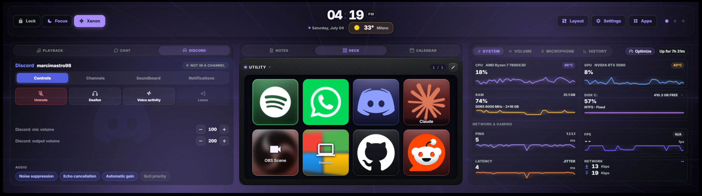

# Xenon

A polished, all-in-one dashboard for the **CORSAIR Xeneon Edge 14.5" LCD touchscreen** — and any browser on Windows.
Monitor your PC, control media and audio, mute your mic, manage your day, talk to a built-in AI assistant, drive your RGB lighting, and more — all from one glanceable screen.

Everything runs **100% locally**: no cloud, no telemetry, no account required.




---

## Built for the Xeneon Edge — great in any browser

Xenon is **optimized for the CORSAIR Xeneon Edge** 14.5" touchscreen: dense, glanceable tiles, comfortable touch targets, and a layout tuned for that display.

But it is **just a local web app**, so it works just as well in any Chromium-based browser (Edge, Chrome) on a normal monitor — touchscreen or not. Every control works with a mouse, and the layout reflows to fit landscape, portrait, large desktop windows, and the Xeneon Edge's short screen. Use it as a second-monitor dashboard, a browser tab, or an embedded panel in iCUE — same features everywhere.

> **Note:** This is **not a native iCUE widget**. It runs as a tiny local Node.js server and is displayed inside iCUE via an **iFrame**. A native iCUE widget version is in development.

---

## What's inside

A quick tour — see **[FEATURES.md](FEATURES.md)** for the full breakdown with screenshots.

- **Customizable, multi-page dashboard** — modular Bento grid with drag-and-drop layout, resizable tiles, tab-grouping, widget duplication, savable layout presets, and up to 8 pages.
- **System & network monitor** — CPU, GPU, RAM, disks, throughput, ping/jitter, and real in-game FPS (PresentMon).
- **Media** — now-playing from any SMTC app, transport controls, album art, per-source volume.
- **Audio & microphone** — output/input device pickers, master volume, mute, and a per-app mixer with real app icons.
- **Xenon AI** — a voice + vision + chat assistant that can control the whole dashboard. Runs on **Google Gemini (cloud)** or a **free local provider (Ollama)**.
- **Advanced AI features** *(opt-in)* — **Genesis** (ask the AI to compose a dashboard page for you), **Game Companion** (in-game overlay with FPS, session time and AI screen insights), **Guardian** (PC health history with AI analysis — and viewable trend charts on the System tile), and **Ambient presence** (proactive greetings and alerts).
- **RGB lighting bridge** — drive Corsair/iCUE LEDs from real data (CPU temp, timers, volume, album art), coexisting with iCUE — plus network lights **Govee, LIFX, WLED, Philips Hue and Nanoleaf** (local, key-free).
- **Deck** — a programmable, Stream Deck-style key grid (apps, media, OBS, hotkeys, webhooks, soundboard, AI, and more).
- **Productivity** — calendar (with external Outlook/Google `.ics` sync), tasks, countdown timers, notes.
- **Weather** — current conditions, forecast, and an hourly timeline.
- **Focus lock screen** — a distraction-free overlay with clock, now-playing, events, and weather.
- **Streaming** — Twitch, YouTube, and OBS widgets and Deck actions.
- **Remote PC control** — turn your phone into a remote for your PC (Sunshine + Tailscale + Moonlight).
- **Performance Mode** — game mode auto-pauses ambient effects during full-screen play, plus on-demand, fully reversible system optimization (power plan, priority boost, closing background apps).
- **App switcher** — every open window at a glance, tap to focus, with favourite app shortcuts.
- **Settings** — Light/Dark/Auto theme, accent colours, ambient backgrounds, language (EN/IT/KO/JA/ZH), custom backgrounds, a cinematic daily greeting, optional auto-open at logon, and more.

---

## Installation

Xenon runs as a small local Node.js server on `http://127.0.0.1:3030/` and works in any browser. On the Xeneon Edge it is embedded in iCUE as an **iFrame**.

### Step 1 — Run the installer (once)

1. Download the ZIP from **[Releases](https://github.com/marcimastro98/Xenon/releases/latest)** and extract it anywhere.
2. Open the extracted folder.
3. Double-click **`INSTALL.bat`**.
4. If Windows asks permission, click **Yes** (it needs admin rights for hardware sensors and the startup task).

The installer automatically:

- installs **Node.js LTS** if missing;
- installs **FFmpeg** if missing (so MP4 backgrounds can be converted for iCUE);
- installs **LibreHardwareMonitor** and **PawnIO** (CPU/disk temperature sensors);
- downloads **PresentMon** into `server/presentmon/` (real in-game FPS counter);
- registers the server to **start silently with Windows** (no terminal, no tray icon);
- starts the server and opens `http://127.0.0.1:3030/` so you can confirm it works.

> The installer **does not** download the free local-AI components (Ollama / Whisper) — that keeps first-time setup fast. You set those up on demand from **Settings → Xenon AI** only if you switch to the local provider. See [FEATURES.md](FEATURES.md#xenon-ai).

### Step 2 — Use it

**In a browser (any monitor, touch or not):**
Just open **`http://127.0.0.1:3030/`**.

**On the Xeneon Edge (via iCUE):**

1. Open **CORSAIR iCUE**.
2. On your Xeneon Edge dashboard, add an **iFrame** widget.
3. Paste this tag and save:

   ```html
   <iframe src="http://127.0.0.1:3030/" width="100%" height="100%" frameborder="0"></iframe>
   ```

   Size **XL** is recommended.

### Every time you start your PC after that

> **Nothing.** The server starts silently in the background and iCUE remembers your layout — the dashboard is live before you even open iCUE.

To remove the startup entry, double-click **`UNINSTALL.bat`**.

---

## Requirements

- **Windows 10 or 11 (x64)**
- **[Node.js 18.15+](https://nodejs.org/)** — installed automatically by `INSTALL.bat`
- **[FFmpeg](https://ffmpeg.org/)** — installed automatically; used for MP4 → WebM background conversion
- **[LibreHardwareMonitor](https://github.com/LibreHardwareMonitor/LibreHardwareMonitor)** + **[PawnIO](https://github.com/namazso/PawnIO)** — installed automatically; CPU/disk temperatures (degrades gracefully if absent)
- **[PresentMon](https://github.com/GameTechDev/PresentMon)** — downloaded automatically; real in-game FPS (falls back to a DWM reading if unavailable)
- **[NirCmd](https://www.nirsoft.net/utils/nircmd.html)** — bundled; used for screen capture (Xenon AI vision)
- **[SoundVolumeView](https://www.nirsoft.net/utils/sound_volume_view.html)** — bundled (NirSoft freeware, unmodified); audio device control

**Optional:**

- A free **[Gemini API key](https://aistudio.google.com)** for Xenon AI (cloud) — everything else works without it.
- **[Ollama](https://ollama.com)** + **[Whisper.cpp](https://github.com/ggerganov/whisper.cpp)** for the free local AI provider — set up on demand from Settings.
- **[Sunshine](https://github.com/LizardByte/Sunshine)** + **[Tailscale](https://tailscale.com/)** for Remote Control — installed for you when you opt in; you use **[Moonlight](https://moonlight-stream.org/)** on your phone.
- `nvidia-smi` is auto-detected for NVIDIA GPU usage/temperature.

---

## Background videos in iCUE

iCUE's embedded WebView can reject some MP4 files even when they play fine in Chrome. Xenon handles this for you:

- Upload **JPG, PNG, WebP, GIF, MP4, or WebM** from **Settings → Background media** (up to **200 MB**).
- When you upload an **MP4**, the server converts it to **WebM (VP8, 30 FPS)** when FFmpeg is available.
- If you run the server manually without FFmpeg, install it once:

  ```powershell
  winget install --id Gyan.FFmpeg.Essentials --exact --source winget --accept-package-agreements --accept-source-agreements
  ```

  Then restart the server and re-upload the MP4. (Existing uploads are not converted retroactively.)

---

## Troubleshooting

- **`node` not recognised** — install Node.js 18+ and reopen your terminal.
- **Port 3030 already in use** — close any other instance, or change the port in `server/server.js`.
- **No CPU temperature** — rerun `INSTALL.bat` and accept the admin prompt so it can install LibreHardwareMonitor/PawnIO and register the elevated startup task.
- **Mic mute does nothing on first launch** — wait a second or two; the device cache populates right after startup.

---

## Documentation

- **[FEATURES.md](FEATURES.md)** — the complete feature guide, with screenshots.
- **[DEVELOPER.md](DEVELOPER.md)** — developer quick start, HTTP API, file layout, and architecture.
- **[CHANGELOG.md](CHANGELOG.md)** — full version history.
- **[docs/streaming-setup.md](docs/streaming-setup.md)** — Twitch & YouTube connection guide.

---

## Support

**Found a bug?** Open a [Bug Report](https://github.com/marcimastro98/Xenon/issues/new?template=bug_report.md) with your Windows version, what you did and what happened, and any error text from `INSTALL.bat`.

**Have an idea?** Open a [Feature Request](https://github.com/marcimastro98/Xenon/issues/new?template=feature_request.md) — all feedback is welcome.

**If this saved you some time** — no pressure, always appreciated:

<a href="https://www.buymeacoffee.com/marcimastro98" target="_blank"></a>

---

## A note on AI assistance

This project was built with AI assistance throughout — architecture, code, debugging, and documentation. Every feature was designed, tested, and iterated on hands-on: the ideas, product direction, and every decision about what ships are mine. AI was a tool, not the author.

---

## License

**Custom non-commercial license.** © 2026 Marcello Mastroeni ([marcimastro98](https://github.com/marcimastro98)) — all rights reserved.

Xenon is **free for personal, non-commercial use**, and you're welcome to read, run, and modify it for yourself. What is **not** allowed without the author's written permission: selling or monetizing it, integrating it into a commercial product, redistributing or repackaging it as your own work, or using the **Xenon** name and branding for another product. Any permitted fork or redistribution must keep attribution to the original author. See **[LICENSE](LICENSE)** for the full terms.

Includes [SoundVolumeView](https://www.nirsoft.net/utils/sound_volume_view.html) © Nir Sofer (freeware, redistributed unmodified).
