# XenonEdge Hub

A polished, all-in-one dashboard widget built for the **CORSAIR Xeneon Edge 14.5" LCD** — also works in any browser or iCUE iFrame on Windows.
Everything runs **100 % locally**: no cloud, no telemetry, no account required.


> **⚠️ Note:** This is **not a native iCUE widget** yet. It runs as a local Node.js server and is displayed inside iCUE via an **iFrame** — not as a `.icuewidget` package. A native iCUE widget version is in development.

---

## Overview

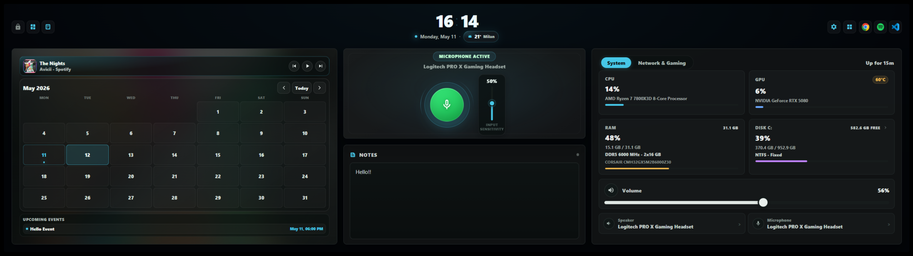

XenonEdge Hub turns your Xeneon Edge display into a real productivity panel.
At a glance you can monitor your PC health, control media playback, mute your mic, check your schedule, jot down a note, and even dim the screen into a focus lock — all without touching your keyboard.

---

## Sections at a glance

### Media

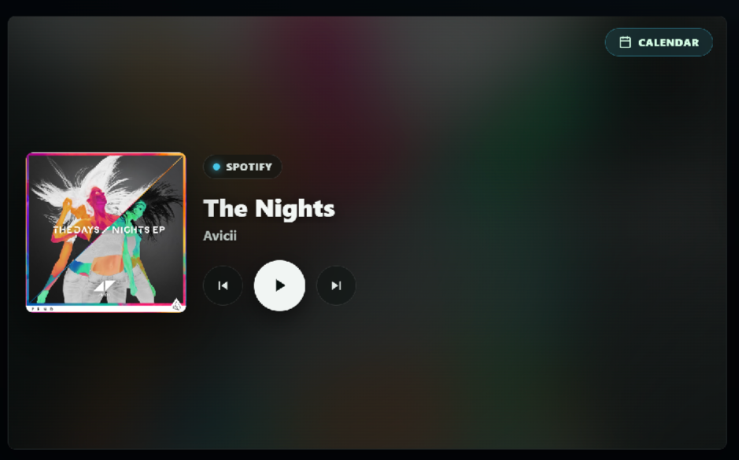

Shows the currently playing track from **any SMTC-aware app** (Spotify, YouTube Music, Windows Media Player, Chrome, Edge, …).

- Album artwork fetched automatically
- Song title and artist name
- **Play / Pause / Previous / Next** transport controls
- Falls back gracefully when nothing is playing

---

### Microphone

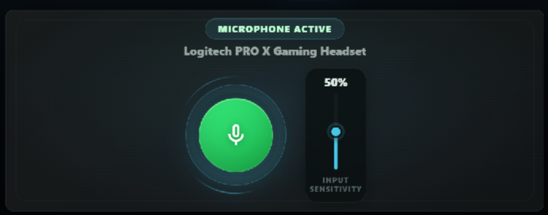

- **One-click mute / unmute** toggle with a clear visual indicator
- Live microphone input level meter
- **Change default mic device** from a drop-down list — no need to open Windows Settings

---

### Audio

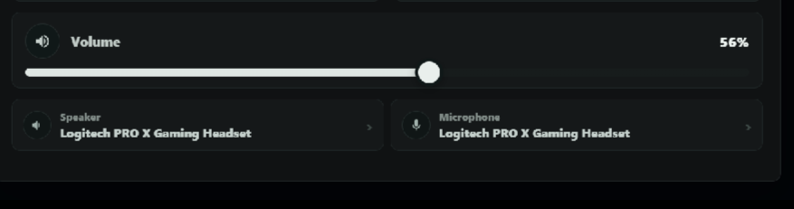

- **Output device picker** — switch between speakers, headphones, headsets in one tap
- **Master volume slider** (0 – 100 %)
- **Speaker mute toggle**
- All changes take effect immediately via [SoundVolumeView](https://www.nirsoft.net/utils/sound_volume_view.html) (bundled, freeware)

---

### System Monitor

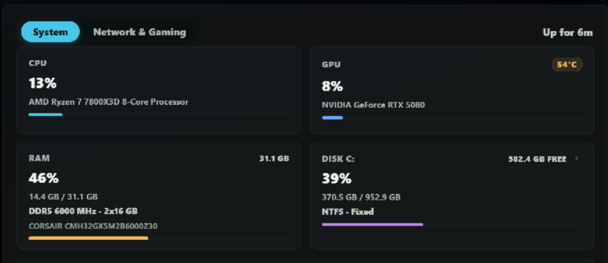

Real-time hardware readouts pulled from Windows performance counters and LibreHardwareMonitor:

| Metric | Details |
|--------|---------|
| **CPU** | Usage %, temperature (package), hostname, uptime |
| **GPU** | Usage %, temperature (NVIDIA `nvidia-smi` or WMI fallback) |
| **RAM** | Used / total (GB), load % |
| **Disks** | Temperature per drive (LibreHardwareMonitor) |

---

### Network

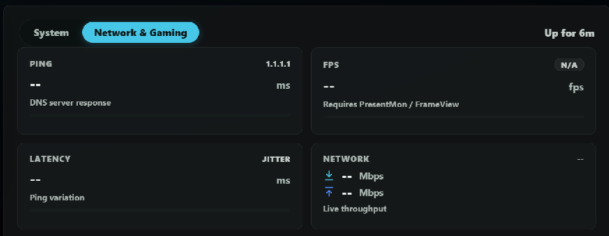

- Live **download / upload** throughput (MB/s) sampled from the active adapter
- **Ping** and **jitter** to a configurable target
- Updates every few seconds without blocking the UI

---

### Weather


- **Current conditions** — temperature, feels-like, humidity, wind speed and direction, pressure, visibility, UV index, cloud cover, precipitation
- **3-day forecast** — daily high / low and condition summary
- **8-hour hourly forecast** with scrollable timeline
- Location **auto-detected via IP** — no configuration, no API key required
- Data provided by [wttr.in](https://wttr.in/) (free, no account), refreshed every 10 minutes
- Tap the weather chip in the top bar to open the full detail modal
- Fully bilingual — descriptions in Italian or English following the widget language setting

---

### Calendar

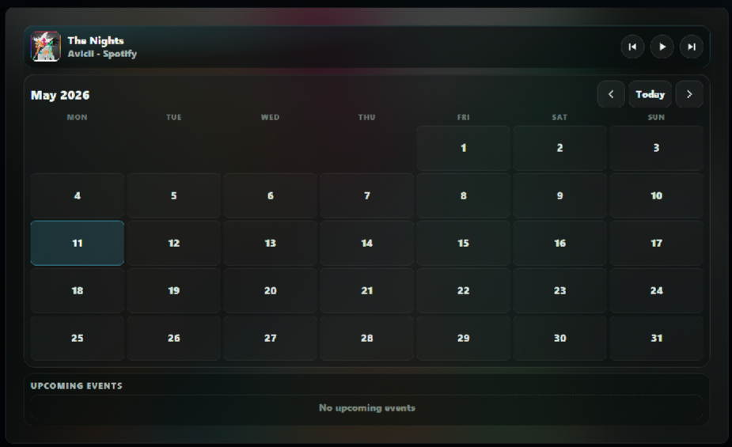

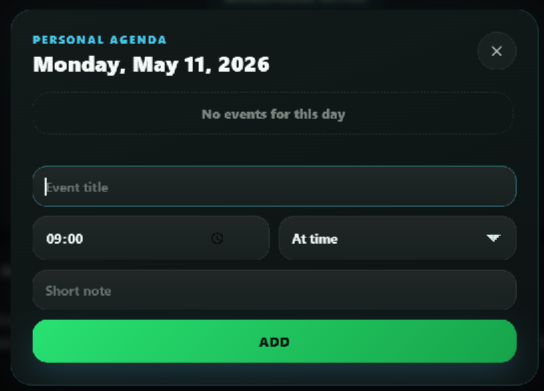

- Add, edit, and delete **events** directly on the widget
- Tap any day to open the **Day Modal** with full event details
- **Reminder toasts** pop up on screen at the configured time — no external app needed
- Data stored locally in `server/events.json` (web version) or `localStorage` (iCUE widget)

---

### Notes

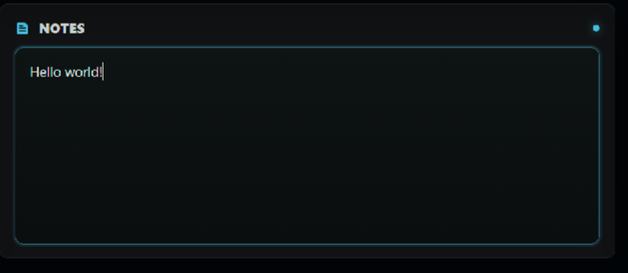

- Inline, always-visible **scratchpad** — just tap and type
- **Auto-saves** on every keystroke; survives server restarts
- Plain text, no formatting needed

---

### App Switcher

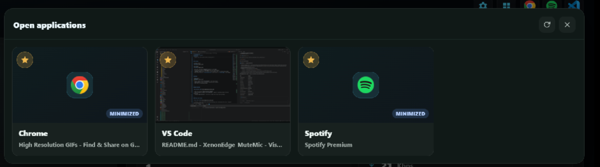
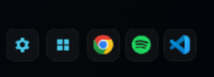

- Lists all currently **open top-level windows**
- **Tap to bring any window to the foreground** — great for switching context from the touchscreen
- **Favorite app shortcuts** — save URLs or deep links to your most-used apps

---

### Focus Lock Screen


An internal, client-side overlay that dims everything into a distraction-free view — separate from the Windows PC lock.

- Activated via the **Focus button** (lock icon) in the top bar; dismissed with a tap or Esc
- **Animated clock** — digits bounce on change, colon pulses, clock breathes
- Configurable **widgets** (all independently toggleable in Settings):
  - **Clock** — large live time display with optional seconds / AM-PM
  - **Now Playing card** — album art, title, artist, playback controls
  - **Upcoming Events** — next 1–3 calendar events with date and time
  - **Weather summary** — current condition icon and temperature
- When only the Now Playing card is active, it expands to fill the full screen

---

### Settings

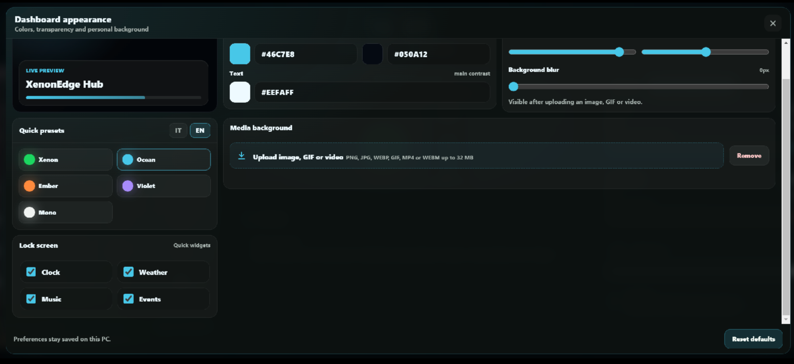

- **Language** — Italian / English, switchable on the fly
- **Clock format** — 12 h / 24 h, show or hide seconds
- **Color presets** — one-click themes: Xenon (green), Ocean (cyan), Ember (orange), Violet, Mono
- **Color personalization** — accent color, text color, background color (hex input + live preview)
- **Background media** — upload a custom image (JPG, PNG, WebP, GIF) or video (MP4, WebM, up to 200 MB) as a full-screen widget background; the file is stored server-side under `server/uploads/` and persists across restarts
- **Lock Screen widgets** — enable / disable each tile individually
- All preferences stored under `xeneonedge.settings.v1` in `localStorage`

---

### Top Bar


Always-visible header with:
- **Live clock** (configurable format)
- **Focus / Lock Screen** button
- **Settings** button

---

## Installation

XenonEdge Hub runs as a tiny local Node.js server (`http://127.0.0.1:3030/`) and is embedded in iCUE as an **iFrame** widget.
It includes the full feature set: microphone control, audio device switching, app switcher, weather, and more.

#### Step 1 — Run the installer (once)

1. Download the ZIP from **[Releases](https://github.com/marcimastro98/XenonEdgeWidget/releases/latest)** and extract it anywhere.
2. Open the extracted folder.
3. Double-click **`INSTALL.bat`**.
4. If Windows asks permission to install Node.js, click **Yes**.

The installer automatically:
- installs **Node.js LTS** if missing;
- registers the server to **start silently with Windows** (no terminal, no tray icon);
- starts the server immediately;
- opens `http://127.0.0.1:3030/` in your browser so you can confirm it works.

#### Step 2 — Add an iFrame widget in iCUE (once)

1. Open **Corsair iCUE**.
2. On your Xenon Edge dashboard, add an **iFrame** widget.
3. Paste one of the following **full `<iframe>` tags** and save:

| What you want to show | iFrame HTML to paste |
|---|---|
| Full dashboard (all panels) | `<iframe src="http://127.0.0.1:3030/" width="100%" height="100%" frameborder="0"></iframe>` |
| Media only | `<iframe src="http://127.0.0.1:3030/?panel=media" width="100%" height="100%" frameborder="0"></iframe>` |
| Microphone only | `<iframe src="http://127.0.0.1:3030/?panel=mic" width="100%" height="100%" frameborder="0"></iframe>` |
| Notes only | `<iframe src="http://127.0.0.1:3030/?panel=notes" width="100%" height="100%" frameborder="0"></iframe>` |
| System monitor only | `<iframe src="http://127.0.0.1:3030/?panel=system" width="100%" height="100%" frameborder="0"></iframe>` |
| Audio devices & volume only | `<iframe src="http://127.0.0.1:3030/?panel=audio" width="100%" height="100%" frameborder="0"></iframe>` |

Size **XL** is recommended for the full dashboard.

#### Every time you start your PC after that

> **Nothing.** The server starts silently in the background; iCUE remembers your layout. The widget is live before you even open iCUE.

To remove the startup entry, double-click **`UNINSTALL.bat`**.

## Requirements

- Windows 10 or 11 (x64)
- [Node.js 18.15 or newer](https://nodejs.org/) — installed automatically by `INSTALL.bat`
- *(Optional)* [LibreHardwareMonitor](https://github.com/LibreHardwareMonitor/LibreHardwareMonitor) running in the background for CPU / disk temperatures (the widget falls back gracefully when it is absent)
- *(Optional)* `nvidia-smi` is auto-detected for NVIDIA GPU usage and temperature

The bundled [`SoundVolumeView`](https://www.nirsoft.net/utils/sound_volume_view.html) by NirSoft handles audio device control and is shipped unmodified under its freeware license.

## Developer quick start

```powershell
git clone https://github.com/marcimastro98/XenonEdgeWidget.git
cd XenonEdgeWidget
npm start
```

Then open <http://127.0.0.1:3030/> in any browser, or paste a full `<iframe>` tag that points to the same URL into a Corsair iCUE **iFrame** widget.

You can also double-click `INSTALL.bat` for the full user-friendly setup, or `server/start.bat` if Node.js is already installed and you only want to start the server manually.

> The server listens **only** on `127.0.0.1:3030` and rejects requests whose `Host` header is not loopback, to prevent DNS-rebinding / CSRF abuse from public websites.

## HTTP API (loopback only)

| Method | Endpoint | Purpose |
|---|---|---|
| `GET`  | `/` | Serve the widget HTML. |
| `GET`  | `/status` | Mic mute state. |
| `POST` | `/toggle` | Toggle mic mute. |
| `GET`  | `/audio` | Audio devices, default speaker / mic, volumes. |
| `POST` | `/volume/set` | `{ level: 0–100 }` set speaker volume. |
| `POST` | `/mic/volume` | `{ level: 0–100 }` set mic volume. |
| `POST` | `/speaker/set` | `{ id }` change default speaker. |
| `POST` | `/mic/set` | `{ id }` change default mic. |
| `POST` | `/speaker/mute` | Toggle speaker mute. |
| `GET`  | `/media` | Currently playing track. |
| `POST` | `/media/playpause`, `/media/next`, `/media/previous` | Transport. |
| `GET`  | `/system` | CPU, GPU, RAM, disks, temps. |
| `GET`  | `/network` | Ping, latency, bandwidth. |
| `GET`  | `/weather` | Current conditions, 3-day forecast, hourly forecast (cached 10 min, sourced from wttr.in). |
| `GET`  | `/windows` | List visible top-level windows. |
| `POST` | `/windows/focus` | `{ id }` bring a window to the foreground. |
| `GET` / `POST` | `/notes` | Read / save the notepad. |
| `GET` / `POST` | `/events` | Read / save calendar events. |
| `POST` | `/lock` | Lock the workstation. |
| `POST` | `/background` | Upload a background image or video (multipart/form-data, max 200 MB). Accepted: JPG, PNG, WebP, GIF, MP4, WebM. Returns `{ url }`. |
| `GET`  | `/uploads/<file>` | Serve a previously uploaded background file. |

## File layout

```
XenonEdgeWidget/
├── INSTALL.bat                  ← One-click installer for normal users
├── UNINSTALL.bat                ← Removes startup entry and stops the server
├── package.json
├── README.md
├── LICENSE
│
├── server/                      ← Node.js web widget (port 3030)
│   ├── server.js                ← HTTP API server
│   ├── index.html               ← Full UI shell
│   ├── widget.html              ← Legacy single-file UI (embeddable)
│   ├── start.bat                ← Double-click launcher
│   ├── start-hidden.vbs         ← Hidden startup launcher (Task Scheduler)
│   ├── install.ps1              ← Installer logic
│   ├── uninstall.ps1            ← Uninstaller logic
│   ├── media.ps1                ← Now-playing via Windows SMTC
│   ├── gpu.ps1                  ← GPU usage / temperature (NVIDIA + WMI)
│   ├── network.ps1              ← Ping + adapter byte counters
│   ├── windows.ps1              ← Window enumeration / focus
│   ├── notes.txt                ← Notes data (auto-created, gitignored)
│   ├── events.json              ← Calendar data (auto-created, gitignored)
│   ├── uploads/                 ← User-uploaded backgrounds (auto-created, gitignored)
│   ├── js/                      ← Frontend JS modules (media, calendar, notes, …)
│   ├── components/              ← Per-panel CSS components
│   ├── styles/                  ← Global CSS + breakpoints
│   └── soundvolumeview-x64/
│       └── SoundVolumeView.exe  ← Audio device control (NirSoft, freeware)
│
└── widget/                      ← Native iCUE widget (Elgato Marketplace)
    ├── manifest.json
    ├── index.html               ← Widget entry point
    ├── translation.json         ← EN / IT strings
    ├── styles/main.css
    ├── modules/                 ← JS modules (sensors, media, calendar, …)
    ├── components/              ← HTML partial templates
    ├── common/plugins/          ← Official iCUE SDK plugin wrappers
    └── resources/icon.svg
```

## Security notes

- The server binds to `127.0.0.1` only and validates the `Host` and `Origin` headers — public websites cannot reach it via DNS rebinding.
- No CORS wildcards: everything is same-origin.
- Inputs to `/windows/focus`, `/shortcut`, `/notes`, `/events` are validated and capped.
- Bundled `SoundVolumeView.exe` is unmodified; you may verify it against [NirSoft's official download](https://www.nirsoft.net/utils/sound_volume_view.html).

## Troubleshooting

- **`node` not recognised** — install Node.js 18+ and reopen your terminal.
- **Port 3030 already in use** — close any other widget instance, or change the port in `server/server.js`.
- **No CPU temperature** — install LibreHardwareMonitor and keep it running in the background.
- **Mic mute does nothing on first launch** — wait one or two seconds: the device cache is populated right after startup.

## Support

**Found a bug?** Open a [Bug Report](https://github.com/marcimastro98/XenonEdgeWidget/issues/new?template=bug_report.md) and include:
- your Windows version (Win 10 / Win 11);
- what you did and what happened instead;
- any error text visible in the window that appeared when you ran `INSTALL.bat`.

**Have an idea or suggestion?** Open a [Feature Request](https://github.com/marcimastro98/XenonEdgeWidget/issues/new?template=feature_request.md) — all feedback is welcome.

**If this widget saved you some time and you want to say thanks:**
[☕ Buy me a coffee via PayPal](https://www.paypal.me/MarcelloMastroeni) — no pressure, always appreciated.

## License

[MIT](LICENSE). Includes [SoundVolumeView](https://www.nirsoft.net/utils/sound_volume_view.html) © Nir Sofer (freeware, redistributed unmodified).
