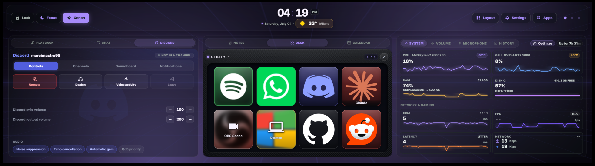

<p align="center">
  
</p>

# Xenon

**Turn any second screen into your PC's control center.** A spare monitor, an old display you dug out of a drawer, a tablet, the phone already in your pocket, or a **CORSAIR Xeneon Edge 14.5" LCD touchscreen** — driven from any browser, on Windows, macOS or Linux.
Monitor your PC, control media and audio, mute your mic, manage your day, talk to a built-in AI assistant, drive your RGB lighting, and more, all from one glanceable screen.

And it has a personality. Xenon is a companion, not just a control panel: a built-in AI you can actually talk to, and **Bit** — a little pixel guardian who lives in the corner, watches your habits, and roasts you (kindly) into drinking some water and standing up now and then.

Everything runs **100% locally**: no cloud, no telemetry, no account required. The app does check for
updates at launch, and reaches the network for features you turn on (weather, media artwork, the
community catalog) — every one of those calls is listed in the [privacy page](https://xenon-app.com/privacy.html).


[](https://discord.gg/MBVrw9kZyg)



**Join the community:** share themes, swap ideas and get help on our [Discord](https://discord.gg/MBVrw9kZyg).

---

## Any second screen will do

Xenon is **just a local web app**, so any screen your PC drives can run the whole dashboard: a spare monitor, an old display propped next to the keyboard, a touchscreen. Every control works with a mouse, and the layout reflows to fit landscape, portrait, large desktop windows, and short wide screens.

> **On a separate device — a phone or a tablet — yes, since v4.11.0** *(beta)*. Settings → **Remote control** → **Phone access** opens a second, opt-in door: your PC shows a QR code, you point your phone's camera at it, and the dashboard opens in the phone's browser on the same Wi-Fi. No account, no cloud, no app to install, and nothing leaves your network. Each paired device is listed and can be removed on its own. See **[the phone guide](https://xenon-app.com/phone.html)**. If instead you want the whole PC rather than the dashboard, **[Remote PC control](FEATURES.md#remote-pc-control)** (Sunshine + Tailscale + Moonlight) is still there.

It is also **tuned for the CORSAIR Xeneon Edge** 14.5" touchscreen, the display it was first designed around: dense, glanceable tiles, comfortable touch targets, and a layout that fits a short, very wide panel. You do not need one, and nothing here is gated on having one.

It also runs on **macOS and Linux**, not only Windows, and both are **beta** in this release. The dashboard, the widgets and the integrations are identical there; the parts that read or drive the machine itself use each platform's own tools, and a few Windows-only ones have no equivalent yet. [What works where](#platform-support) says exactly which.

**One Xenon, five ways to see it.** A single local engine (started automatically at login, running quietly in the background) serves the dashboard, and every surface draws from that same live UI — so a feature added once appears everywhere:

- the **native app** — a full-screen, borderless kiosk that opens itself on the screen you pick, no browser or iCUE required — with **game-safe touch**: taps never move your mouse away or steal your game's focus;
- a **browser tab** on any monitor (`http://127.0.0.1:3030/`);
- your **phone or tablet** over your own Wi-Fi, once paired *(beta)*;
- an **iCUE iFrame** panel, if you would rather keep the dashboard inside iCUE;
- the **native iCUE widget** *(in development)*.

> **Note:** the browser/iFrame surface is **not** a native iCUE widget — it runs as a tiny local Node.js service displayed inside iCUE via an **iFrame**. The separate native iCUE widget is in development.

---

## What's inside

A quick tour — see **[FEATURES.md](FEATURES.md)** for the full breakdown with screenshots.

- **Native full-screen app** — a borderless kiosk that opens itself on the screen you pick (no browser or iCUE), finds that display among your monitors and stays pinned to it through display changes and standby. **Xenon asks which screen the first time it opens**, and Settings → Schermo changes the answer later; pick your phone instead and this PC shows nothing at all, not even at login, with a system-tray icon (show/hide/restart/exit). Runs the same dashboard as every other surface. **Swipe up for the desktop, iPhone-style**: a quick flick up from the bottom of the screen tucks the dashboard away into a small floating button and reveals the desktop underneath — tap the button to bring Xenon back (toggleable in Settings → General).
- **Game-safe touch** *(native app)* — touch the dashboard mid-game and nothing breaks: the cursor snaps straight back to the monitor it came from, and while a game is running taps never steal its focus — no more full-screen games minimizing because you muted the mic or skipped a track. Typing (AI chat, notes, search) still works exactly as before. This is something only the native app can offer — on the stock iCUE dashboard, in a browser tab or in the iCUE iFrame a touch still teleports your cursor and takes the game's focus, because only a real native window can tell Windows how to treat it. Both protections are on by default and toggleable from the tray.
- **Customizable, multi-page dashboard** — modular Bento grid with drag-and-drop layout, resizable tiles, tab-grouping, widget duplication, savable layout presets, and up to 8 pages.
- **Widget SDK** *(beta)* — the dashboard is now a platform: anyone can build a widget (a `manifest.json` + an HTML page) and run it in a sandboxed **Custom widget** tile. No network access, no reach into your data — only the sensor streams and low-risk actions you explicitly approve. Widgets can also request host-rendered **Dynamic Island Live Activities**: persistent music/status layouts, animated goal-style takeovers and safe action buttons, all individually switchable by the user. See **[docs/WIDGET_SDK.md](docs/WIDGET_SDK.md)**.
- **Notifications hub** — a **Notifications tile** mirrors the whole PC's Windows toasts (WhatsApp, mail, Teams, Discord, launchers…) with real app icons, plus a **Discord DMs & mentions** feed — all read locally, nothing leaves your PC.
- **Incoming calls** — when Discord, Teams, Zoom or your phone rings, the dashboard opens a full-screen card with **Answer, Decline and Silence**, on every screen at once, and pushes it to a paired phone. Discord calls are answered outright; Teams and Zoom are answered by bringing their window forward and pressing the shortcut they document. Where a call cannot be picked up the card says so and offers to open the app instead of showing a button that does nothing.
- **Your phone on the dashboard** *(Windows, beta)* — contacts, call history, a keypad that places real calls, and text messages you can read and reply to, from the phone paired to the PC over Bluetooth. It reads the phone the way a car does, over the standard Bluetooth profiles, so the same thing works with an iPhone and with an Android with nothing installed on the phone. Nothing is stored and nothing is uploaded. Answering a call is deliberately absent and the app says why: that channel belongs to the operating system. Also reachable by voice through Xenon AI and from a Deck key.
- **Share your setup** — export your **theme**, a **dashboard page**, a full **Deck profile**, a single **community widget**, a **code-defined background**, or a whole **package** (theme + pages + widgets in one code) as a link or `.json`, and import someone else's in one step. Any export can be **protected with access codes** (encrypted locally, installs only for people you hand a code to), and every import is re-validated (widgets never auto-grant — you approve each one) so a shared preset can never run code behind your back. **Installed content** records what each download added and removes its theme, pages, Deck profiles, widgets, Ambient scenes, background and fonts together in one action.
- **Make it yours, down to the last detail** — a full theme editor (colours, corner roundness, glass blur/saturation, borders, shadows), the same controls per individual widget, Xenon AI that can build a whole theme *or* an animated background from a description, and an **animated background** you can pick from a nine-item gallery, have the AI write, import, or code yourself in JavaScript (with your own bundled images) — running in an isolated sandbox.
- **System & network monitor** — CPU, GPU, RAM, disks, throughput, ping/jitter, and real in-game FPS (PresentMon on Windows, MangoHud on Linux).
- **Media** — now-playing from any SMTC app, transport controls, album art, per-source volume.
- **Audio & microphone** — output/input device pickers, master volume, mute, and a per-app mixer with real app icons.
- **Xenon AI** — a voice + vision + chat assistant that can control the whole dashboard, started hands-free with the local **"Hey Xenon"** wake word. It **remembers facts about you**, stays coherent across long conversations, starts **speaking its reply almost immediately**, and offers **one-tap undo** for changes it makes. Runs on **Google Gemini (cloud)** or a **free local provider (Ollama)**.
- **Advanced AI features** *(opt-in)* — **Genesis** (ask the AI to compose a dashboard page for you), **Game Companion** (in-game overlay with FPS, session time and AI screen insights), **Guardian** (PC health history with AI analysis — and viewable trend charts on the System tile), and **Ambient presence** (proactive greetings and alerts).
- **Sensor history & PC Screen Time** — an opt-in **History** tab on the System tile charts CPU/GPU temperature and load and RAM over 24h / 7 days / 30 days, plus a screen-time breakdown of your most-used apps and games. No AI needed; everything stays on your PC.
- **Proactive moments** *(opt-in)* — a game-session recap when you finish playing, sustained-heat alerts, and a morning agenda in the daily greeting — all computed locally, no AI required.
- **Smart context profiles** *(opt-in)* — set a page, lighting effect and Deck profile per activity (gaming, coding, streaming…) and the dashboard switches to match automatically, then reverts when you're done.
- **RGB lighting bridge** — drive Corsair/iCUE LEDs from real data (CPU temp, timers, volume, album art), coexisting with iCUE — plus network lights **Govee, LIFX, WLED, Philips Hue and Nanoleaf** (local, key-free).
- **Deck** — a programmable, Stream Deck-style key grid (apps, media, OBS, hotkeys, webhooks, soundboard, AI, and more).
- **Productivity** — calendar (with external Outlook/Google `.ics` sync), tasks, countdown timers, notes.
- **Vitals & Bit** — a pixel-art self-care HUD (hydration, energy, stamina, focus, posture) that drains as you sit at the PC, plus **Bit**, an opt-in 8-bit tamagotchi that roasts you with 250+ ever-changing lines, glitches the dashboard, pops up on your real monitors and — if you let him — minimizes your windows or locks the PC until you take a break.
- **Weather** — current conditions, forecast, and an hourly timeline.
- **Stocks (Borsa)** — a live watchlist with sparklines and price charts (stocks, indices, crypto, FX incl. Borsa Italiana), favorites with rise/fall alerts, and an optional scrolling ticker bar — keyless by default, voice/text-aware.
- **Focus lock screen** — a distraction-free overlay with clock, now-playing, events, and weather.
- **Streaming** — Twitch, YouTube, OBS, Discord, Spotify and Streamer.bot widgets and Deck actions (Discord voice: mute, deafen, push-to-talk, join a channel, **soundboard**; Spotify: Up Next queue, playlists, Connect devices, save & shuffle).
- **Remote PC control** — turn your phone into a remote for your PC (Sunshine + Tailscale + Moonlight).
- **Browser** — a live, interactive web page inside a tile (real headless Edge, so framing-blocked sites work too); local-only, streams only while on screen. Optional one-click **ad-blocker** (uBlock Origin Lite) and a hide-toolbar mode for full-screen video.
- **Second screen** — a genuine extra Windows desktop inside a tile you can see and control; one-click virtual-display setup, instant resolution (incl. ultra-wide), touch-or-mouse control.
- **Smart Home** — control your home's lights, sensors and appliances via [Home Assistant](https://www.home-assistant.io/), grouped by room; live, local, and lightweight (a tile plus Deck actions).
- **Performance Mode** — game mode auto-pauses ambient effects during full-screen play, plus on-demand, fully reversible system optimization (power plan, priority boost, closing background apps) and optional pausing of heavy live tiles (Browser, Second screen) while gaming or optimizing.
- **App switcher** — every open window at a glance, tap to focus, with favourite app shortcuts.
- **Settings** — Light/Dark/Auto theme, accent colours, ambient backgrounds, language (10 languages — EN, IT, ES, FR, DE, PT, RU, JA, KO, ZH), custom backgrounds, a cinematic daily greeting, optional auto-open at logon, and more.

---

## Installation

Xenon runs as a small local Node.js server on `http://127.0.0.1:3030/`. The **native Xenon app** shows it full-screen on whichever display you pick — no browser, no iCUE. It also works in any browser, on your phone once paired, and can alternatively be embedded in iCUE as an **iFrame**.

### Step 1 — Run the installer (once)

#### Windows

**Option A — one-click setup (recommended):**

1. Download **[Xenon-Setup-x64.exe](https://github.com/marcimastro98/Xenon/releases/latest/download/Xenon-Setup-x64.exe)** — that link always serves the newest version.
2. Double-click it. It installs the native Xenon app, which opens by itself.
3. The app needs the dashboard engine behind it, so on first launch it waits a few seconds, finds nothing there, and offers a **Complete setup** button. Press it: a window opens and installs the rest, showing you what it's doing (the download is verified against the project's signing key before anything runs). It takes a few minutes and only happens once.
4. If Windows asks permission, click **Yes** (admin rights unlock the hardware temperature sensors and the reserved touchscreen gesture).

> The setup deliberately installs nothing behind your back — it never starts a hidden install of its own. See [If Windows blocks the download, or flags Xenon as a virus](#if-windows-blocks-the-download-or-flags-xenon-as-a-virus) for why that matters.

**Option B — classic install (advanced, or if you prefer iCUE/browser only):**

1. Download the **Source code (zip)** from **[Releases](https://github.com/marcimastro98/Xenon/releases/latest)** and **extract it** (right-click → **Extract All**) into a folder you keep, such as `C:\Xenon`. Double-clicking the zip only shows you the contents; running the installer from that window installs into a Windows temporary folder that gets deleted later. The installer detects this and moves itself to a permanent folder, but extracting first is the clean way.
2. Open the extracted folder and double-click **`INSTALL.bat`**.
3. If Windows asks permission, click **Yes**.

> The extracted folder carries one installer per platform, so there is nothing to go hunting for: **`INSTALL.bat`** (Windows), **`INSTALL.command`** (macOS — double-click it in Finder), **`INSTALL.sh`** (Linux — `./INSTALL.sh`). Each has its `UNINSTALL` twin beside it. They all end up in the same place; only the way your system prefers to launch a script differs.

Either way — the **Complete setup** button in Option A and `INSTALL.bat` in Option B run the same installer — it automatically:

- installs **Node.js LTS** if missing;
- installs **FFmpeg** if missing (so MP4 backgrounds can be converted for iCUE);
- installs **LibreHardwareMonitor** and **PawnIO** (CPU/disk temperature sensors);
- downloads **PresentMon** into `server/presentmon/` (real in-game FPS counter);
- registers a silent **per-logon startup task** so the engine starts every time you sign in (and retries anything that failed to download, with a clear component checklist at the end);
- installs the **native app** if it isn't already on the PC (ensuring the WebView2 runtime), and sets it to open at login;
- starts the engine and opens `http://127.0.0.1:3030/` so you can confirm it works.

> **Gray or empty screen in the app?** That means the dashboard engine isn't installed or running. Leave the app open: after a few seconds it offers the **Complete setup** button, which installs or repairs it. If the button says Xenon is already installed and the screen still doesn't come up, restart your PC — the engine starts on sign-in. Running `INSTALL.bat` again repairs it too. (Re-running `Xenon-Setup-x64.exe` only reinstalls the app itself, not the engine.)

> **Where the setup writes down what it did:** `%LOCALAPPDATA%\Xenon\setup.log` (the run before it is kept as `setup.log.1`). Both the **Complete setup** button and `INSTALL.bat` append to it, including the elevated part that runs in its own window and closes as soon as it finishes. If setup fails — or the app folder ends up holding only `xenon-native.exe`, `uninstall.exe` and `windows\` — that file says which step never ran. Attach it to a bug report. It goes away with the uninstaller.

> The installer **does not** download the free local-AI components (Ollama / Whisper) — that keeps first-time setup fast. You set those up on demand from **Settings → Xenon AI** only if you switch to the local provider. See [FEATURES.md](FEATURES.md#xenon-ai).

#### If Windows blocks the download, or flags Xenon as a virus

You may see SmartScreen refuse to run the setup, your browser cancel the download as "malicious", or Defender quarantine `Xenon-Setup-x64.exe` or `xenon-native.exe`. Two different things can be behind it, and the name of the detection tells you which one you are looking at.

**A name ending in `!cl`, such as `Trojan:Win32/Sonbokli.A!cl`.** The suffix means the verdict came from Defender's cloud *machine-learning* model rather than from a signature matching known malware. What that model weighs most is reputation, and Xenon is not **code-signed** yet, because a certificate is a paid, identity-verified thing and this is a free one-person project. An unsigned installer that almost nobody has downloaded starts from zero reputation, and every new release resets the counter.

**A plain name with no suffix, such as `Trojan:Win32/Vigorf.A`.** This is a generic behavioural signature, so the reasoning above does not apply to it, and it is worth being straight about what Defender is reacting to. The setup carries a PowerShell script inside it: the backend installer. When you choose **Complete setup** in the app, that script downloads an archive from GitHub, verifies its signature before unpacking anything, and registers the task that starts the dashboard when you sign in. It also installs LibreHardwareMonitor and the PawnIO driver, which are what read CPU and disk temperatures. None of it happens behind your back: the setup itself only installs the app, and the script runs in a console window you can read and stop. But compressed into one sentence, "an unsigned installer carrying a script that downloads code and installs a kernel driver" is also an accurate description of a dropper, and a generic signature has no way to tell the two apart.

Two things are worth knowing about that last part. Those temperature components are installed through **winget**, so their binaries come from their own developers through Microsoft's package manager, not from this project. And PawnIO is the *signed* replacement for WinRing0, the driver behind most of the older hardware-monitoring false positives. Xenon has never shipped WinRing0 and never will.

**Neither explanation is proof, so check the file yourself.** Every release ships a `SHA256SUMS` file signed with the project's Ed25519 key. Compare the hash of what you downloaded:

```powershell
Get-FileHash .\Xenon-Setup-x64.exe -Algorithm SHA256
```

If it matches the `Xenon-Setup-x64.exe` line in that release's `SHA256SUMS`, the file is byte-for-byte the one GitHub Actions built from the public source at that tag. You can also paste the file into [VirusTotal](https://www.virustotal.com/): a handful of engines flagging it while the rest come back clean is the signature of a reputation problem, not of malware. Code signing is the real fix and it is on the roadmap. Until then, either kind of detection can come and go release by release.

**To install it anyway:**

1. **Browser blocked the download** — open your downloads list (`Ctrl+J`) and choose **Keep** / **Keep anyway** on the cancelled file.
2. **Defender already quarantined it** — open **Windows Security → Virus & threat protection → Protection history**, find the Xenon entry, and choose **Actions → Restore**.
3. **Add an exclusion** so it isn't re-quarantined mid-install, or later while it runs — **Virus & threat protection → Manage settings → Exclusions → Add an exclusion → Folder** — for both of the folders Xenon uses: `%LOCALAPPDATA%\Xenon` (the app) and `%LOCALAPPDATA%\Programs\Xenon` (the dashboard engine).
4. **SmartScreen warning on launch** — click **More info**, then **Run anyway**.

**Please also report it to Microsoft.** It's a two-minute form at [microsoft.com/wdsi/filesubmission](https://www.microsoft.com/en-us/wdsi/filesubmission) — pick *Home customer* and *Incorrectly detected as malware*. Reports from real users carry weight and get the detection pulled for everyone, usually within a few days.

> Only ever do the above for a file you downloaded from **[this repository's Releases page](https://github.com/marcimastro98/Xenon/releases)** and whose hash you checked. Turning off a warning is exactly what actual malware wants you to do — the hash is what tells the two situations apart.

#### If Xenon simply will not start: Smart App Control

Smart App Control is a different gatekeeper from the one above, and **none of the steps in the previous section affect it.** If Xenon refuses to run and you never saw a Defender detection at all, open **Windows Security → App & browser control → Smart App Control** and check whether it is on.

Smart App Control blocks any app it does not already trust, and it decides that before your antivirus is ever consulted. So a Defender exclusion does not make it allow the file, and there is no way to permit one app while leaving it on. It only ever switches itself on during a clean installation of Windows 11, which is why you can meet it on a freshly rebuilt PC and never on an upgraded one.

That leaves two settings: **Evaluation**, where Windows watches how you use the PC and decides for itself whether to keep it on, and **Off**.

> **Read this before you change it: turning Smart App Control off is a one-way door.** Windows will not let you switch it back on afterwards without resetting or reinstalling the PC. That is Microsoft's design and not something Xenon can work around. If you would rather keep it on, the honest answer today is that Xenon cannot run on that machine. Code signing is what will change that, and it is the same missing piece behind the Defender false positive above.

#### If Xenon closes on its own while you are using it

The window disappears mid-session with no message, no error and nothing left on screen. Two completely different things look identical from the outside, so the app now writes down which one it was.

Open the **tray menu → Open crash log**. It is a plain text file — `%APPDATA%\com.marcimastro98.xenon\crash.log`, and `~/Library/Application Support/com.marcimastro98.xenon/` or `~/.config/com.marcimastro98.xenon/` off Windows — with one line per event:

```
[2026-08-18T19:27:04Z] v4.11.4 launched windows
[2026-08-18T21:02:11Z] v4.11.4 exited clean shutdown
```

**A `launched` line followed by a `PANIC` line.** The app itself failed, and the line names the thread and the exact source line it failed on. Paste it into the [Discord](https://discord.gg/MBVrw9kZyg) or a [bug report](https://github.com/marcimastro98/Xenon/issues/new?template=bug_report.md) — with that one line the fix is usually quick. A failure inside one of the background watchers (the display watchdog, the cursor and focus guards) no longer closes the app either: it is recorded, the watcher restarts, and the window stays where it is.

**A `launched` line with nothing after it at all.** Nothing inside the app decided to stop, so something outside it ended the process — on Windows, almost always your antivirus quarantining `xenon-native.exe` *while it is running*. Open **Windows Security → Virus & threat protection → Protection history** and look for an entry timed to the moment the window vanished. That is the same false positive as [the one above](#if-windows-blocks-the-download-or-flags-xenon-as-a-virus), just caught mid-session instead of during the download, and it is fixed the same way:

1. **Restore** the quarantined file from Protection history.
2. **Exclude both folders** — **Manage settings → Exclusions → Add an exclusion → Folder** — because Xenon lives in two of them: `%LOCALAPPDATA%\Xenon` (the app) and `%LOCALAPPDATA%\Programs\Xenon` (the dashboard engine). Excluding only the first leaves the half that runs all day unprotected from the same detection.
3. **Report it** at [microsoft.com/wdsi/filesubmission](https://www.microsoft.com/en-us/wdsi/filesubmission) — *Home customer*, *Incorrectly detected as malware*. That is the only step that helps everyone else too.

> Turning your antivirus off is not on that list on purpose: an exclusion for a file whose hash you checked is a decision about one program, and switching off real-time protection is a decision about every program you will run this week.

#### macOS

> **Beta.** The dashboard, the widgets, the Store and the integrations are the same as on Windows. What still differs is the part that reads the machine itself, and the [table below](#platform-support) says exactly what works where. If something misbehaves, the [Discord](https://discord.gg/MBVrw9kZyg) is where it gets fixed fastest.

Universal build: one download for both Apple Silicon and Intel.

1. Download **[Xenon-macOS-universal.dmg](https://github.com/marcimastro98/Xenon/releases/latest/download/Xenon-macOS-universal.dmg)** and drag **Xenon** to Applications.
2. Open it. The first launch has no dashboard behind it yet, so it offers to set one up in a Terminal window you can read and stop. The download is checked against the project's signing key **before** anything is extracted.
3. Let it finish. Xenon installs itself under `~/Library/Application Support/Xenon`, registers a login agent so it starts with you, and the app window comes alive.

> **"Xenon can't be opened because Apple cannot check it."** Expected for now: the app is not notarized yet (that needs a paid Apple Developer membership, which this project does not have). On **macOS 15 and later** open **System Settings → Privacy & Security**, scroll to the bottom and click **Open Anyway** next to Xenon — Apple removed the old right-click → Open shortcut. On **macOS 11–14** right-click the app → **Open** → **Open** still works. Either way it is once per version.

<a id="macos-full-disk-access"></a>
##### Give Xenon Full Disk Access — once

The Trash and most of `~/Library/Caches` sit behind a permission macOS grants **per app**. Without it the Disk widget and search still work, they just cannot see those folders — and a folder macOS refuses to list looks exactly like an empty one, so nothing reports an error. On the Mac this was measured on, the Trash alone was 2.4 GB the cleanup could not offer and the disk map was under-reporting by 15 GB.

1. **System Settings → Privacy & Security → Full Disk Access**
2. Click **+**, choose **Xenon** in Applications, and make sure its switch is **on**
3. Quit Xenon (menu bar or ⌘Q) and open it again — the permission is read at launch

You give it to **Xenon**, not to Node: the app starts the dashboard itself precisely so one grant under a name you recognise covers it, instead of handing the same access to an interpreter that runs every other script on your machine.

> **Until 4.11.3 this had to be redone after every update, and now it does not.** macOS ties the permission to the app's code signature. Xenon used to be ad-hoc signed, which gives every build a different identity, so each release silently looked like a different app and the grant stopped applying — with no error anywhere, and a permission dialog for the Desktop, Documents, Downloads, Photos and Music every time the index ran. Xenon is now signed with its own certificate, which stays the same across releases, so the grant survives updates. **The 4.11.3 update itself resets it one last time**, because that is the release where the identity changes; grant it again there and it holds from then on.
>
> If Xenon is listed but the permission is clearly not working, select it, press **−**, and add it again with **+** — that rewrites the entry against the app currently on disk. Xenon now notices this state by itself and says so on the dashboard rather than leaving you to guess. (The certificate is self-signed, so it changes nothing about the warning on first open: that needs Apple notarization, which is [still on the list](#platform-support).)

macOS needs **Node.js** and will say so if it is missing. The optional tools below each light up one thing, and Xenon tells you which are absent instead of failing later:

```bash
brew install node                      # required
brew install vladkens/tap/macmon       # fallback for temperature and GPU load (the companion reads them without it)
brew install switchaudio-osx           # switching the output device
brew install ffmpeg                    # voice input and spoken replies
```

Prefer no app? Download the **Source code (zip)** from [Releases](https://github.com/marcimastro98/Xenon/releases/latest), extract it, and double-click **`INSTALL.command`** in the folder — same dashboard, no kiosk window. From a terminal, `./INSTALL.sh` is the same thing.

#### Linux

> **Beta.** Same as macOS above: the dashboard and everything on it is identical, and what differs is the part that reads the machine. The [table below](#platform-support) is the exact list.

Two ways, same result.

- **The app:** download **[Xenon-Linux-x86_64.AppImage](https://github.com/marcimastro98/Xenon/releases/latest/download/Xenon-Linux-x86_64.AppImage)** (`chmod +x` it and run it) or **[Xenon-Linux-x86_64.deb](https://github.com/marcimastro98/Xenon/releases/latest/download/Xenon-Linux-x86_64.deb)**. Like macOS, the first launch offers to set the dashboard up in a terminal window, verifying the download before extracting it. The package deliberately does **not** install it for you: everything it would create belongs to one user account, and a package installs as root for the whole machine.
- **Browser only:** download the **Source code (zip)** from [Releases](https://github.com/marcimastro98/Xenon/releases/latest), extract it, and run `./INSTALL.sh` in the folder.

The installer registers a `systemd --user` service so Xenon starts when you log in, and falls back to an XDG autostart entry where there is no user manager (saying so, including that the fallback has no crash-restart). It also lists the optional tools you do not have:

```bash
sudo apt install nodejs npm unzip      # required
sudo apt install wireplumber           # volume, microphone and the per-app mixer
sudo apt install wmctrl xdotool x11-utils   # the open-applications widget (X11 sessions)
sudo apt install ffmpeg                # voice input and spoken replies
```

> If your desktop has no terminal emulator at all, the app cannot show you the installer. Run `./INSTALL.sh` from an extracted source zip instead.

### Step 2 — Use it

**The native Xenon app (recommended):**
Nothing to configure: on Windows the installer already put the **Xenon app** on your PC and set it to open at login (on macOS and Linux the app is the thing you installed in Step 1). It opens by itself — no browser, no iCUE — with **game-safe touch** and a system-tray icon (show / hide / restart / exit). If it isn't on screen right now, launch **Xenon** from the Start menu or the tray icon. Where it opens: **the first time Xenon runs it asks you**, and lists the screens it can see. Pick one and it stays there, even if you have a Xeneon Edge attached; leave it on Automatic and it takes the Edge when one is connected and opens a window on your main screen otherwise. Pick your phone or tablet and nothing opens on this PC at all — only the background service starts at login, and the dashboard lives on the phone. Settings → **Schermo** changes any of that at any time.

**In a browser (any monitor, touch or not):**
Just open **`http://127.0.0.1:3030/`**.

**Via iCUE (alternative, if you would rather keep the dashboard inside iCUE):**

1. Open **CORSAIR iCUE**.
2. On your iCUE dashboard, add an **iFrame** widget.
3. Paste this tag and save:

   ```html
   <iframe src="http://127.0.0.1:3030/" width="100%" height="100%" frameborder="0"></iframe>
   ```

   Size **XL** is recommended. (Note: inside iCUE, touch still moves your mouse cursor — only the native app has game-safe touch.)

### Every time you start your PC after that

> **Nothing.** The engine starts automatically when you log in and the native app reopens itself on its display — the dashboard is live before you even settle in. (Using iCUE instead? It remembers your layout too.)

To remove Xenon, double-click **`UNINSTALL.bat`** on Windows or **`UNINSTALL.command`** on macOS, and run `./UNINSTALL.sh` on Linux. All three ask once, then take the whole thing with them: the app, the startup entry, the local server, your data and the install folder. Add `--keep-data` (`-KeepData` on Windows) to keep your settings, layouts and notes, or `--dry-run` to see what would go without changing anything.

### Updating

Xenon updates itself. When a new release is out, the dashboard shows an **update prompt** — one tap downloads it (signature-verified), installs the dashboard engine first and then the app, shows real progress, and automatically restores your previous version if anything goes wrong. Your data, layouts and settings are always preserved, and leftover files from old versions are cleaned up. No manual downloads needed.

---

## Requirements

- **Windows 10 or 11 (x64)**, **macOS 11+** (Apple Silicon or Intel) or **Linux (x64)**
- **[Node.js 18.15+](https://nodejs.org/)** — installed automatically by `INSTALL.bat`

Everything below is the **Windows** list. On macOS and Linux the equivalents are installed with `brew` / your package manager and are all optional except Node.js; the installer names the ones you are missing and what each would light up (see [Installation](#step-1--run-the-installer-once)).
- **[FFmpeg](https://ffmpeg.org/)** — installed automatically; used for MP4 → WebM background conversion
- **[LibreHardwareMonitor](https://github.com/LibreHardwareMonitor/LibreHardwareMonitor)** + **[PawnIO](https://github.com/namazso/PawnIO)** — installed automatically; CPU/disk temperatures (degrades gracefully if absent)
- **[PresentMon](https://github.com/GameTechDev/PresentMon)** — downloaded automatically; real in-game FPS (falls back to a DWM reading if unavailable)
- **[NirCmd](https://www.nirsoft.net/utils/nircmd.html)** — bundled; used for screen capture (Xenon AI vision)
- **[SoundVolumeView](https://www.nirsoft.net/utils/sound_volume_view.html)** — bundled (NirSoft freeware, unmodified); audio device control

**Optional:**

- A free **[Gemini API key](https://aistudio.google.com)** for Xenon AI (cloud) — everything else works without it.
- **[Ollama](https://ollama.com)** + **[Whisper.cpp](https://github.com/ggerganov/whisper.cpp)** for the free local AI provider — set up on demand from Settings.
- **[Sunshine](https://github.com/LizardByte/Sunshine)** + **[Tailscale](https://tailscale.com/)** for Remote Control — installed for you when you opt in; you use **[Moonlight](https://moonlight-stream.org/)** on your phone. *(Windows only — see the [platform table](#platform-support).)*
- `nvidia-smi` is auto-detected for NVIDIA GPU usage/temperature.

**On Linux, specifically** — everything below is optional, and the dashboard tells you which tile each one lights up. Run `npm run doctor` to see what your machine is missing.

- `x11-utils` (`xprop`) — the app switcher and game-mode detection.
- **[MangoHud](https://github.com/flightlessmango/MangoHud)** — in-game FPS. Launch the game with it (`mangohud %command%`); Xenon configures the rest.
- `playerctl` — makes the now-playing tile update instantly instead of once a second. Without it Xenon reads the same data itself over D-Bus.
- `wmctrl` — lets the app switcher focus and close windows, not just list them.
- `dbus-monitor` (part of `dbus`) — mirroring desktop notifications.
- `nvidia-smi` for NVIDIA cards. AMD and Intel need nothing.

---

## Platform support

Windows is where Xenon started and is the most complete. macOS and Linux are **beta**, and they run the same dashboard, the same widgets, the same Store and the same integrations — what differs is only the part that reads or drives the machine itself, where each platform gets its own tools and a few Windows features have no equivalent yet.

Anything unavailable is **hidden**, not offered and then failed: a Deck key that cannot work on your system does not appear in the editor, and a tile with no data source says so.

| | Windows | macOS | Linux |
|---|:---:|:---:|:---:|
| Dashboard, tiles, themes, presets, widget Store & SDK | ✅ | ✅ | ✅ |
| Native full-screen app | ✅ | ✅ | ✅ |
| Starts at login, updates itself | ✅ | ✅ | ✅ |
| CPU, RAM, disks, network | ✅ | ✅ | ✅ |
| CPU/GPU temperature and GPU load | ✅ | ✅ ⁸ | ✅ ¹ |
| Fan speeds | ✅ | — | ✅ ⁹ |
| System volume, microphone mute | ✅ | ✅ | ✅ |
| Per-app volume mixer | ✅ | — | ✅ |
| Now playing + media keys | ✅ | ✅ | ✅ ² |
| Open apps / app switcher | ✅ | ✅ ³ | X11 only ¹¹ |
| Deck: open app, file or site, run a script, lock | ✅ | ✅ | ✅ |
| Global search hotkey | ✅ | ✅ ³ | GNOME ¹² |
| Type text, move windows | ✅ | — | — ¹⁴ |
| Xenon AI, chat and actions (cloud and local) | ✅ | ✅ | ✅ |
| Talking to it: voice input, screen vision | ✅ | ✅ | X11 only ⁴ |
| "Hey Xenon" wake word | ✅ | ✅ ⁵ | ✅ ⁵ |
| Network lighting (WLED, Hue, Nanoleaf, OpenRGB) | ✅ | ✅ | ✅ |
| CORSAIR iCUE lighting | ✅ | — | — |
| Streaming, Spotify, Discord, Home Assistant, Claude Code | ✅ | ✅ | ✅ |
| In-game FPS counter | ✅ | — | ✅ ¹³ |
| Game mode (auto-pauses effects while playing) | ✅ | ✅ ³ | ✅ ¹⁶ |
| Mirroring desktop notifications | ✅ | — | ✅ ⁶ |
| Incoming-call card (ring + silence + open the app) | ✅ | Discord only ¹⁸ | ✅ ⁶ |
| Answering a call from the dashboard | ✅ | ✅ ¹⁹ | ✅ ²⁰ |
| Living Index, PC search, disk cleanup | ✅ | — | ✅ ¹⁰ |
| Embedded browser tile | ✅ | ✅ ⁷ | ✅ ⁷ |
| Phone as a second screen (QR pairing) | ✅ | ✅ | ✅ |
| Secure access away from home (Tailscale + HTTPS) | ✅ | ✅ ¹⁷ | ✅ ¹⁷ |
| Push notifications to your phone | ✅ | ✅ ¹⁷ | ✅ ¹⁷ |
| Second screen (virtual monitor) | ✅ | — | — ¹⁵ |
| Remote PC control (Sunshine) | ✅ | — | — ¹⁵ |

¹ NVIDIA needs `nvidia-smi`; AMD is read from the kernel directly and needs nothing. Intel has no load counter a normal process may read, so the figure comes from how much of each interval the GPU spent out of its deepest sleep state — a real, responsive measurement, but a broader one than execution-unit utilisation, so it reads higher than `nvidia-smi` would for the same work. Intel temperature is reported only by chips that publish a sensor (recent discrete cards do; most integrated ones do not).

² Linux reads MPRIS over D-Bus. Nothing to install: it talks to the bus with `busctl`, which ships with systemd — the same systemd Xenon already uses to start at login. If `playerctl` happens to be installed it is preferred, because it pushes changes instead of being polled, so the tile updates the instant a track does.

³ Uses the Xenon Helper, a small companion the installer fetches. Without it the app switcher falls back to scripting, which asks for permission once per application, and the hotkey is not offered.

⁴ Voice input needs ffmpeg with PulseAudio or ALSA. Screen vision uses X11 capture; under Wayland it is refused rather than guessed, because capturing there goes through a permission portal rather than an ffmpeg input.

⁵ Needs the free local Whisper installed (Settings → Xenon AI), same as on Windows, and a microphone ffmpeg can open.

⁶ Linux reads the freedesktop notification bus, which needs `dbus-monitor` (part of the standard dbus package).

⁷ Needs a Chromium-based browser installed (Edge, Chrome, Chromium or Brave); the tile drives it over the DevTools protocol.

⁸ The Xenon Helper reads the thermal sensors and the graphics load directly, with nothing to install and no administrator password. Without the companion, `macmon` on PATH is the fallback; without either, both read "--".

⁹ Linux reads every tachometer the kernel publishes under `/sys/class/hwmon`, with nothing to install and no elevation. Coverage depends on the chip having a driver: laptops are usually covered, and most desktop boards are once `lm_sensors` has loaded the right module.

¹⁰ Linux indexes the folders you choose in Node itself, with no companion: search, the disk map and its categories all come from that one walk, and cleanup moves files to your desktop's Trash via the freedesktop specification. Content search (the part Windows Search provides) has no equivalent, so results match on file names.

¹¹ Reading the window list needs only `xprop` (the `x11-utils` package) — no `wmctrl`, which is required only to *focus* or *close* a window from the tile. Under a Wayland session the list covers apps running through Xwayland; native Wayland windows are absent because Wayland has no protocol that lets a background app enumerate them, by design.

¹² Global shortcuts belong to the desktop on Linux — X11's key grabs are invisible to a Wayland session, and Wayland deliberately offers no way for a background app to claim a key. So Xenon registers a real GNOME custom shortcut, the same one Settings → Keyboard writes: you can see it, edit it and delete it there, named **Xenon Search**. A combination another shortcut already owns is reported as taken instead of silently overwritten. On other desktops the shortcut is not registered and Settings shows the one-line command to bind by hand.

¹³ Through **[MangoHud](https://github.com/flightlessmango/MangoHud)**, and only for games launched with it (`mangohud %command%` as a Steam launch option, or `mangohud ./game`). This is not a limitation of the port: Linux exposes no per-process frame counter — under Wayland each client presents to the compositor on its own, and the GPU's own counters are per-card, not per-application — so a game's frame rate cannot be read without the game's cooperation. Install MangoHud from your package manager; Xenon configures its logging and reads it from there.

¹⁴ Sending synthetic keystrokes is refused by design under Wayland, which is what most current desktops run. On an X11 session it would be possible via `xdotool`; that path is not shipped because it could not be tested here, and shipping input injection unverified is worse than not offering it.

¹⁵ Both are built on Windows-only foundations rather than merely untested: Second screen needs a Windows Indirect Display Driver to create the virtual monitor, and Remote control installs and supervises Sunshine and Tailscale as Windows services through winget and UAC. Neither panel is shown on macOS or Linux — they are hidden rather than offered and then failed.

¹⁶ Linux reads the focused window from the window manager's own properties with `xprop` — which Xwayland maintains for X11 clients too, and games are almost always X11 clients (Proton and Wine render through Xwayland, and SDL2 still defaults to the X11 driver), so this keeps working on a GNOME or KDE Wayland session for exactly the applications game mode cares about. On sway and Hyprland their IPC is used instead. When the focused window is a native Wayland one, Xenon reports that it cannot see it rather than reusing the last window it could — a stale reading would leave game mode stuck on after you quit.

¹⁷ Works, with one manual step. The door itself is the same everywhere — the same Tailscale CLI, the same certificate, the same TLS listener — but Xenon can only *install* Tailscale for you on Windows, through winget. On macOS and Linux you install it once yourself (`brew install tailscale`, or your package manager) and Xenon does the rest: sign-in, the certificate, and bringing the door up. On Linux, `tailscale` also has to be allowed to take orders from your user account — `sudo tailscale set --operator=$USER`, once — and the panel prints that exact line if it is needed rather than failing.

¹⁸ macOS gives no application a way to read another app's notifications, so the ring can only come from an app that reports it directly. Discord does, over its local RPC connection, so Discord calls ring on a Mac exactly as they do everywhere else. Teams, Zoom and mirrored phone calls do not raise a card there.

¹⁹ Discord is answered outright over its RPC connection, on all three systems. Teams and Zoom are answered the way you would by hand — Xenon brings their window to the front and presses the shortcut each app documents — which on macOS needs Xenon Helper allowed under System Settings → Privacy & Security → Accessibility. Until you allow it, the card still rings, silences and opens the app, and Settings says which permission is missing.

²⁰ Same two routes as macOS. Pressing a shortcut into another window needs `xdotool` on an X11 session, or `ydotool` on Wayland, which forbids one application from typing into another by design. Without either, Discord calls are still answered (that path is a network call, not a keystroke) and everything else rings and offers to open the app.

macOS and Linux support is **new**. It is written against each platform's documented behaviour and covered by unit tests, but it has had far less real-world use than the Windows build — if something misbehaves, please [open an issue](https://github.com/marcimastro98/Xenon/issues) or say so on [Discord](https://discord.gg/MBVrw9kZyg).

If a tile is empty and you want to know why, run **`npm run doctor`** from the install folder. It reads your machine the way Xenon does and prints, line by line, what works, what is simply absent (a sensor your hardware does not expose — the tile shows `--` and that is expected), and what is actually broken. It changes nothing: it starts no server, installs nothing and touches no setting. Adding `-- --capture ./caps` also saves the raw output of each tool, which is exactly what to attach to a bug report.

---

## Background videos in iCUE

iCUE's embedded WebView can reject some MP4 files even when they play fine in Chrome. Xenon handles this for you:

- Upload **JPG, PNG, WebP, GIF, MP4, or WebM** from **Settings → Background media** (up to **200 MB**).
- When you upload an **MP4**, the server converts it to **WebM (VP8, 30 FPS)** when FFmpeg is available.
- If you run the server manually without FFmpeg, install it once:

  ```powershell
  winget install --id Gyan.FFmpeg.Essentials --exact --source winget --accept-package-agreements --accept-source-agreements
  ```

  Then restart the server and re-upload the MP4. (Existing uploads are not converted retroactively.)

---

## Troubleshooting

- **`node` not recognised** — install Node.js 18+ and reopen your terminal.
- **Port 3030 already in use** — close any other instance, or change the port in `server/server.js`.
- **No CPU temperature** — rerun `INSTALL.bat` and accept the admin prompt so it can install LibreHardwareMonitor/PawnIO and register the elevated startup task.
- **Mic mute does nothing on first launch** — wait a second or two; the device cache populates right after startup.
- **Defender quarantined Xenon, or the download was blocked** — a false positive: either an unsigned build with no reputation yet, or a generic signature reacting to an installer that downloads what it installs. See [If Windows blocks the download, or flags Xenon as a virus](#if-windows-blocks-the-download-or-flags-xenon-as-a-virus) for how to tell which, verify the file, and restore it.
- **Nothing happens when you launch Xenon, and Defender never said anything** — on Windows 11 this is usually Smart App Control, which is separate from your antivirus and is not affected by an exclusion. See [If Xenon simply will not start: Smart App Control](#if-xenon-simply-will-not-start-smart-app-control).
- **"Can not find script file …\server\open-dashboard.vbs" every time you sign in, but Xenon starts anyway** — that is the optional "open the dashboard in your browser at logon" task, pointing at a launcher that is no longer where it was: the install moved, or an antivirus quarantined the `.vbs`. Xenon now repoints or removes that task the next time the engine starts, so the box stops after one more sign-in. To clear it by hand: **Task Scheduler → Task Scheduler Library → Xenon Edge Dashboard → Delete**, or in PowerShell `Unregister-ScheduledTask -TaskName 'Xenon Edge Dashboard' -Confirm:$false`. If the script was quarantined, **Protection history** has it, and restoring it plus the folder exclusions above brings the feature back.
- **Xenon closes on its own after a while** — the tray menu's **Open crash log** tells you whether the app stopped itself (a `PANIC` line, worth reporting) or something outside it killed the process, which on Windows is usually antivirus quarantining it mid-session. See [If Xenon closes on its own while you are using it](#if-xenon-closes-on-its-own-while-you-are-using-it).

---

## Documentation

- **[FEATURES.md](FEATURES.md)** — the complete feature guide, with screenshots.
- **[DEVELOPER.md](DEVELOPER.md)** — developer quick start, HTTP API, file layout, and architecture.
- **[docs/THEME_SYSTEM.md](docs/THEME_SYSTEM.md)** — semantic theme roles, contrast, per-widget overrides, and import/export.
- **[docs/WIDGET_SDK.md](docs/WIDGET_SDK.md)** — build your own Xenon widget: package format, sandbox, and the bridge protocol.
- **[CHANGELOG.md](CHANGELOG.md)** — full version history.
- **[docs/streaming-setup.md](docs/streaming-setup.md)** — Twitch & YouTube connection guide.

---

## Support

**Found a bug?** Open a [Bug Report](https://github.com/marcimastro98/Xenon/issues/new?template=bug_report.md) with your Windows version, what you did and what happened, and any error text from `INSTALL.bat`. For anything that went wrong while installing, attach `%LOCALAPPDATA%\Xenon\setup.log`.

**Have an idea?** Open a [Feature Request](https://github.com/marcimastro98/Xenon/issues/new?template=feature_request.md) — all feedback is welcome.

**If this saved you some time** — no pressure, always appreciated. 💙 Supporters get a role on our Discord + a spot in the Hall of Supporters!

<a href="https://www.buymeacoffee.com/marcimastro98" target="_blank"></a>

---

## A note on AI assistance

This project was built with AI assistance throughout — architecture, code, debugging, and documentation. Every feature was designed, tested, and iterated on hands-on: the ideas, product direction, and every decision about what ships are mine. AI was a tool, not the author.

---

## License

**Custom non-commercial license.** © 2026 Marcello Mastroeni ([marcimastro98](https://github.com/marcimastro98)) — all rights reserved.

Xenon is **free for personal, non-commercial use**, and you're welcome to read, run, and modify it for yourself. What is **not** allowed without the author's written permission: selling or monetizing it, integrating it into a commercial product, redistributing or repackaging it as your own work, or using the **Xenon** name and branding for another product. Any permitted fork or redistribution must keep attribution to the original author. See **[LICENSE](LICENSE)** for the full terms.

Includes [SoundVolumeView](https://www.nirsoft.net/utils/sound_volume_view.html) © Nir Sofer (freeware, redistributed unmodified).
